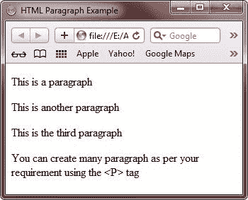
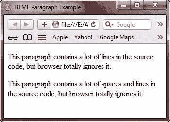
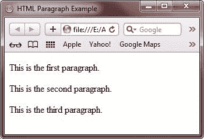

# HTML 段落

> 原文：<https://codescracker.com/html/html-paragraphs.htm>

HTML 文档被分成不同的段落。一般来说，一个新的段落是通过按回车键开始的。

但是，在 HTML 中，浏览器不理解回车键创建的空格。因此，必须在我们想要开始新段落的地方插入一个特殊的元素或标记，即 P，称为段落元素(P 元素)。

段落标签是一个容器标签，这意味着它同时具有开始标签

和结束标签

。

**注意** -浏览器会自动在段落前后添加一个空行

## HTML P 元素属性

下表描述了 P 元素的属性:

| 属性 | 目的 |
| 班级 | 定义元素的名称 |
| 目录 | 定义从左到右或从右到左书写段落的方向 |
| 身份证明（identification） | 定义 id 的值 |
| 语言 | 定义编写段落所用的语言 |
| 风格 | 定义元素的内联样式 |
| 标题 | 提供有关元素的额外信息 |
| Onclick | 单击鼠标打开一个 HTML 文档 |
| Ondblclick(点击鼠标) | 双击打开一个 HTML 文档 |
| Onkeydown | 按下一个键打开一个 HTML 文档 |
| Onkeypress | 按下并释放鼠标按钮时打开一个 HTML 文档 |
| Onkeyup | 释放一个键时打开一个 HTML 文档 |
| Onmousedown | 单击鼠标按钮打开一个 HTML 文档 |
| Onmousemove | 鼠标指针移动时打开一个 HTML 文档 |
| Onmouseout | 当鼠标指针移出文档时打开一个 HTML 文档 |
| Onmouseover | 当鼠标指针移动到元素上时打开一个 HTML 文档 |
| 是 mouseup | 释放鼠标按钮时打开一个 HTML 文档 |

## HTML 段落示例

下面是一个 HTML 段落的例子:

```
<!DOCTYPE html>
<html>
<head>
   <title>HTML Paragraph Example</title>
</head>
<body>

<p>This is a paragraph</p>
<p>This is another paragraph</p>
<p>This is the third paragraph</p>
<p>You can create many paragraph as per your requirement using the <P> tag</p>

</body>
</html>
```

它将显示以下结果:



这里有另一个例子也演示了 HTML 中的段落:

```
<!DOCTYPE html>
<html>
<head>
   <title>HTML Paragraph Example</title>
</head>
<body>

<p>
This paragraph
contains a lot of lines
in the source code,
but browser totally
ignores it.
</p>

<p>
This paragraph
contains      a lot of spaces and lines
in the source     code,
but    browser totally
ignores it.
</p>

</body>
</html>
```

下面是由上面的 HTML 段落示例代码生成的示例输出:



要在 HTML 中写“因为它是文本”,可以使用 HTML pre 标签。要详细了解 pre 标签，你可以参考 [HTML 基础标签](/html/html-basic-tags.htm)，在那里你会看到 pre 标签的使用示例。

让我们以 HTML 中的段落为例:

```
<!DOCTYPE html>
<html>
<head>
   <title>HTML Paragraph Example</title>
</head>
<body>

<p>This is the first paragraph.</p>
<p>This is the second paragraph.</p>
<p>This is the third paragraph.</p>

</body>
</html>
```

以下是上述 HTML 段落示例显示的输出:



[HTML 在线测试](/exam/showtest.php?subid=4)

* * *

* * *