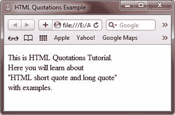
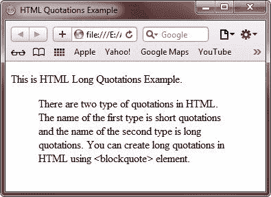

# HTML 报价

> 原文：<https://codescracker.com/html/html-quotations.htm>

QuotationBelow is the quoted paragraph:

> 这是用引号括起来的段落。在这里，你将通过例子学习所有关于 HTML 中的引用。本教程包括 HTML 中的简短引用和示例，以及 HTML 中的长引用和示例。要在 HTML 中指定短引号，请使用<q>，要在 HTML 中指定长引号，请使用
> 
> > 。</q>

## HTML 简短引用

HTML <q>元素用于指定 HTML 文档中的简短引用。下面的例子展示了如何在 HTML 中使用短引号:</q>

```
<!DOCTYPE html>
<html>
<head>
   <title>HTML Quotations Example</title>
</head>
<body>

<p>This is HTML Quotations Tutorial. <br />
Here you will learn about <br />
<q>HTML short quote and long quote</q> <br />
with examples.</p>

</body>
</html>
```

以下是上述 HTML 报价(短报价)示例产生的示例输出:



## HTML 长报价

HTML

> Element is used to specify the block (long) reference text. The following example shows how to use long quotation marks in HTML:

```
<!DOCTYPE html>
<html>
<head>
   <title>HTML Quotations Example</title>
</head>
<body>

<p>This is HTML Long Quotations Example.</p>
<blockquote>
   There are two type of quotations in HTML.
   The name of the first type is short quotations
   and the name of the second type is long quotations.
   You can create long quotations in HTML using
   <blockquote> element.
</blockquote>

</body>
</html>
```

下面是由上面的 HTML 长报价示例代码生成的示例输出:



[HTML 在线测试](/exam/showtest.php?subid=4)

* * *

* * *