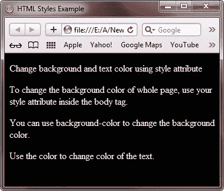
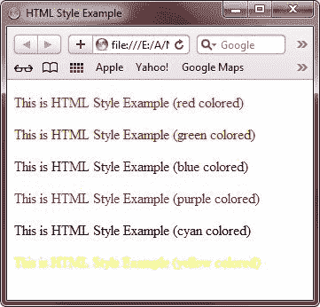
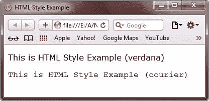
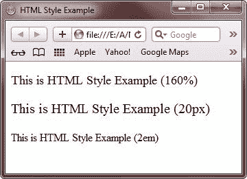
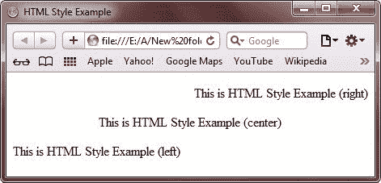

# HTML 样式

> 原文：<https://codescracker.com/html/html-styles.htm>

在这里你将学习如何使用 style [attribute](/html/html-attributes.htm) 设置 HTML 元素的样式。

您可以使用以下属性来设置 HTML 文档中文本的样式:

*   [背景色](/css/css-background-color.htm)
*   [font-family](/html/html-fonts.htm)
*   [颜色](/html/html-colors.htm)
*   [文本对齐](/css/css-text.htm)
*   [字号](/html/html-fonts.htm)

从上面可以看出，background-color 用于设置背景色，font-family 用于设置文本字体，color 用于设置文本颜色，text-align 用于设置文本对齐方式，font-size 用于设置文本大小。

以下是设置 HTML 元素样式的一般形式:

```
style="property:value"
```

从上面的代码片段来看，property 是一个 [CSS](/css/index.htm) 属性，value 是一个 CSS 值。

## 更改背景颜色的 HTML 样式

我们知道默认的背景色是白色，因此这里有一个例子说明如何改变网页的背景色:

```
<!DOCTYPE html>
<html>
<head>
   <title>HTML Styles Example</title>
</head>
<body style="background-color:black;color:white;">

<p>Change background and text color using style attribute</p>
<p>To change the background color of whole page, use your style attribute
inside the body tag.</p>
<p>You can use background-color to change the background color.</p>
<p>Use the color to change color of the text.</p>

</body>
</html>
```

下面是上述 HTML 样式更改背景颜色示例代码产生的示例输出:



## 更改文本颜色的 HTML 样式

正如我们所知，默认的文本颜色是黑色的，因此这里有一个例子来说明如何改变网页中文本的颜色。

```
<!DOCTYPE html>
<html>
<head>
   <title>HTML Style Example</title>
</head>
<body>

<p style="color:red;">This is HTML Style Example (red colored)</p>
<p style="color:green;">This is HTML Style Example (green colored)</p>
<p style="color:blue;">This is HTML Style Example (blue colored)</p>
<p style="color:purple;">This is HTML Style Example (purple colored)</p>
<p style="color:cyna;">This is HTML Style Example (cyan colored)</p>
<p style="color:yellow;">This is HTML Style Example (yellow colored)</p>

</body>
</html>
```

下面是上面的 HTML 样式改变文本颜色的输出示例代码:



## 更改文本字体的 HTML 样式

您可以使用 HTML font-family 属性来指定 HTML 元素的字体。下面的例子展示了如何在 HTML 中改变文本字体:

```
<!DOCTYPE html>
<html>
<head>
   <title>HTML Style Example</title>
</head>
<body>

<p style="font-family:verdana">This is HTML Style Example (verdana)</p>
<p style="font-family:courier">This is HTML Style Example (courier)</p>

</body>
</html>
```

下面是上述 HTML 样式改变文本字体的输出示例代码:



## 更改文本大小的 HTML 样式

您可以使用 HTML font-size 属性来指定 HTML 元素的文本大小。下面是一个示例，展示了如何在 HTML 中更改文本大小:

```
<!DOCTYPE html>
<html>
<head>
   <title>HTML Style Example</title>
</head>
<body>

<p style="font-size:110%">This is HTML Style Example (160%)</p>
<p style="font-size:20px;">This is HTML Style Example (20px)</p>
<p style="font-size:1em;">This is HTML Style Example (2em)</p>

</body>
</html>
```

以下是上述 HTML 样式的输出示例，用于更改文本大小示例代码:



## 更改文本对齐方式的 HTML 样式

HTML text-align 属性定义 HTML 元素的水平文本对齐方式。下面的示例显示了如何在 HTML 中更改文本对齐方式:

```
<!DOCTYPE html>
<html>
<head>
   <title>HTML Style Example</title>
</head>
<body>

<p style="text-align:right;">This is HTML Style Example (right)</p>
<p style="text-align:center;">This is HTML Style Example (center)</p>
<p style="text-align:left;">This is HTML Style Example (left)</p>

</body>
</html>
```

下面是由上述 HTMl 样式生成的示例输出，以更改文本对齐示例代码:



要了解 HTML 元素样式的更多细节，请参考 [CSS 教程](/css/index.htm)。

[HTML 在线测试](/exam/showtest.php?subid=4)

* * *

* * *