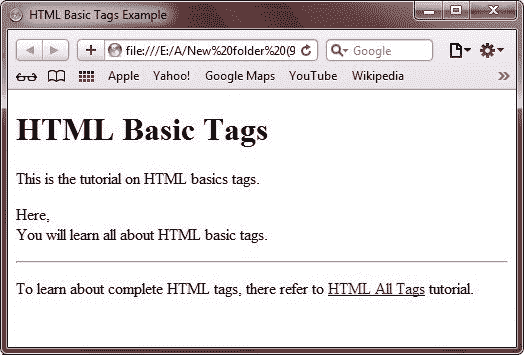
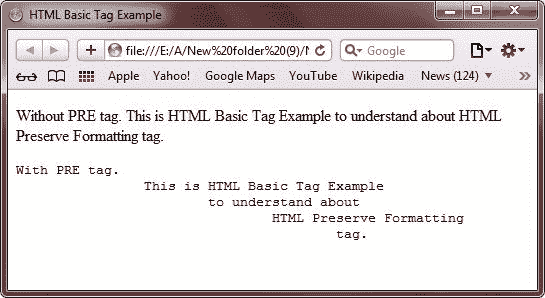

# HTML 基本标签

> 原文：<https://codescracker.com/html/html-basic-tags.htm>

在这里，您将了解 HTML 文档中使用的基本标签。您将在本教程中学习以下基本标签:

*   [HTML 头和标题标签](/html/html-heading-elements.htm)
*   [HTML 段落标签](/html/html-paragraphs.htm)
*   [HTML 换行符标签](/html/html-line-break.htm)
*   [HTML 水平标签](/html/html-horizontal-rule.htm)
*   HTML 保留格式标记
*   [HTML 链接标签](/html/html-links.htm)
*   [HTML 图像标签](/html/html-images.htm)

## HTML 基本标签示例

这是一个在 HTML 文档中使用的基本标签的例子。这是 HTML 中第一个关于基本标签的例子。

```
<!DOCTYPE HTML>
<html>
<head>
   <title>HTML Basic Tags Example</title>
</head>
<body>

   <h1>HTML Basic Tags</h1>
   <p>This is the tutorial on HTML basics tags.</p>
   <p>Here,<br />You will learn all about HTML basic tags.</p>
   <hr />
   <p>To learn about complete HTML tags, there refer   to 
   <a href="http://codescracker.com/html/html-elements.htm">HTML All Tags</a> tutorial.</p>

</body>
</html>
```

以下是上述 HTML 基本标记示例代码产生的输出:



## HTML 保留格式标记

您可以使用 HTML

```
标签自由编写您的“原样文本”。例如，要编写计算机代码，使用

```
标签。下面是一个使用

```
标签在网页上写“因为它是文本”的例子。这是 HTML 中基本标签的第二个例子。
```

```

```

```
<!DOCTYPE html>
<html>
<head>
   <title>HTML Basic Tag Example</title>
</head>
<body>

   <p>Without PRE tag.
      This is HTML Basic Tag Example
         to understand about
            HTML Preserve Formatting
               tag.</p>

   <p><pre>With PRE tag.
      This is HTML Basic Tag Example
         to understand about
            HTML Preserve Formatting
               tag.</pre></p>

</body>
</html>
```

下面是由上面的 HTML 基本标记示例产生的示例输出。



这里还有一个例子:

```
<!DOCTYPE html>
<html>
<head>
   <title>HTML Basics Tags Example</title>
</head>
<body>

<p><pre>This is
   HTML basic
tag example. You can
         use pre tag
   to create "as it is text".</pre></p>

</body>
</html>
```

以下是由上述 HTML 基本标记示例代码生成的示例输出:


[HTML 在线测试](/exam/showtest.php?subid=4)

* * *

* * *