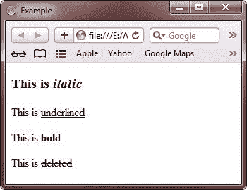

# HTML 所有标签

> 原文：<https://codescracker.com/html/html-elements.htm>

在这里你会发现所有的 HTML 标签列表。标签是 HTML 文档的组成部分。没有标签，你就不能创建一个 HTML 文档。通常标签包含以下内容:

| 开始标签 |  |
| 结束标签 |  |
| 包含在开始和结束标记之间的标记内容 | 这就是内容 |

让我们看看下面的代码片段，它包含一个开始和一个结束标记，标记内有内容:

```
<P>This is content</P>
```

**注意** -标签的名称不区分大小写。意思是小写的标签如<头>和大写的标签 如<头>是一样的。

本教程分为以下几个部分:

*   [HTML 根标签](/html/html-root-elements.htm)
*   [HTML 元数据标签](/html/html-metadata-elements.htm)
*   [HTML 部分标签](/html/html-section-elements.htm)
*   [HTML 头和标题标签](/html/html-heading-elements.htm)
*   [HTML 流标签](/html/html-flow-elements.htm)
*   [HTML 语法标签](/html/html-phrasing-elements.htm)
*   [HTML 嵌入标签](/html/html-embedded-elements.htm)
*   [HTML 互动标签](/html/html-interactive-elements.htm)

## 例子

这里有一个例子。

```
<!DOCTYPE html>
<html>
<head>
   <title>Example</title>
</head>
<body>

<h3>This is <i>italic</i></h3>
<p>This is <u>underlined</u></p>
<p>This is <b>bold</b></p>
<p>This is <del>deleted</del></p>

</body>
</html>
```

以下是上述示例产生的输出示例:



[HTML 在线测试](/exam/showtest.php?subid=4)

* * *

* * *