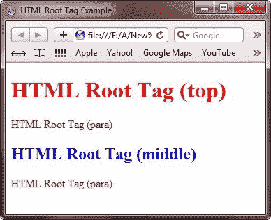
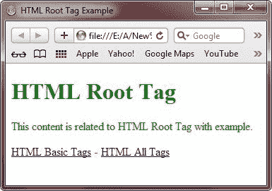

# HTML 根标签

> 原文：<https://codescracker.com/html/html-root-elements.htm>

HTML 根标签表示应该出现在所有 HTML 文档中的主标签或起始标签。HTML 标签是跟随在标签之后的第一个标签，并且在其中指定了其他 HTML 标签。这个标签允许浏览器识别文档类型。

## HTML 标签属性

由于 HTML 标记是 HTML 文档的根标记，因此下表提供了 HTML 标记的属性描述:

| 属性 | 价值 | 描述 |
| 班级 | 类别名称 | 指定 HTML 文档中元素的类 |
| 身份证明（identification） | 唯一 id | 为元素指定了唯一的字母数字标识符 |
| 目录 | **ltr** -从左到右
**rtl** -从右到左 | 指定元素中内容的文本方向 |
| 语言 | 语言代码 | 指定用于元素的基本语言 |
| xmlns | http://www.w3.org/1999/xhtml | 为 HTML 文档中使用的标记声明命名空间 |
| xml:语言 | 语言代码 | 指定用于可扩展超文本标记语言(XHTML)文档中的元素的基本语言 |
| 隐藏的 | 隐藏的 | 将元素声明为隐藏元素。文档中不显示隐藏元素 |
| 显示 | 统一资源定位器(URL) | 定义包含文档缓存信息的 URL |
| 上下文菜单 | menu-id | 指定元素的上下文菜单 |
| 内容可编辑 | 真，假 | 指定您是否可以编辑文档中的内容 |
| accesskey | 性格；角色；字母 | 指定了访问元素的快捷键 |
| 可拖动的 | 真、假、自动 | 指定是否可以拖动元素 |
| tab 键索引 | 数字 | 指定了元素的 tab 键顺序索引 |
| 拼写检查 | 真，假 | 指定是否应该检查元素的拼写和语法 |
| 风格 | 风格定义 | 使用 |
| 标题 | 文本 | 指定 html 文档的标题 |

## HTML 根标签示例

下面是 HTML 中根标签的一个例子:

```
<!DOCTYPE HTML>
<html>
<head>
   <title>HTML Root Tag Example</title>
   <style>
      #top{ color:red; }
      #middle{ color:blue; }
      .para{ color:green; }
   </style>
</head>
<body>

<h1 id="top">HTML Root Tag (top)</h1>
<p class="para">HTML Root Tag (para)</p>
<h2 id="middle">HTML Root Tag (middle)</h2>
<p class="para">HTML Root Tag (para)</p>

</body>
</html>
```

以下是由上述 HTML 根标记示例代码生成的示例输出:



这是另一个 HTML 根标签的例子。

```
<!doctype html>
<html>
<head>
   <title>HTML Root Tag Example</title>
   <meta name="tutorial" content="tutorial on root tags">
   <style type="text/css">
      body{color:green;}
   </style>
</head>
<body>

<h1>HTML Root Tag</h1>
<p>This content is related to HTML Root Tag with example.</p>
<a href="http://codescracker.com/html/html-basic-tags.htm">HTML Basic Tags</a> -
<a href="http://codescracker.com/html/html-elements.htm">HTML All Tags</a>

</body>
</html>
```

以下是上述 HTML 根标记示例代码的输出示例:



[HTML 在线测试](/exam/showtest.php?subid=4)

* * *

* * *