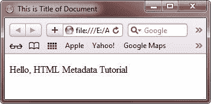
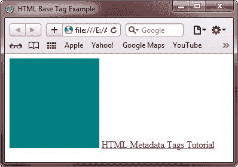
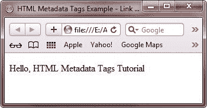
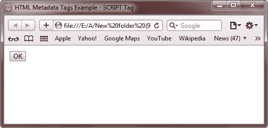
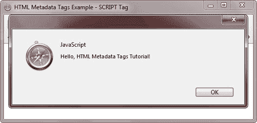
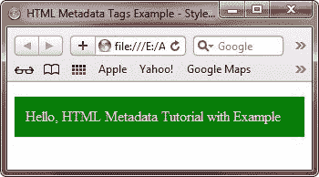
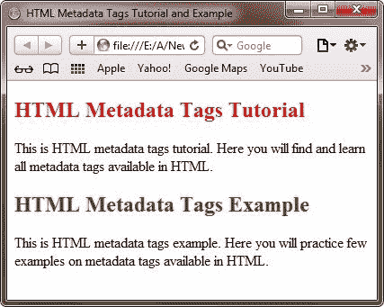
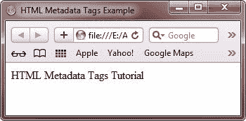

# HTML 元数据标签

> 原文：<https://codescracker.com/html/html-metadata-elements.htm>

元数据标签用于设置文档剩余内容的表示或行为。

元数据标签也可以用来设置一个文档与其他文档的关系。

您可以使用元数据标签来提供关于 HTML 文档的附加信息。

以下是元数据标记的列表:

*   标题
*   基础
*   环
*   命令
*   [META](/html/html-meta-tags.htm)
*   脚本
*   NOSCRIPT
*   风格

让我们逐一讨论以上所有的元数据标签。

## HTML TITLE Tag

TITLE 标记包含出现在 Web 浏览器标题栏中的 HTML 文档的标题。搜索引擎使用该标签来选择文档并将其显示在搜索结果中。每个 HEAD 标签应该包含一个 TITLE 标签。

**注意**——记住标题文本要简短，因为有些浏览器可能会发现处理超过 256 个字符的标题很困难。

### 例子

以下代码片段显示了 HTML 文档中 TITLE 标记的用法:

```
<!doctype html>
<html>
<head>
   <title>
      This is the title of the Web page
   </title>
</head>
</html>
```

下面是一个使用 HTML title 标签的例子:

```
<!DOCTYPE html>
<html>
<head>
   <title>This is Title of Document</title>
</head>
<body>

<p>Hello, HTML Metadata Tutorial</p>

</body>
</html>
```

以下是上面 HTML 中的 title 标记示例产生的示例输出:



## HTML 标题标签属性

下表描述了标题标签的属性:

| 属性 | 描述 |
| 身份证明（identification） | 为文档中的标签指定唯一的字母数字标识符 |
| 班级 | 指定 HTML 文档中标签的类别 |
| 风格 | 指定在文档中呈现标签的内联样式 |
| 语言 | 指定标签使用的语言 |

## HTML 基本标签

BASE 标记用于指定 HTML 文档中所有链接的默认 URL 和目标。这个标签出现在文档的 HEAD 标签中，应该用作 HEAD 标签中的第一个标签。这使得 head 部分中的其他标签能够使用 BASE 标签的信息。

### 例子

以下代码片段显示了 HTML 文档中 BASE 标记的用法:

```
<!doctype html>
<html>
<head>
   <base href="url" target="value"/>
</head>
</html>
```

下面是一个使用 HTML 基本标签的例子:

```
<!DOCTYPE html>
<html>
<head>
   <title>HTML Base Tag Example</title>
   <base href="http://codescracker.com/" />
</head>
<body>


<a href="/html/html-metadata-elements.htm">HTML Metadata Tags Tutorial</a> 

</body>
</html>
```

以下是上述 HTML 基本标记示例代码的输出示例:



如果你把基本网址改成别的，例如，如果基本网址是**http://codescracker.com/home**，那么图像和其他给定的 链接将变成像**http://codescracker.com/hoimg/colpic.jpg**和 T4【http://codescracker . com/home/html/html-metadata-elements . htm

## HTML 基本标签属性

下表描述了基本标记的属性:

| 属性 | 描述 |
| href | 指定 HTML 文档中的 URL |
| 目标 | 指定 HTML 文档链接打开的位置。以下是目标属性的四个可能值:

*   **_ blank** -Open the link in a new window.
*   **_ parent** -Open the link in the same frame and click the link.
*   **_ self** -Open the link in the current frameset.
*   **_ top** -Open the link in the same window

 |

## HTML 链接标签

LINK 标签用于将一个 HTML 文档链接到其他 HTML 文档。它还定义了两个不同 HTML 文档之间的关系。LINK 标记包含 href 属性，用于指定链接的目标 URL。href 属性是必需的属性，必须具有有效的 URL。LINK 标记还包含 rel 属性，该属性定义了链接文档的关系。

### 例子

以下代码片段显示了 LINK 标记的用法:

```
<head>
   <link href="file_name.html" rel="stylesheet">
</head>
```

下面是一个使用 HTML 链接标签的例子:

```
<!DOCTYPE html>
<html>
<head>
   <title>HTML Metadata Tags Example - Link Tag</title>
   <link rel="stylesheet" type="text/css" href="style.css">
</head>
<body>

<p>Hello, HTML Metadata Tags Tutorial</p>

</body>
</html>
```

下面是上面的 HTML 链接标记示例代码产生的示例输出:



## HTML 链接标签属性

下表描述了链接标记的属性:

| 属性 | 价值 | 描述 |
| href | 统一资源定位器 | 指定单击链接后导航到的目标 url |
| 元首万岁 | 语言 _ 代码 | 定义目标 URL 的基本语言 |
| 媒体 | 屏幕、tty、电视、投影、手持、打印、盲文、听觉 | 指定显示 html 文档的设备 |
| 能量损耗率 | 备选、归档、作者、第一个、提要、图标、帮助、索引、许可证、最后一个、下一个、pingback、上一个、预取、搜索、样式表、侧栏、标签、向上 | 指定 HTML 文档和目标 URL 或其他 HTML 文档之间的关系 |
| 类型 | mime_type
例如: text/javascript text/css | 指定目标 URL 的多用途 Internet 主扩展(MIME)类型。MIME 类型决定了在 HTML 页面中应该遵循哪种类型的语言规则，比如 JavaScript 或 CSS。 |
| 大小 | 任何数字 | 定义链接的 HTML 文档的大小 |

## HTML 命令标签

COMMAND 标记是 HTML5 中引入的新标记，用于在表单控件(如单选按钮或复选框)触发事件时执行命令。您可以将命令标签与上下文菜单或工具栏一起使用。

### 例子

下面的 HTML 代码片段显示了 COMMAND 标记的用法:

```
<MENU label="Cars">
   <COMMAND type="radio" radiogroup="cars" label="Lamborghini">
   <COMMAND type="radio" radiogroup="cars" label="Ferrari">
</MENU>
```

## HTML 命令标签属性

下表列出了命令标记的属性:

| 属性 | 价值 | 描述 |
| 类型 | 命令(默认)，复选框，单选 | 指定命令的类型 |
| 标签 | 一些 _ 文字 | 指定将在 HTML 页面上显示的命令的名称 |
| 图标 | 统一资源定位器 | 指定要显示为 HTML 页面图标的图像的位置 |
| 有缺陷的 | [空字符串]，已禁用 | 指定一个值，该值指示命令是否被禁用 |
| 检查 | [空字符串]，选中 | 指定一个值来指示命令是否被选中 |
| 无线电组 | 一些 _ 文字 | 指定一个字符串值，该值表示 type 属性以 radio 为值的命令组的名称 |
| 标题 | 一些 _ 文字 | 指定命令的标题 |

## HTML 脚本标签

SCRIPT 标签用于声明脚本，例如 HTML 文档中的 JavaScript。这个标签或者包含脚本语句，或者通过 src 属性指向外部脚本文件。您可以使用 SCRIPT 标记来验证 Web 表单并操作这些表单上的内容和图像。脚本标签有以下五个属性:

*   异步ˌ非同步(asynchronous)
*   类型
*   字符集
*   推迟
*   科学研究委员会

如果 async 属性的值为 true，则脚本异步执行，在这种情况下，脚本在文档被解析时执行。如果 async 属性的值为 false，而 defer 属性的值为 true，那么脚本将在文档解析完成后执行。如果 async 和 defer 属性的值为 false，则立即执行脚本，HTML 页面在继续解析之前等待脚本执行完毕

### 例子

以下 HTML 代码片段显示了如何在 HTML 文档中使用 SCRIPT 标记:

```
<HEAD>
   <SCRIPT type="text/javascript">
      Script code here
   </SCRIPT>
</HEAD>
```

下面是一个使用 HTML 脚本标签的例子:

```
<!DOCTYPE html>
<html>
<head>
   <title>HTML Metadata Tags Example - SCRIPT Tag</title>
   <script type="text/javascript">
      function metadataFun()
      {
         alert("Hello, HTML Metadata Tags Tutorial!");
      }
   </script>
</head>
<body>

<input type="button" onclick="metadataFun();" name="ok" value="OK"  />

</body>
</html>
```

以下是上述 HTML 脚本标记示例的输出:



当您点击 **OK** 按钮时，将在浏览器中显示以下内容:



要检查它是如何工作的，点击下面的 **OK** 按钮:

 <input type="button" onclick="metadataFun();" name="ok" value="OK">

## HTML 脚本标签属性

下表描述了脚本标记的属性:

| 属性 | 价值 | 描述 |
| 异步ˌ非同步(asynchronous) | 真，假 | 指定脚本是否应该异步执行 |
| 类型 | text/ecmascript
text/JavaScript
application/ecmascript
T6】application/JavaScript
text/VBScript | 指定脚本的 MIME 类型 |
| 字符集 | 字符集 | 指定脚本中使用的字符编码 |
| 推迟 | 真，假 | 指定浏览器是否可以继续解析 HTML 文档 |
| 科学研究委员会 | 统一资源定位器 | 指定了包含脚本的文件的 url |

## HTML NOSCRIPT 标记

NOSCRIPT 标记用于在不支持 JavaScript 或禁用了 JavaScript 的 Web 浏览器上显示替代内容。如果 Web 浏览器启用或支持 JavaScript，则不考虑 NOSCRIPT 标记。

### 例子

以下 HTML 代码片段显示了 NOSCRIPT 标记的用法:

```
<SCRIPT type="text/javascript">
   document.write("Have a nice day.")
</SCRIPT>
<NOSCRIPT>
   JavaScript is disabled or not supported on your browser.
</NOSCRIPT>
```

## HTML 样式标签

HTML 样式标签用来声明 HTML 文档中的样式表。此标签指定 HTML 标签在浏览器中的呈现方式。 样式标签有以下三个属性:

*   类型
*   媒体
*   审视

### 例子

以下 HTML 代码片段显示了 STYLE 标记的用法:

```
<HEAD>
   <STYLE type="text/css">
      Style code here
   </STYLE>
</HEAD>
```

下面是一个使用 HTML 样式标签的例子:

```
<!DOCTYPE html>
<html>
<head>
   <title>HTML Metadata Tags Example - Style Tag</title>
   <style type="text/css">
      .myclass1
      {
         background-color: green;
         padding: 12px;
         color: white;
      }
   </style>
</head>
<body>

<p class="myclass1">Hello, HTML Metadata Tutorial with Example</p>

</body>
</html>
```

以下是上述 HTML 样式标签示例代码的输出:



您可以使用 HTML 样式属性随意更改标题标签的颜色。这里有一个例子:

```
<!DOCTYPE HTML>
<HTML>
<HEAD>
   <TITLE>HTML Metadata Tags Tutorial and Example</TITLE>
</HEAD>
<BODY>

<h2 style="color:red;">HTML Metadata Tags Tutorial</h2>
<p>This is HTML metadata tags tutorial. 
Here you will find and learn all metadata tags available
in HTML.</p>
<h2 style="color:green;">HTML Metadata Tags Example</h2>
<p>This is HTML metadata tags example.
Here you will practice few examples on metadata tags
available in HTML.</p>

</BODY>
</HTML>
```

下面是由上面的 HTML 样式标签示例生成的示例输出:



**注**:要了解级联样式表是如何工作的，请参考 [CSS 教程](/css/index.htm)

## HTML 样式标签属性

下表描述了样式标记的属性:

| 属性 | 价值 | 描述 |
| 类型 | 文本/css | 指定内容的类型，例如 HTML 文档中的简单文本或样式表 |
| 媒体 | 屏幕、tty、电视、投影、手持、打印、盲文、听觉 | 指定显示样式的目标媒体 |
| 审视 | 审视 | 指定样式标签，即父标签及其子标签 |

## HTML 元数据标签示例

下面是一个 SCRIPT 和 NOSCRIPT 标签的例子。

```
<!DOCTYPE HTML>
<html>
<head>
   <title>HTML Metadata Tags Example</title>
   <script type="text/javascript">
      document.write("HTML Metadata Tags Tutorial");
   </script>
</head>
<body>

<noscript>
   Javascript is disabled or not supported in this browser.
</noscript>

</body>
</html>
```

下面是浏览器产生的输出(支持 Javascript)



[HTML 在线测试](/exam/showtest.php?subid=4)

* * *

* * *