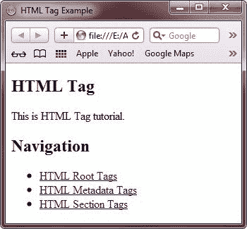
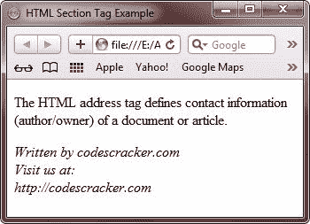
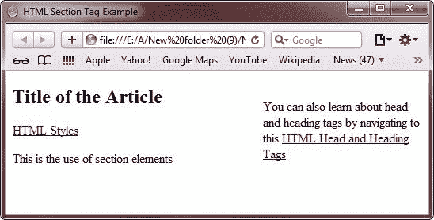
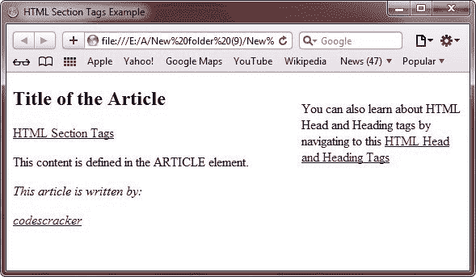
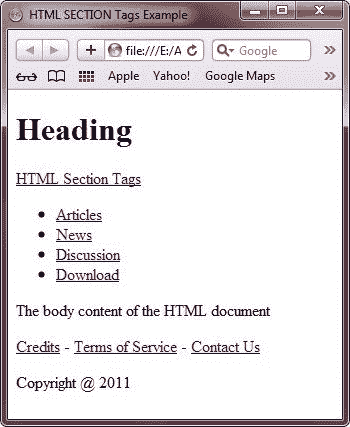

# HTML 部分标签

> 原文：<https://codescracker.com/html/html-section-elements.htm>

SECTION 标记用于表示 HTML 文档的一般部分。

## HTML 部分标签示例

以下 HTML 代码片段显示了 SECTION 标记的示例:

```
<SECTION>
<H1>HTML5</H1>
<P>Example of SECTION tag.</P>
</SECTION>
```

在“标记”一节中，您将了解下面给出的标记:

*   资产净值
*   文章
*   在旁边
*   页眉
*   页脚
*   地址

现在让我们逐一讨论以上所有标签。

## HTML 导航标签

NAV 标签用于从一个 HTML 页面导航到另一个页面。这个标签在一个 HTML 文档中显示一组链接。

### 例子

以下 HTML 代码片段显示了 NAV 标记的示例:

```
<NAV>
<H1>Navigation</H1>
<UL>
   <LI><A href="news.html">News</A></LI>
   <LI><A href="article.html">Article</A></LI>
</UL>
</NAV>
```

以下是 HTML 中 section 标签的一个示例:

```
<!DOCTYPE HTML>
<HTML>
<HEAD>
   <title>HTML Tag Example</title>
</head>
<body>

<section>
   <h1>HTML Tag</h1>
   <p>This is HTML Tag tutorial.</p>
</section>
<nav>
   <h1>Navigation</h1>
   <ul>
      <li><a href="/html/html-root-elements.htm">HTML Root Tags</a></li>
      <li><a href="/html/html-metadata-elements.htm">HTML Metadata Tags</a></li>
      <li><a href="/html/html-section-elements.htm">HTML Section Tags</a></li>
   </ul>
</nav>

</BODY>
</HTML>
```

上面的 HTML 示例将产生以下结果:



如果你点击 **HTML 根标签**超链接，这会将你重定向到 **HTML 根标签**页面。

## HTML 文章标签

ARTICLE 标记用于表示包含 HTML 页面信息的部分，如标题和创建日期。您可以以各种格式显示该标签中的信息，例如一篇新文章、一篇博客文章或用户的评论部分。

### 例子

以下 HTML 代码片段显示了使用文章标记的示例:

```
<ARTICLE>
<HEADER>
   Some heading content
</HEADER>
<P>Some article content</P>
</ARTICLE>
```

## HTML 旁白标签

ASIDE 标记允许我们创建一个部分，用于显示关于其他标记内容的信息，例如时间和日期、当前新闻和天气预报。这个标签也可以用来在文档中插入印刷效果，例如广告、注释、链接和提示的侧边栏。

### 例子

以下 HTML 代码片段显示了 ASIDE 标记的示例:

```
<body>
<header>
   <h1>Article Heading</h1>
   <p>Article content</p>
</header>
<aside>
   Enter some content related to the aside article
</aside>
</body>
```

## HTML 标题标记

HEADER 标签用于在 HTML 页面上提供介绍性内容。HEADER 标签可以包含标题、段落、链接和其他内容。

### 例子

以下 HTML 代码片段显示了 HEADER 标记的一个示例:

```
<header>
<h1>Level 1 Heading</h1>
<a href="http://codescracker.com/html/html-section-elements.htm#sections">HTML Section Tags</a></dd>
<nav>
   <ul>
      <li><a href="/news">News</a>
      <li><a href="/article">Article</a>
   </ul>
</nav>
</header>
```

## HTML 页脚标记

FOOTER 标记用于表示页脚，页脚包含各种类型的信息，例如与文档或文档的一部分相关的链接和版权数据。

### 例子

以下 HTML 代码片段显示了页脚标记的示例:

```
<footer>
<ul>
   <li>Home</li>
   <li>News</li>
   <li>Links</li>
   <li>Article</li>
   <li>About</li>
</ul>
</footer>
```

## HTML 地址标签

ADDRESS 标记通常定义在 HTML 页面的页眉或页脚，用于显示文档的联系信息，如文档所有者、维护者的姓名、反馈的电子邮件地址、邮政地址和电话号码。地址标签的内容在 Web 浏览器上以斜体显示。

### 例子

以下 HTML 代码片段显示了地址标记的示例:

```
<address>
   <a href="codes.html">codes</a>
   <a href="cracker.html">cracker</a>
   Contact persons for the <a href="activity.html">codescracker Web Design Activity</a>
</address>
```

下面是一个 HTML 地址标签的例子:

```
<!DOCTYPE html>
<html>
<head>
   <title>HTML Section Tag Example</title>
</head>
<body>

<p>The HTML address tag defines contact information (author/owner) of a document or article.</p>
<address>
   Written by codescracker.com<br> 
   Visit us at:<br>
   http://codescracker.com
</address>

</body>
</html>
```

以下是由上述 HTML 地址标记示例代码生成的示例输出:



## HTML 部分标签示例

以下是 HTML 部分标签的示例:

```
<!DOCTYPE HTML>
<HTML>
<HEAD>
   <title>HTML Section Tag Example</title>
</head>
<body>

<aside style="float:right;width:200px;">
   <p>You can also learn about head and heading tags by navigating to this
   <a href="http://codescracker.com/html/html-heading-elements.htm">HTML Head and Heading Tags</a>
</aside>
<article>
   <header>
   <h1>Title of the Article</h1>
   <a href="http://codescracker.com/html/html-styles.htm">HTML Styles</a>
   </header>
   <p>This is the use of section elements</p>
</article>

</BODY>
</HTML>
```

以下是由上述 HTML 部分标记示例代码生成的示例输出:



现在，让我们考虑下面的例子来理解地址标签的用法:

```
<!DOCTYPE HTML>
<HTML>
<HEAD>
   <title>HTML Section Tags Example</title>
</head>
<body>

<aside style="float:right;width:200px;">
<p>You can also learn about HTML Head and Heading tags by navigating to this
<a href="http://codescracker.com/html/html-heading-elements.htm">HTML Head and Heading Tags</a>
</aside>
<article>
   <header>
   <h1>Title of the Article</h1>
   <a href="http://codescracker.com/html/html-section-elements.htm">
   HTML Section Tags</a>
   </header>
   <p>This content is defined in the ARTICLE element.</p>
</article>
<address>
   <p>This article is written by:</p>
   <a href="http://codescracker.com">codescracker</a>
</address>

</BODY>
</HTML>
```

以下是上述 HTML 部分标签示例的输出示例:



现在，让我们以 HTML 中的节标记(页眉和页脚标记)为例:

```
<!DOCTYPE HTML>
<HTML>
<HEAD>
   <TITLE>HTML SECTION Tags Example</TITLE>
</HEAD>
<BODY>

<header>
   <h1>Heading</h1>
   <a href="http://codescracker.com/html/html-section-elements.htm">HTML Section Tags</a></dd>
   <nav>
      <ul>
         <li><a href="articles.html">Articles</a></li>
         <li><a href="news.html">News</a></li>
         <li><a href="discussion.html">Discussion</a></li>
         <li><a href="download.html">Download</a></li>
      </ul>
   </nav>
</header>
The body content of the HTML document
<footer>
   <nav>
      <p><a href="credits.html">Credits</a> - 
      <a href="terms.html">Terms of Service</a> - 
      <a href="contact.html">Contact Us</a></p>
   </nav>
   <p>Copyright @ 2011</p>
</footer>

</BODY>
</HTML>
```

下面是上述 HTML 部分标签示例代码的输出:



[HTML 在线测试](/exam/showtest.php?subid=4)

* * *

* * *