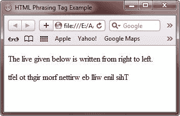

# HTML 语法标签

> 原文：<https://codescracker.com/html/html-phrasing-elements.htm>

语法标签用于表示 HTML 文档的文本。这些标签也用于标记文档段落中的 HTML 文档文本。您可以使用 HTML 短语标签来组织 HTML 文档的文本。

## HTML 语法标签列表

下表列出并描述了 HTML 中所有可用的语法标签:

| 标签 | 描述 |
| 一个
(如果它只包含语法内容) | 表示 HTML 文档的链接 |
| 缩写的/缩写词 | 代表缩写 |
| 区域
(如果是地图标签的后代) | 表示图像映射的一个区域 |
| 声音的 | 表示音频和声音流 |
| B | 表示粗体文本 |
| BDO | 表示文本方向 |
| 溴 | 表示换行符 |
| 按钮 | 代表一个按钮 |
| 帆布 | 允许您使用 JavaScript 绘制图形 |
| 引用 | 代表引用 |
| 密码 | 表示代码文本 |
| 命令 | 定义一个命令 |
| 数据列表 | 通过使用各种标记(如 option 和 INPUT)来定义控件的选项 |
| DEL
(如果它只包含语法内容) | 代表删除的文本 |
| DFN | 表示定义术语 |
| 东地中海(Eastern Mediterranean) | 代表强调的文本 |
| 把…嵌入 | 表示 HTML 文档中的插件内容 |
| 我 | 代表斜体文本 |
| 内联框架 | 表示嵌入式框架 |
| IMG | 代表一个图像 |
| 投入 | 表示输入控件 |
| INS
(如果它只包含语法内容) | 代表插入的文本 |
| keyboard 键盘 | 表示键盘文本 |
| KEYGEN | 表示生成密钥对的控件 |
| 标签 | 表示输入标记的标签 |
| 地图
(如果它只包含语法内容) | 表示图像映射 |
| 标记 | 表示 HTML 文档中突出显示以供参考的文本 |
| 数学 | 用 XHTML 定义数学表达式 |
| 米 | 定义度量，如磁盘使用量 |
| NOSCRIPT | 表示要在不支持 JavaScript 或禁用 JavaScript 的 Web 浏览器上显示的替代文本 |
| 目标 | 表示嵌入的对象 |
| 输出 | 代表一些输出 |
| 进步 | 定义任务和操作的进度 |
| Q | 代表简短的报价 |
| 红宝石 | 允许您在 HTML 文档中标记拼音注释 |
| 玉米片 | 表示示例计算机代码 |
| 脚本 | 表示客户端脚本 |
| 挑选 | 表示选择列表(下拉列表) |
| 小的 | 表示一小段文本 |
| 跨度 | 表示 HTML 文档中的一节 |
| 强烈的 | 表示一个强文本 |
| 潜水艇 | 表示下标文本 |
| 小口喝；怎么了 | 表示上标文本 |
| 挽救（saving 的简写） | 定义 XHTML 文档中的图形 |
| 文本区域 | 表示多行文本输入控件 |
| 时间 | 定义日期或/和时间 |
| 增值转销公司 | 代表文本的可变部分 |
| 录像 | 代表视频或电影流 |
| WBR | 定义换行符机会 |
| 文本 | 表示 HTML 文档中的文本 |

## HTML 语法标签示例

下面是一个在 HTML 中使用语法标签(<bdo>标签，用于定义双向覆盖)的例子。</bdo>

```
<!DOCTYPE html>
<html>
<head>
   <title>HTML Phrasing Tag Example</title>
</head>
<body>

<p>The live given below is written from right to left.</p>
<bdo dir="rtl">This line will be written from right to left</bdo>

</body>
</html>
```

下面是由上面的 HTML 语法标记示例代码生成的示例输出:



[HTML 在线测试](/exam/showtest.php?subid=4)

* * *

* * *