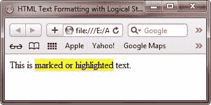
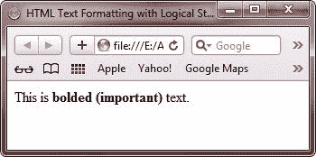
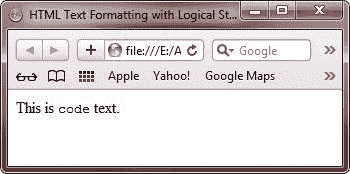
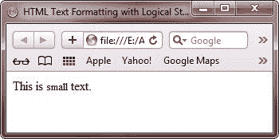

# 带有逻辑样式标签的 HTML 文本格式

> 原文：<https://codescracker.com/html/html-logical-text.htm>

在 HTML 中，逻辑样式标签指定包含的文本具有特定的含义、上下文或用法。例如，ABBR 标签向 Web 浏览器传达了这个标签中包含的文本是一个缩写。浏览器根据标签的含义改变文本的外观。

使用逻辑样式标签而不是物理样式标签的优点在于，与标签相关的含义被更精确地传达给用户

## HTML 逻辑样式标签列表

下表列出并描述了用于格式化 HTML 文档中文本的所有逻辑样式标签:

| 标签 | 描述 |
| 缩写的/缩写词 | 在网页上显示缩写 |
| 密码 | 指的是程序代码 |
| 玉米片 | 在网页上显示示例程序输出 |
| keyboard 键盘 | 指键盘上的按键 |
| 东地中海(Eastern Mediterranean) | 强调文本 |
| 强烈的 | 通过增加粗体来强调文本 |
| DFN | 在网页上显示新术语 |
| Q | 在网页上显示简短的报价 |
| 引用 | 在网页上显示长报价 |
| 移民归化局 | 显示插入的文本 |
| 是吗 | 显示删除的文本 |
| 增值转销公司 | 代表一个变量 |
| BDO | 更改文本的方向 |

## HTML 逻辑样式标签属性

下表列出并描述了逻辑样式标签用于格式化 HTML 文档中文本的所有属性:

| 属性 | 描述 |
| 班级 | 指示标签的类名 |
| 目录 | 指示文本的方向，例如从左到右或从右到左 |
| 身份证明（identification） | 表示标签的唯一 id |
| 语言 | 指示标签中内容的语言代码 |
| 风格 | 指示标记的内联样式 |
| 标题 | 指示标签的标题 |

除了上述属性，还有一些其他属性，如 cite 和 datetime，它们只能与 INS 和 DEL 标记一起使用。INS 和 DEL 标签用于在 HTML 文档中通过下划线显示内容的插入，通过删除内容来显示内容的删除。cite 属性用于表示插入和删除的原因。cite 属性的值是一个统一资源定位器(URL ),它指向描述插入或删除文本的其他文档

datetime 属性用于指示插入或删除的时间。该属性采用单个值，即一个编码的日期和时间戳。日期时间属性值的格式必须是 YYYY-MM-DDThh:mm:ssTZD

### 日期时间值属性的组件

下表显示了日期时间值属性的组件:

| 成分 | 描述 |
| YYYY | 表示年份，例如 1996 或 2010 |
| abbr. 毫米（millimeter） | 指示月份，例如 05 代表五月 |
| 直接伤害 | 表示日期，例如 01 到 31 |
| T | 指定下一部分显示时间 |
| 倍硬 | 以 24 小时制表示小时 |
| 毫米 | 指示一小时中的分钟数 |
| 悬浮物 | 表示秒，从 00 到 59 |
| 正确的顶点距离ˌ真天顶距(true zenith distance) | 表示时区指示符(TZD |

现在，让我们讨论一些重要的标签。

## HTML 标记标签

HTML 标记用于标记或突出显示 HTML 文档中的文本。

**注意** -默认情况下，标记标签显示黄色背景的文本

### HTML 标记标签属性

下表列出并描述了可与 MARK 标签一起使用的属性，以格式化 HTML 文档中的文本:

| 属性 | 描述 |
| 班级 | 表示标记标签的类别名称 |
| 身份证明（identification） | 表示标记标签的唯一 id |
| 风格 | 指示标记标签的内嵌样式 |
| 标题 | 指示标记标签的标题 |

### 例子

下面是一个 HTML 标记标签的例子:

```
<html>
<head>
   <title>HTML Text Formatting with Logical Style Tags Example</title>
</head>
<body>

<p>This is <mark>marked or highlighted</mark> text.</p>

</body>
</html>
```

以下是由上述 HTML 标记示例代码生成的示例输出:



## HTML 强标记

HTML STRONG 标签用于用粗体强调重要的文本。该标签增加文本的字体粗细，并使文本显示为粗体。以便帮助我们识别 HTML 文档中的重要文本

### HTML 强标记属性

下表显示了可以与 STRONG 标记一起使用的属性:

| 属性 | 描述 |
| 班级 | 指示强标记的类名 |
| 身份证明（identification） | 指示强标记的唯一 id |
| 风格 | 指示强标记的内联样式 |
| 标题 | 指示强标记的标题 |

### 例子

以下是 HTML 强标记的一个示例:

```
<html>
<head>
   <title>HTML Text Formatting with Logical Style Tags Example</title>
</head>
<body>

<p>This is <strong>bolded (important)</strong> text.</p>

</body>
</html>
```

以下是由上述 HTML 强标记示例代码生成的示例输出:



## HTML 代码标签

HTML 代码标签用于表示 HTML 文档中的计算机代码。因此，如果你想在网页上显示一些文章，其中包含一些文本和程序代码，那么你可以在代码标签中编写程序代码，这样文章的读者就可以区分正常的文本和代码。

### HTML 代码标签属性

下表显示了 CODE 标记的属性:

| 属性 | 描述 |
| 班级 | 指示代码标签的类名 |
| 身份证明（identification） | 指示代码标签的唯一 id |
| 风格 | 指示代码标记的内联样式 |
| 标题 | 指示代码标签的标题 |

### 例子

下面是一个 HTML 代码标签的例子:

```
<html>
<head>
   <title>HTML Text Formatting with Logical Style Tags Example</title>
</head>
<body>

<p>This is <code>code</code> text.</p>

</body>
</html>
```

以下是上述 HTML 代码标签示例代码的输出:



## HTML 小标签

HTML 小标签用于将文本显示为侧注释或小字体。小字包括免责声明、法律限制和版权。

### HTML 小标签属性

下表显示了小标签的属性:

| 属性 | 描述 |
| 班级 | 指示小标签的类名 |
| 身份证明（identification） | 表示小标签的唯一 id |
| 风格 | 指示小标记的内联样式 |
| 标题 | 指示小标签的标题 |

### 例子

下面是一个 HTML 小标签的例子，用于格式化 HTML 文档中的文本:

```
<html>
<head>
   <title>HTML Text Formatting with Logical Style Tags Example</title>
</head>
<body>

<p>This is <small>small</small> text.</p>

</body>
</html>
```

以下是上述 HTML 小标签示例代码的输出示例:



[HTML 在线测试](/exam/showtest.php?subid=4)

* * *

* * *