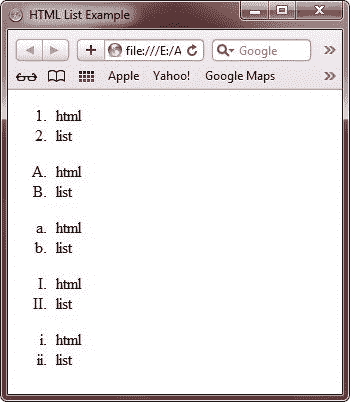
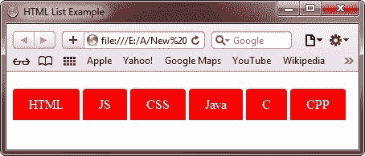

# HTML 列表

> 原文：<https://codescracker.com/html/html-lists.htm>

HTML 列表帮助我们以列表的形式显示信息。列表可以有以下三种形式:

*   有序列表
*   无序列表
*   描述列表

## HTML 有序列表

HTML 有序列表以

1.  Start the label. The following is an example of an ordered list:

1.  编码
2.  精神崩溃的人
3.  超文本标记语言
4.  目录
5.  辅导的
6.  例子

### 例子

下面是一个 HTML 列表的例子，使用 HTML 排序列表:

```
<!DOCTYPE html>
<html>
<head>
   <title>HTML Lists Example</title>
</head>
<body>

<ol>
   <li>codes</li>
   <li>cracker</li>
   <li>html</li>
   <li>list</li>
   <li>tutorial</li>
   <li>examples</li>
</ol>

</body>
</html>
```

以下是由上述 HTML 有序列表示例代码生成的示例输出:


## HTML 有序列表类型属性

可以将类型属性添加到有序列表中，以定义标记的类型。此处给出的表格列出并描述了有序列表中使用的标记类型列表。

| 类型 | 描述 |
| type="1 " | 列表项将用数字进行编号(默认) |
| type="a " | 列表项将用小写字母编号 |
| type="A " | 列表项将用大写字母编号 |
| type="i " | 列表项将用小写罗马数字进行编号 |
| type="I " | 列表项将用大写罗马数字进行编号 |

让我们来看下面的例子(全合一)来制作类型为 **1** 、 **A** 、 **a** 、 **I** 、 **i** 的标记。

```
<!DOCTYPE html>
<html>
<head>
   <title>HTML List Example</title>
</head>
<body>

<ol type="1">
   <li>html</li>
   <li>list</li>
</ol>
<ol type="A">
   <li>html</li>
   <li>list</li>
</ol>
<ol type="a">
   <li>html</li>
   <li>list</li>
</ol>
<ol type="I">
   <li>html</li>
   <li>list</li>
</ol>
<ol type="i">
   <li>html</li>
   <li>list</li>
</ol>

</body>
</html>
```

下面是上述 HTML 列表示例代码的输出示例:



## HTML 无序列表

HTML 无序列表以

*   Start the label. This is an example of an unordered list.

*   编码
*   精神崩溃的人
*   超文本标记语言
*   目录
*   辅导的
*   例子

默认情况下，列表项将用项目符号(黑色小圆圈)标记

### 例子

这是一个 HTML 无序列表的例子。

```
<!DOCTYPE html>
<html>
<head>
   <title>HTML List Example</title>
</head>
<body>

<ul>
   <li>codes</li>
   <li>cracker</li>
   <li>html</li>
   <li>list</li>
   <li>tutorial</li>
   <li>examples</li>
</ul>

</body>
</html>
```

以下是上述 HTML 无序列表示例代码的输出示例:


## HTML 无序列表样式类型属性

可以将样式属性添加到无序列表中，以定义标记的样式。下表列出并描述了 HTML 无序列表样式类型的属性。

| 风格 | 描述 |
| 列表样式类型:圆形 | 列表项将用圆圈标记 |
| 列表样式类型:光盘 | 列表项将用项目符号标记(默认) |
| 列表样式类型:方形 | 列表项将用正方形标记 |
| 列表样式类型:无 | 列表项将不会被标记 |

## HTML 将标记制作成圆盘

让我们看看下面的例子，使标记为光盘:

```
<!DOCTYPE html>
<html>
<head>
   <title>HTML List Example</title>
</head>
<body>

<ul style="list-style-type:disc">
   <li>codes</li>
   <li>cracker</li>
   <li>html</li>
   <li>list</li>
   <li>tutorial</li>
   <li>examples</li>
</ul>

</body>
</html>
```

由于这是默认的标记样式，因此您将看到与上述输出相同的输出:


## HTML 将标记制作成圆形

让我们看看下面的例子，使标记为圆:

```
<!DOCTYPE html>
<html>
<head>
   <title>HTML List Example</title>
</head>
<body>

<ul style="list-style-type:circle">
   <li>codes</li>
   <li>cracker</li>
   <li>html</li>
   <li>list</li>
   <li>tutorial</li>
   <li>examples</li>
</ul>

</body>
</html>
```

以下是上述 HTML make marker 作为圆形示例代码的示例输出:


## HTML 将标记设为方形

让我们看看下面的例子，使标记为正方形:

```
<!DOCTYPE html>
<html>
<head>
   <title>HTML List Example</title>
</head>
<body>

<ul style="list-style-type:square">
   <li>codes</li>
   <li>cracker</li>
   <li>html</li>
   <li>list</li>
   <li>tutorial</li>
   <li>examples</li>
</ul>

</body>
</html>
```

以下是上述 HTML make marker 作为方形示例代码的示例输出:


## HTML 从列表中删除标记

让我们看看下面的例子显示了如何从列表中删除标记:

```
<!DOCTYPE html>
<html>
<head>
   <title>HTML List Example</title>
</head>
<body>

<ul style="list-style-type:none">
   <li>codes</li>
   <li>cracker</li>
   <li>html</li>
   <li>list</li>
   <li>tutorial</li>
   <li>examples</li>
</ul>

</body>
</html>
```

它将显示以下结果:


## HTML 描述列表

描述列表是一个术语列表，包含每个术语的描述。

标签

定义了一个描述列表，标签

定义了术语(名称)，标签

定义了数据(描述)。

下面是一个使用 HTML 描述列表的示例:

```
<!DOCTYPE html>
<html>
<head>
   <title>HTML List Example</title>
</head>
<body>

<dl>
   <dt>html</dt>
      <dd>hyper text markup language</dd>
   <dt>list</dt>
      <dd>organized, unorganized, description list</dd>
</dl>

</body>
</html>
```

以下是上述 HTML 描述列表示例代码的输出示例:


## HTML 嵌套列表

您可以自由地将一个列表嵌套到另一个列表中，也称为嵌套列表。下面的例子展示了如何在 HTML 文档中使用嵌套列表。

```
<!DOCTYPE html>
<html>
<head>
   <title>HTML List Example</title>
</head>
<body>

<ul>
   <li>html
   <ul>
      <li>list
      <ul>
         <li>list tutorial</li>
         <li>list example</li>
      </ul>
      </li>
      <li>list tag
      <ul>
         <li>list tag tutorial</li>
         <li>list tag examples</li>
      </ul>
      </li>
   </ul>
   </li>
</ul>

</body>
</html>
```

下面是上面的 HTML 嵌套列表示例代码生成的示例输出:


## HTML 创建水平列表

您还可以使用 [CSS](/css/index.htm) 在 HTML 中创建横向列表。下面的例子展示了如何在 HTML 中创建横向列表 :

```
<!DOCTYPE html>
<html>
<head>
   <title>HTML List Example</title>
   <style>
      ul li{display:inline;}
   </style>
</head>
<body>

<ul>
   <li>codes</li> - 
   <li>cracker</li> - 
   <li>html</li> - 
   <li>list</li> - 
   <li>tutorial</li> - 
   <li>examples</li>
</ul>

</body>
</html>
```

下面是上述 HTML 水平列表示例代码的输出示例:


## HTML 创建奇特的或交互式的水平列表

通过一点点额外的[风格](/html/html-styles.htm)，你可以让列表变得更加有趣和互动。这里有一个例子展示了 如何在 HTML 中创建花哨的或者交互式的横向列表。

```
<!DOCTYPE html>
<html>
<head>
   <title>HTML List Example</title>
   <style>
      ul
      {
         padding: 0;
      }
      ul li
      {
         display: inline;
      }
      ul li a
      {
         background-color: red;
         color: white;
         padding: 10px 20px;
         text-decoration: none;
         border-radius: 4px 4px 0 0;
         line-height:50px;
      }
      ul li a:hover
      {
         background-color: white;
         color:red;
      }
   </style>
</head>
<body>

<ul>
   <li><a href="http://codescracker.com/html">HTML</a></li>
   <li><a href="http://codescracker.com/js">JS</a></li>
   <li><a href="http://codescracker.com/css">CSS</a></li>
   <li><a href="http://codescracker.com/java">Java</a></li>
   <li><a href="http://codescracker.com/c">C</a></li>
   <li><a href="http://codescracker.com/cpp">CPP</a></li>
</ul>

</body>
</html>
```

下面是上面的 HTML 花式或交互式水平列表示例代码产生的示例输出:



下面是上面花式或交互式横式列表示例代码的现场演示输出。

*   [HTML](/html/index.htm)
*   [JS](/js/index.htm)
*   [CSS](/css/index.htm)
*   [Java](/java/index.htm)
*   [C](/c/index.htm)
*   [CPP](/cpp/index.htm)

[HTML 在线测试](/exam/showtest.php?subid=4)

* * *

* * *