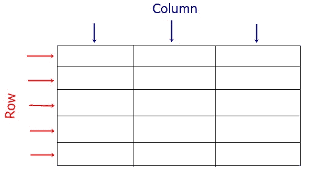

# HTML 表格|如何用 HTML 制作表格

> 原文：<https://codescracker.com/html/html-tables.htm>

本文旨在定义如何创建表格，或者简单地说，如何在 web 上插入管状数据。

## 四个 HTML 表格标签

同时在 web 上以表格的形式呈现数据。这是四个必需的标签:

1.  |  | **<表>** 创建一个表，而 **< TR >** 创建一行。要将数据包含在 表格中，您需要使用 **< TH >** 来包含表格标题，或者使用 **< TD >** 来包含普通的 表格数据。**注意-** 在创建新标签之前，不要忘记关闭标签。

    ## HTML 表格行和列表示

    使用第**个**和第**个**标签创建列。只有这两个标签用于将数据输入到 表中。这方面的例子如下。

    ## HTML 表格标签

    **<表格>** 标签用于创建表格。例如:

    ```
    <table>
    </table>
    ```

    上述 HMTL 代码的输出将是空的，因为我没有在表中包含任何数据。可以使用 **< TH >** 或 **< TD >** 标签来包含数据。

    ## HTML TR 标签

    **< TR >** 标签用于创建表格行。例如:

    ```
    <table>
       <tr>
       </tr>
    </table>
    ```

    每隔 **< TR >** 后跟 **< /TR >** 创建一行。

    ## HTML TH 标签

    **< TH >** 标签用于创建表格标题数据。例如:

    ```
    <table>
       <tr>
          <th>FirstHeading</th>
          <th>SecondHeading</th>
       </tr>
    </table>
    ```

    因为我在上面的例子中使用了第**个**标签，所以创建了列。该列用于将数据插入到 表中。因此，上述示例的输出应该是:

    ```

    &#124; 第一标题 &#124; 第二标题 &#124;

    ```

    ## HTML TD 标签

    **< TD >** 标签用于创建普通表格数据。例如:

    ```
    <table>
       <tr>
          <th>FirstHeading</th>
          <th>SecondHeading</th>
       </tr>
       <tr>
          <td>SecondRowFirstColumnData</td>
          <td>SecondRowSecondColumnData</td>
       </tr>
       <tr>
          <td>ThirdRowFirstColumnData</td>
          <td>ThirdRowSecondColumnData</td>
       </tr>
    </table>
    ```

    输出应该是:

    ```

    &#124; 第一标题 &#124; 第二标题 &#124;
    &#124; SecondRowFirstColumnData &#124; SecondRowSecondColumnData &#124;
    &#124; ThirdRowFirstColumnData &#124; ThirdRowSecondColumnData &#124;

    ```

    **注意-** 要创建更多的行，使用 **TR** 。使用 **TH** 或 **TD** 来创建更多的列。要输入 数据，使用 **TH** 或 **TD** ，如示例所示。**注意-** 要样式表，使用[样式表使用 CSS](/css/css-tables.htm) 。在那里，我定义了 所有与 HTML 表格样式相关的东西。[HTML 在线测试](/exam/showtest.php?subid=4)

    * * *

    * * *

     |