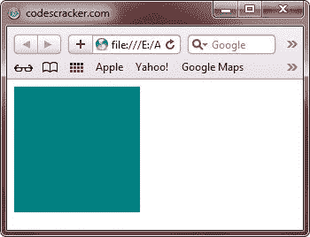

# HTML 图像

> 原文：<https://codescracker.com/html/html-images.htm>

## 在网页中插入图像

HTML 允许你借助 IMG 标签在网页中插入图像。这个标记使用几个属性，比如 src、id、lang、dir 和 alt。

**注意**——在 IMG 标签的所有属性中，只有 src 属性是必需的。

src 属性向 Web 浏览器提供有关图像文件路径的信息。如果您的图像和 HTML 文件存储在同一个文件夹中，那么没有必要在 src 属性中指定图像文件的完整路径。

如果您的图像和 HTML 文件在不同的文件夹中，您必须在 IMG 标签的 src 属性中指定图像文件的完整路径

### 在网页中插入图像的语法

以下是在网页中插入图像的语法:

```

```

### IMG 标签的属性

下表描述了 IMG 标签的属性:

| 属性 | 描述 |
| 身份证明（identification） | 为标签分配唯一的标识符。该标识符在一个文档中只能使用一次。该属性是可选的 |
| 班级 | 为标签分配一个名称或一组`class`名称。但是，一个或多个标签可以分配相同的`class` 名称。该属性是可选的 |
| 语言 | 指定用于 IMG 标记的基本语言。该属性是可选的 |
| 目录 | 为整个或部分 HTML 文件指定方向。该属性是可选的 |
| 标题 | 描述使用 IMG 标签的目的。该属性是可选的 |
| 风格 | 对 HTML 文件中的单个标记应用内联 CSS 样式。该属性是可选的 |
| 科学研究委员会 | 指定图像的 URL 或位置。该属性是强制性的 |
| 中高音 | 指定当 Web 浏览器无法呈现图像时要使用的替代文本。该属性是可选的 |
| 高度 | 指定图像的高度。该属性是可选的 |
| 宽度 | 指定图像的宽度。该属性是可选的 |
| ismap | 指示图像用作图像映射。该属性是可选的 |
| usemap | 将标签与图像映射相关联。该属性是可选的 |

## HTML alt 属性

如果图像无法显示，alt 属性指定图像的替代文本

alt 属性的值应该用文字描述图像:

```

```

**注意**:alt 属性是必需的。没有它，网页将无法正确验证

**注意**:一定要指定图像的宽度和高度。如果没有指定宽度和高度，页面将在图像加载时闪烁

## HTML 屏幕阅读器

屏幕阅读器是可以阅读屏幕上显示的内容的软件程序

在网络上使用时，屏幕阅读器可以将 HTML“复制”为文本到语音、声音图标或盲文输出

屏幕阅读器由盲人、视力受损者或学习障碍者使用

**注意**:屏幕阅读器可以读取 alt 属性

## HTML 图像大小-宽度和高度

使用 style 属性指定图像的宽度和高度

这些值以像素为单位指定(在值后使用 px)。下面是一个示例，演示了如何设置网页中图像的宽度和高度:

```
<!DOCTYPE html>
<html>
<head>
   <title>HTML Image Example</title>
</head>
<body>


</body>
</html>
```

以下是上述 HTML 图像示例代码生成的示例输出，显示了如何设置图像的宽度和高度:


下面是由上面的 HTML 图像示例程序生成的实时演示输出:


或者，您可以使用宽度和高度属性。这些值以像素为单位指定(值后没有像素)。这里有一个例子:

```

```

它将产生与上面相同的结果。

宽度、高度和样式属性在最新的 HTML5 标准中都是有效的。

我们建议您使用样式属性。它防止样式表改变图像的默认大小。这里有一个例子。

```
<!DOCTYPE html>
<html>
<head>
   <title>HTML Image Example</title>
   <style>
      img
      { 
         width:100%; 
      }
   </style>
</head>
<body>


</body>
</html>
```

下面是由上面的 HTML 图像示例代码生成的示例输出:


## HTML 图像浮动

下面的例子展示了如何在 HTML 中的网页右侧浮动一个图像:

```
<!DOCTYPE html>
<html>
<head>
   <title>HTML Image Example - Image Float</title>
</head>
<body>


</body>
</html>
```

以下是上述 HTML 图像浮动示例代码的输出示例:


## HTML 图像格式

您可以在网页中使用不同类型的图像格式。一些常用的图像格式有:

*   **GIF** -用于创建插图，如标志或漫画
*   **JPEG** -用于生成复杂图像，如照片
*   **PNG** -用于颜色数量较多的图像

所有的网络浏览器都支持 GIF 和 JPEG，而某些网络浏览器支持 PNG。

### GIF 图像格式

GIF 图像格式是在互联网发明之前为 CompuServe(一种在线信息服务)开发的。将图像转换为 GIF 格式是安全的，因为在转换过程中不会丢失任何数据。GIF 图像有以下两种类型:

*   **GIF87** -不支持图像透明和动画
*   **GIF89a** -支持图像透明和动画

这两种类型的 GIF 图像都支持 256 色，并具有。gif 文件扩展名

### JPEG 图像格式

与 GIF 相比，JPEG 支持无限数量的颜色，并且具有。jpeg 或者。jpg 扩展名。JPEG 使用一种复杂的压缩算法，称为 JPEG 算法。

您可以使用 JPEG 算法将任何图像格式转换为 JPEG 图像格式。该算法集中于各种重要的方面，例如图像的亮度和对比度。

JPEG 图像格式具有指定编解码器的特定标准，编解码器定义了将图像压缩成字节并再次将字节解压缩成图像的过程。可交换图像文件格式(EXIF)和联合图像专家组(JFIF)是 JPEG 最常用的标准。

### PNG 图像格式

PNG 图像格式具有 GIF 的所有功能。PNG 使用无损压缩算法，并支持无限数量的颜色。无损压缩算法可防止压缩图像时出现任何损失。

PNG 提供了 alpha 透明度，与 GIF 相比，它允许您拥有不同级别的不透明度。在真正的 alpha 透明度中，图像的每个像素可以与指示像素透明度的 alpha 值一起存储。可以调整 alpha 值，使 PNG 图像完全透明或完全不透明。

## HTML 图像示例

下面是一个在网页上插入图像的简单示例:

```
<!DOCTYPE html>
<html>
<body>


</body>
</html>
```

以下是上述 HTML 图像示例代码的输出示例:



[HTML 在线测试](/exam/showtest.php?subid=4)

* * *

* * *