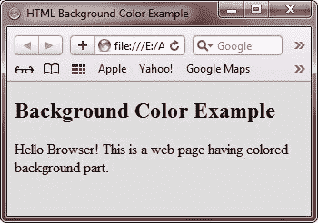
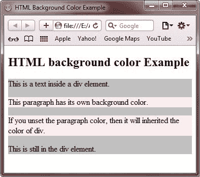
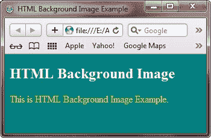

# HTML 背景

> 原文：<https://codescracker.com/html/html-backgrounds.htm>

默认情况下，您的网页背景是白色的。

HTML 提供了以下两种装饰网页背景部分的好方法。

*   用[颜色](/html/html-colors.htm)装饰 HTML 背景
*   用[图片](/html/html-images.htm)装饰 HTML 背景

## HTML 背景颜色

[背景色](/css/css-background-color.htm)属性用于控制 HTML 元素的背景，具体来说就是 页面主体和表格背景。

以下是对任何 HTML 标记使用背景色属性的语法:

```
<tagname style="background-color:color_value;">
```

background-color 属性指定元素的背景色。

您可以设置页面的背景颜色，设置如下:

```
<!DOCTYPE html>
<html>
<head>
   <title>HTML Background Color Example</title>
   <style>
      body
      {
         background-color: #dedede;
      }
   </style>
</head>
<body>

<h2>Background Color Example</h2>
<p>Hello Browser! This is a web page having colored background part.</p>

</body>
</html>
```

下面是由上面的 HTML 背景色示例代码生成的示例输出:



颜色通常由以下三种方法指定:

*   像“#ff0000”这样的十六进制值
*   像“红色”这样的颜色名称
*   类似“rgb(255，0，0)”的 RGB 值

要获取所有颜色代码，请参考 [HTML 颜色代码](/html/html-colors.htm)教程。

在下面的例子中，

## 、

和

元素有不同的背景颜色:

```
<!DOCTYPE html>
<html>
<head>
   <title>HTML Background Color Example</title>
   <style>
      h1
      {
         background-color: #dedede;
      }
      p
      {
         background-color: #ffeded;
      }
      div
      {
         background-color: #c0c0c0;
      }
   </style>
</head>
<body>

<h2>HTML background color Example</h2>
<div>
   This is a text inside a div element.
      <p>This paragraph has its own background color.</p>
      <p>If you unset the paragraph color,
         then it will inherited the color of div.</p>
   This is still in the div element.
</div>

</body>
</html>
```

以下是上面的 HTML 背景色示例代码显示的示例输出:



## HTML 背景图像

属性指定一个图像作为元素的背景。

默认情况下，图像是重复的，因此它覆盖了整个元素。您可以为页面设置背景图像，如下所示:

```
<!DOCTYPE html>
<html>
<head>
   <title>HTML Background Image Example</title>
   <style>
      body
      {
         background-image: url("imagecol.jpg");
      }
      h2
      {
         color:white;
      }
      p
      {
         color:yellow;
      }
   </style>
</head>
<body>

<h2>HTML Background Image</h2>
<p>This is HTML Background Image Example.</p>

</body>
</html>
```

以下是上述 HTML 背景图像示例代码显示的示例输出:



你可以在 [CSS 背景](/css/css-backgrounds.htm)教程中详细了解如何设置网页的不同背景。

[HTML 在线测试](/exam/showtest.php?subid=4)

* * *

* * *