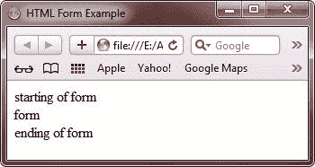
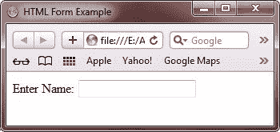
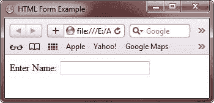
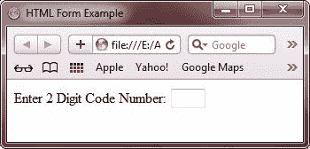
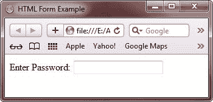
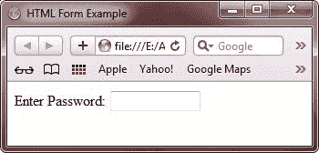
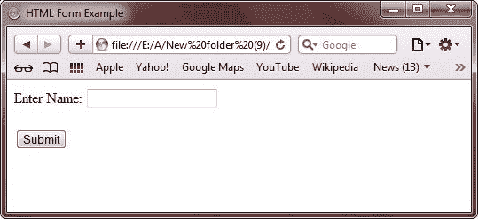
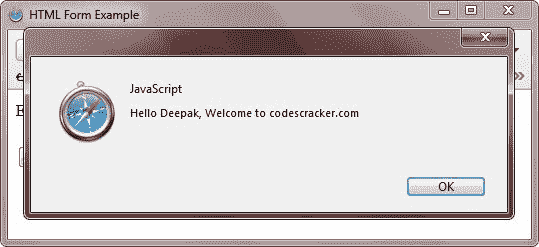
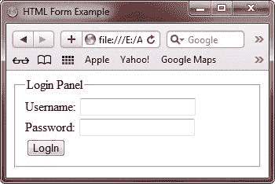

# HTML 表单

> 原文：<https://codescracker.com/html/html-forms.htm>

在这里，你将学习所有关于 HTML 表单处理的例子。HTML 表单提供用户与网站的交互。

有时候，你需要开发一个需要用户交互的网站。例如，您需要开发一个铁路网站，允许用户在互联网上查看火车的到达或出发状态。该网站使用注册或登录表单来收集用户信息，并将信息提交给服务器进行进一步处理。这些类型的表单提供了网站和用户在互联网上交互的媒介。

表单是网页的一个区域，它允许用户以各种方式提供他们的信息，例如通过输入文本字段或从提供的列表中选择一个或多个可用选项。

HTML 使您能够通过使用 form 标记在网页中添加表单。在网页上添加表单后，可以使用各种标记在表单上添加各种控件，如按钮和文本字段。这些元素的一些例子是[输入](/html/html-input-element-types.htm)、[按钮](/html/html-button-elements.htm)、 、[文本区](/html/html-textarea-label-elements.htm)和[数据列表](/html/html-datalist-element.htm)。

INPUT 标记允许您输入不同类型的值，例如日期、时间和电子邮件地址。BUTTON 标记使您能够添加按钮，如表单上的 submit 和 cancel 按钮，以提交或取消表单的详细信息。TEXTAREA 标签使您能够在提供的区域中输入文本。DATALIST 标记允许您通过提供一组预定义的值在文本字段中输入文本。

您将在单独的教程中学习所有关于表单处理的内容:

*   [表单标签](/html/html-form-elements.htm)
*   [输入标签类型](/html/html-input-element-types.htm)
*   [按钮标签](/html/html-button-elements.htm)
*   [多选标签](/html/html-multiple-choice-elements.htm)
*   [选择标签](/html/html-select-element.htm)
*   [选项标签](/html/html-option-element.htm)
*   [Optgroup 标签](/html/html-optgroup-element.htm)
*   [文本区和标签标记](/html/html-textarea-label-elements.htm)
*   [字段集和图例标签](/html/html-fieldset-legend-elements.htm)
*   [数据表标签](/html/html-datalist-element.htm)
*   [密钥生成标签](/html/html-keygen-element.htm)
*   [输出标签](/html/html-output-element.htm)
*   [流程标签](/html/html-progress-element.htm)
*   [仪表标签](/html/html-meter-element.htm)
*   [提交表格](/html/html-form-submitting.htm)
*   [enctype 属性](/html/html-enctype-attribute.htm)
*   [动作属性](/html/html-action-attribute.htm)
*   [方法属性](/html/html-method-attribute.htm)
*   [获取方法](/html/html-get-method.htm)
*   [发布方法](/html/html-post-method.htm)

## HTML 表单示例

这里有一些 HTML 中表单处理的例子。

## HTML 表单示例 1

下面是一个关于 HTML 表单的例子:

```
<!DOCTYPE HTML>
<html>
<head>
   <title>HTML Form Example</title>
</head>
<body>

starting of form
<form>
   form
</form>
ending of form

</body>
</html>
```

以下是上述 HTML 表单示例的输出:



下面是由上面的 HTML 表单示例代码生成的实时演示输出。

starting of form

<form>form</form>

ending of form

## HTML 表单示例 2

这是另一个 HTML 表单的例子。

```
<!DOCTYPE HTML>
<html>
<head>
   <title>HTML Form Example</title>
</head>
<body>

<form>
   Enter Name: <input>
</form>

</body>
</html>
```

以下是上述 HTML 表单示例的输出:



下面是上面 HTML 表单示例的实时演示输出。

<form>Enter Name: <input></form>

## HTML 表单示例 3

下面是 HTML 表单的另一个例子:

```
<!DOCTYPE HTML>
<html>
<head>
   <title>HTML Form Example</title>
</head>
<body>

<form>
   Enter Name: <input type="text" name="name">
</form>

</body>
</html>
```

以下是上述 HTML 表单示例的输出:



下面是上面 HTML 格式的表单处理示例的实时演示输出:

<form>Enter Name: <input type="text" name="name"></form>

## HTML 表单示例 4

下面是 HTML 中的另一个表单处理示例:

```
<!DOCTYPE HTML>
<html>
<head>
   <title>HTML Form Example</title>
</head>
<body>

<form>
   Enter 2 Digit Code Number: <input type="text" name="code" size="2" maxlength="2">
</form>

</body>
</html>
```

上述 HTML 表单处理示例代码将产生以下输出:



这是上述表单处理示例代码的实时演示输出。

<form>Enter 2 Digit Code Number: <input type="text" name="code" size="2" maxlength="2"></form>

## HTML 表单示例 5

```
<!DOCTYPE HTML>
<html>
<head>
   <title>HTML Form Example</title>
</head>
<body>

<form>
   Enter Password: <input type="password">
</form>

</body>
</html>
```

这是上面 HTML 表单示例的输出:



下面是上述表单示例代码的演示输出。

<form>Enter Password: <input type="password"></form>

## HTML 表单示例 6

让我们再举一个关于表单处理的例子。

```
<!DOCTYPE HTML>
<html>
<head>
   <title>HTML Form Example</title>
</head>
<body>

<form>
   Enter Password: <input type="password" name="passw" size="12" maxlength="12">
</form>

</body>
</html>
```

上述表单处理示例代码将产生以下输出:



下面是上面的 HTML 表单示例生成的演示输出:

<form>Enter Password: <input type="password" name="passw" size="12" maxlength="12"></form>

## HTML 表单示例 7

下面是另一个关于表单处理的例子。

```
<!DOCTYPE HTML>
<html>
<head>
   <title>HTML Form Example</title>
</head>
<body>

<form>
   Enter Name: <input type="text" id="name" /><br/>
   <input type="hidden" id="country" value="codescracker.com" /><br/>
   <input type="submit" onclick="alert('Hello ' + 
   document.getElementById('name').value + ', Welcome to ' + 
   document.getElementById('country').value)" value="Submit">
</form>

</body>
</html>
```

以下是上述 HTML 表单示例的输出:



现在，输入你的名字。这里我要输入名字， **Deepak** 。输入姓名后，按回车键或点击**提交**或 按钮。然后，您将看到以下输出:



以下是上述 HTML 格式的表单示例代码的实时演示输出:

<form>Enter Name: <input type="text" id="name">
<input type="hidden" id="country" value="codescracker.com">
<input type="submit" onclick="alert('Hello ' + 
   document.getElementById('name').value + ', Welcome to ' + 
   document.getElementById('country').value)" value="Submit"></form>

## HTML 表单示例 8

下面是 HTML 中表单处理的另一个例子。

```
<!DOCTYPE HTML>
<html>
<head>
   <title>HTML Form Example</title>
</head>
<body>

<form>
   <fieldset>
      <legend>Login Panel</legend>
      <label>
         Username: <input type="text">
      </label>
      <br/>
      <label>
         Password: <input type="password">
      </label>
      <br/>
      <label>
         <input type="submit" name="submit" value="LogIn">
      </label>
   </fieldset>
</form>

</body>
</html>
```

下面是上面的 HTML 表单处理示例产生的输出:



这是上面表单示例代码的实时演示输出。

<form>

<fieldset><legend>Login Panel</legend> <label>Username: <input type="text"></label> 
<label>Password: <input type="password"></label> 
<label><input type="submit" name="submit" value="LogIn"></label> </fieldset>

</form>

[HTML 在线测试](/exam/showtest.php?subid=4)

* * *

* * *