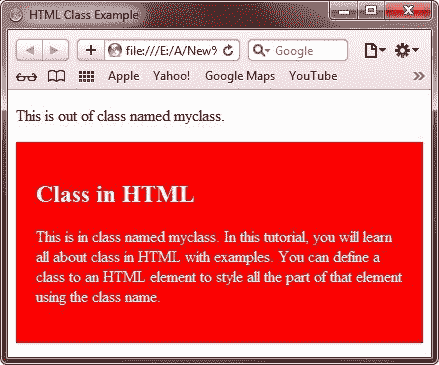
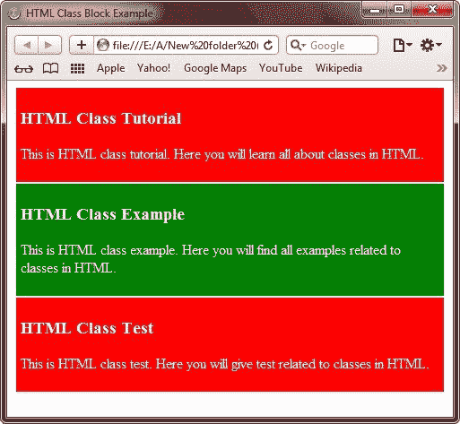

# HTML 类

> 原文：<https://codescracker.com/html/html-classes.htm>

HTML 中的类用于定义 HTML 元素的类，并使用 [CSS](/css/index.htm) 对该元素的类进行样式化。

对 HTML 元素进行分类，使得为特定的元素类定义 CSS 样式成为可能。

同等阶级的同等风格，或者不同阶级的不同风格。

## HTML 类示例

这是一个 HTML 中的类的例子。

```
<!DOCTYPE html>
<html>
<head>
   <title>HTML Class Example</title>
   <style>
      .myclass{background-color:red; color:white; padding:20px;}
   </style>
</head>
<body>

<p>This is out of class named myclass.</p>
<div class="myclass">
   <h2>Class in HTML</h2>
   <p>This is in class named myclass. In this tutorial, you will learn all about class in HTML
   with examples. You can define a class to an HTML element to style all the part of that element
   using the class name.</p>
</div> 

</body>
</html>
```

以下是上述 HTML 类示例代码生成的示例输出:



## HTML 类块

HTML

元素是一个块级元素。它可以用作其他 HTML 元素的容器。

分类

元素。这是一个 HTML 中的类块的例子。

```
<!DOCTYPE html>
<html>
<head>
   <title>HTML Class Block Example</title>
   <style>
      .myclass2{background-color:red; color:white; margin:2px; padding:5px;}
      .myclass3{background-color:green; color:white; margin:2px; padding:5px;}
   </style>
</head>
<body>

<div class="myclass2">
   <h3>HTML Class Tutorial</h3>
   <p>This is HTML class tutorial. Here you will learn all about classes in HTML.</p>
</div> 
<div class="myclass3">
   <h3>HTML Class Example</h3>
   <p>This is HTML class example. Here you will find all examples related to classes in HTML.</p>
</div> 
<div class="myclass2">
   <h3>HTML Class Test</h3>
   <p>This is HTML class test. Here you will give test related to classes in HTML.</p>
</div> 

</body>
</html>
```

下面是上面的 HTML 类块示例代码生成的示例输出:



你也可以学习关于内联 HTML 元素分类的教程。在本教程的最后，你会发现关于内联 HTML 元素的分类。

[HTML 在线测试](/exam/showtest.php?subid=4)

* * *

* * *