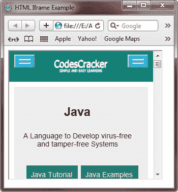
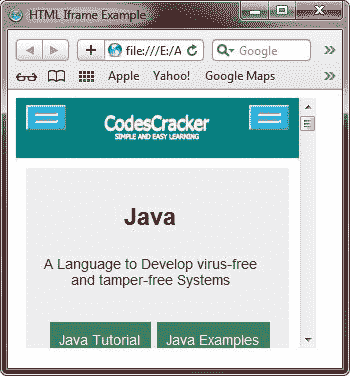
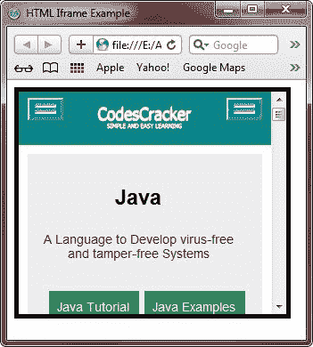
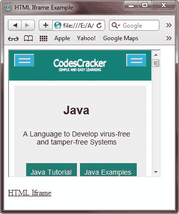
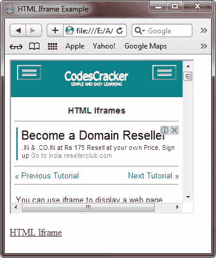

# HTML Iframes

> 原文：<https://codescracker.com/html/html-iframes.htm>

您可以使用 iframe 像这样在网页中显示网页。

<iframe style="width:300px;height:250px;" src="http://codescracker.com">&#13; &#13; <h2>在 HTML 中创建 Iframe</h2>&#13; 
下面是在 HTML 中创建一个 iframe 的一般形式，用来在一个网页中包含一个网页。
&#13; 
&#13; <pre>&lt;iframe src="URL"&gt;&lt;/iframe&gt;</pre>&#13; 
&#13; 
这里，src 属性表示 iframe 页面的 URL(网址)。
&#13; &#13; <h2>设置 Iframe 的高度和宽度</h2>&#13; 
要设置 iframe 的高度和宽度，只需使用 height 和 width 属性来指定大小。下面的例子展示了如何设置网页中 iframe 的高度和宽度。
&#13; 
&#13; <pre>&lt;!DOCTYPE html&gt;&#13; &lt;html&gt;&#13; &lt;head&gt;&#13; &lt;title&gt;HTML Iframe Example&lt;/title&gt;&#13; &lt;/head&gt;&#13; &lt;body&gt;&#13; &#13; &lt;iframe src="http://codescracker.com" width="300px" height="250"&gt;&lt;/iframe&gt;&#13; &#13; &lt;/body&gt;&#13; &lt;/html&gt;</pre>&#13; 
&#13; 
下面是上面的 HTML iframe 示例代码生成的示例输出:
&#13; 
&#13; &#13; 
&#13; 
下面是上面的 iframe HTML 示例的实时演示输出。
&#13; <iframe src="/index.htm" width="300" height="250"/>&#13; &#13; <h2>移除 Iframe 的边框</h2>&#13; 
要移除 iframe 的边框，只需添加 style 属性并使用<a href="/css/css-border.htm"> CSS border </a>属性。&#13;这个例子展示了如何在 HTML 中移除 iframe 的边框。
&#13; 
&#13; <pre>&lt;!DOCTYPE html&gt;&#13; &lt;html&gt;&#13; &lt;head&gt;&#13; &lt;title&gt;HTML Iframe Example&lt;/title&gt;&#13; &lt;/head&gt;&#13; &lt;body&gt;&#13; &#13; &lt;iframe src="http://codescracker.com" width="300" height="250" style="border:none"&gt;&lt;/iframe&gt;&#13; &#13; &lt;/body&gt;&#13; &lt;/html&gt;</pre>&#13; 
&#13; 
上述 HTML iframe 示例代码将产生如下输出:
&#13; 
&#13; &#13; 
&#13; 
下面是上面 HTML iframe 示例代码的实时演示输出。
&#13; <iframe src="http://codescracker.com" width="300" height="250" style="border:none"/>&#13; &#13; <h2>HTML Iframe 示例</h2>&#13; 
这里还有一些关于 HTML 中 iframe 的例子。使用 CSS，你还可以改变 iframe 边框的大小、样式和颜色。
&#13; 
您可以使用 CSS 使 iframe 更具交互性。下面的例子展示了如何在 HTML 中创建交互式 iframe。
&#13; 
&#13; <pre>&lt;!DOCTYPE html&gt;&#13; &lt;html&gt;&#13; &lt;head&gt;&#13; &lt;title&gt;HTML Iframe Example&lt;/title&gt;&#13; &lt;/head&gt;&#13; &lt;body&gt;&#13; &#13; &lt;iframe src="http://codescracker.com" width="300" height="250" style="border:5px solid black"&gt;&lt;/iframe&gt;&#13; &#13; &lt;/body&gt;&#13; &lt;/html&gt;</pre>&#13; 
&#13; 
下面是由上面的 HTML 交互式 iframe 示例代码生成的示例输出:
&#13; 
&#13; &#13; 
&#13; 
下面是上面交互式 iframe 示例代码的 HTML 实时演示输出:
&#13; <iframe src="http://codescracker.com" width="300" height="250" style="border:5px solid black"/>&#13; &#13; <h2>使用 iframe 作为链接的目标</h2>&#13; 
您还可以使用 iframe 作为 HTML 中链接的目标。换句话说，iframe 也可以用作特定链接的目标框架。下面的例子展示了如何使用 iframe 作为链接的目标。
&#13; 
&#13; <pre>&lt;!DOCTYPE html&gt;&#13; &lt;html&gt;&#13; &lt;head&gt;&#13; &lt;title&gt;HTML Iframe Example&lt;/title&gt;&#13; &lt;/head&gt;&#13; &lt;body&gt;&#13; &#13; &lt;iframe width="300px" height="250px" src="http://codescracker.com" name="my_iframe"&gt;&lt;/iframe&gt;&#13; &lt;p&gt;&lt;a href="http://codescracker.com/html/html-iframes.htm" target="my_iframe"&gt;HTML Iframe&lt;/a&gt;&lt;/p&gt;&#13; &#13; &lt;/body&gt;&#13; &lt;/html&gt;</pre>&#13; 
&#13; 
当链接的目标与 iframe 的名称匹配时，链接将在该 iframe 中打开。这里我们已经创建了一个名为<b> my_iframe </b> &#13;的 iframe，然后创建了一个指向名为<b> my_iframe </b>的 iframe 的链接。因此，当你点击<b> HTML Iframe </b>链接时，你的&#13;网页(HTML Iframe)将在名为<b> my_iframe </b>的 Iframe 中打开。下面是上面的 HTML iframe 示例&#13;代码产生的初始输出。
&#13; 
&#13; &#13; 
&#13; 
现在点击<b> HTML Iframe </b>链接，该链接将在名为<b> my_iframe </b>的目标 Iframe 中打开，下面是在<b> HTML Iframe </b>链接上点击&#13;后的输出:
&#13; 
&#13; &#13; 
&#13; 
下面是上面的 iframe 示例代码以 HTML 格式生成的针对链接的实时演示输出:
&#13; <iframe width="300" height="250" src="http://codescracker.com" name="my_iframe"/>&#13; 
<a href="http://codescracker.com/html/html-iframes.htm" target="my_iframe"> HTML Iframe </a>
&#13; &#13; 
<a href="/exam/showtest.php?subid=4"> HTML 在线测试</a>

 &#13; &#13;  
&#13; &#13; &#13; </body> </html></iframe>