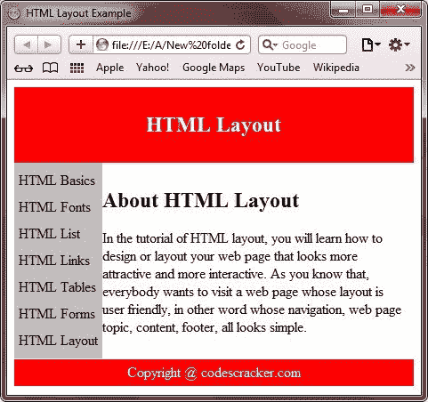
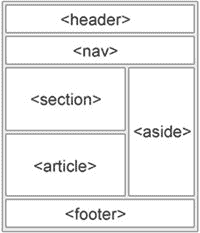
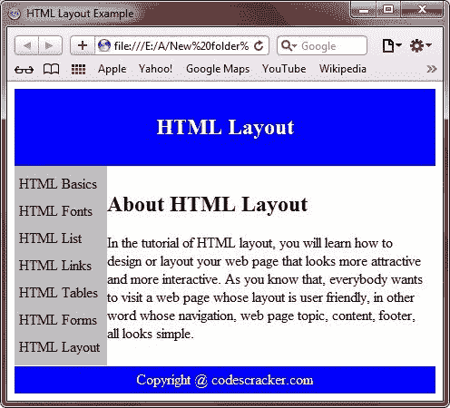
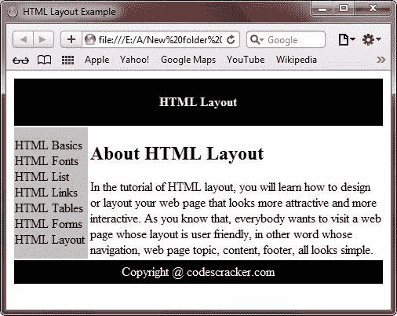

# HTML 布局

> 原文：<https://codescracker.com/html/html-layouts.htm>

你可以用一种看起来更有吸引力/交互性和用户友好(易于导航)的方式来布局你的网页。

网站通常在多个栏目中显示内容(如杂志或报纸)，看起来更花哨，更具互动性。

## HTML 布局

*   [HTML 基础知识](/html/html-fundamentals.htm)
*   [HTML Fonts](/html/html-fonts.htm)
*   [HTML 标题](/html/html-headings.htm)
*   [HTML 段落](/html/html-paragraphs.htm)
*   [HTML 基本标签](/html/html-basic-tags.htm)
*   [HTML 列表](/html/html-lists.htm)
*   [HTML 链接](/html/html-links.htm)
*   [HTML 表格](/html/html-tables.htm)
*   [HTML 颜色代码](/html/html-colors.htm)
*   [HTML 表单](/html/html-forms.htm)
*   [HTML 布局](/html/html-layouts.htm)
*   [HTML 响应](/html/html-responsive.htm)
*   [HTML 在线测试](/exam/showtest.php?subid=4)

## 关于 HTML 布局

在 HTML 布局教程中，你将学习如何设计或布局你的网页，使其看起来更有吸引力，更具互动性。众所周知，每个人都想访问一个布局友好的网页，换句话说，它的导航、网页主题、内容、页脚看起来都很简单。

为了吸引用户，你必须使你的网页的导航菜单、主题名称、内容或文章以及页脚看起来对用户友好。

版权所有@ codescracker.com

## 使用标签的 HTML 布局

下面的例子展示了如何使用 div 标签来布局你的网页。

```
<!DOCTYPE html>
<html>
<head>
   <title>HTML Layout Example</title>
   <style>
      #header { background-color:red; color:white; text-align:center; padding:10px; }
      #nav { line-height:30px; background-color:silver; height:210px; width:20%;
      float:left; padding:5px; }
      #section { width:80% float:left; padding:10px; }
      #footer { background-color:red; color:white; clear:both; text-align:center;
      padding:5px; }
   </style>
</head>
<body>

<div id="header">
   <h2>HTML Layout</h2>
</div>
<div id="nav">
   HTML Basics<br/>
   HTML Fonts<br/>
   HTML List<br/>
   HTML Links<br/>
   HTML Tables<br/>
   HTML Forms<br/>
   HTML Layout<br/>
</div>
<div id="section">
   <h2>About HTML Layout</h2>
   <p>In the tutorial of HTML layout, you will learn how to design or layout your web page
   that looks more attractive and more interactive. As you know that, everybody wants to visit a
   web page whose layout is user friendly, in other word whose navigation, web page topic, content,
   footer, all looks simple.</p>
</div>
<div id="footer">
   Copyright @ codescracker.com
</div>

</body>
</html>
```

以下是由上述 HTML 布局示例代码生成的示例输出:



## 使用 HTML5 的网站布局

HTML5 提供了新的语义标签来定义网页的不同部分，如下图所示。



下表描述了上图中显示的所有标签。

| 标签 | 描述 |
| 

<header></header>

 | 定义文档或节的标题 |
| 

<nav></nav>

 | 定义导航链接的容器 |
|  | 定义文档中的节 |
|  | 定义一个独立的自包含项目 |
|  | 定义内容之外的内容(像侧边栏) |
|  | 定义文档或节的页脚 |

这里有一个例子，展示了如何使用新的 HTML5 语义标签来布局你的网页。

```
<!DOCTYPE html>
<html>
<head>
   <title>HTML Layout Example</title>
   <style>
      header { background-color:blue; color:white; text-align:center; padding:10px; }
      nav { line-height:30px; background-color:silver; height:210px; width:20%;
      float:left; padding:5px; }
      section { width:80% float:left; padding:10px; }
      footer { background-color:blue; color:white; clear:both; text-align:center;
      padding:5px; }
   </style>
</head>
<body>

<header>
   <h2>HTML Layout</h2>
</header>
<nav>
   HTML Basics<br/>
   HTML Fonts<br/>
   HTML List<br/>
   HTML Links<br/>
   HTML Tables<br/>
   HTML Forms<br/>
   HTML Layout<br/>
</nav>
<section>
   <h2>About HTML Layout</h2>
   <p>In the tutorial of HTML layout, you will learn how to design or layout your web page
   that looks more attractive and more interactive. As you know that, everybody wants to visit a
   web page whose layout is user friendly, in other word whose navigation, web page topic, content,
   footer, all looks simple.</p>
</section>
<footer>
   Copyright @ codescracker.com
</footer>

</body>
</html>
```

以下是上述 HTML 布局示例代码的输出示例:



## 使用表格的 HTML 布局

下面是另一个例子，展示了如何使用[表格](/html/html-tables.htm)来布局你的网页。

```
<!DOCTYPE html>
<html>
<head>
   <title>HTML Layout Example</title>
</head>
<body>

<table class="layout_using_table">
<tr>
   <th colspan="2" style="background-color:black;color:white;padding:20px;">HTML Layout</th>
</tr>
<tr>
   <td style="width:20%;background-color:silver;">HTML Basics<br/>HTML Fonts<br/>
   HTML List<br/>HTML Links<br/>HTML Tables<br/>HTML Forms<br/>HTML Layout</td>
   <td style="width:80%;background-color:white;"><h2>About HTML Layout</h2>
   In the tutorial of HTML layout, you will learn how to design or layout your web page
   that looks more attractive and more interactive. As you know that, everybody wants
   to visit a web page whose layout is user friendly, in other word whose navigation,
   web page topic, content, footer, all looks simple.</td>
</tr>
<tr>
   <td colspan="2" style="background-color:black;color:white;text-align:center;
   padding:5px;">Copyright @ codescracker.com</td>
</tr>
</table>

</body>
</html>
```

上述 HTML 布局示例代码将产生如下输出:



[HTML 在线测试](/exam/showtest.php?subid=4)

* * *

* * *