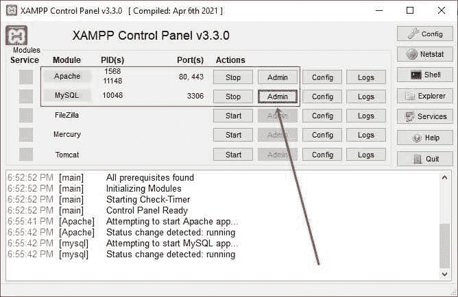
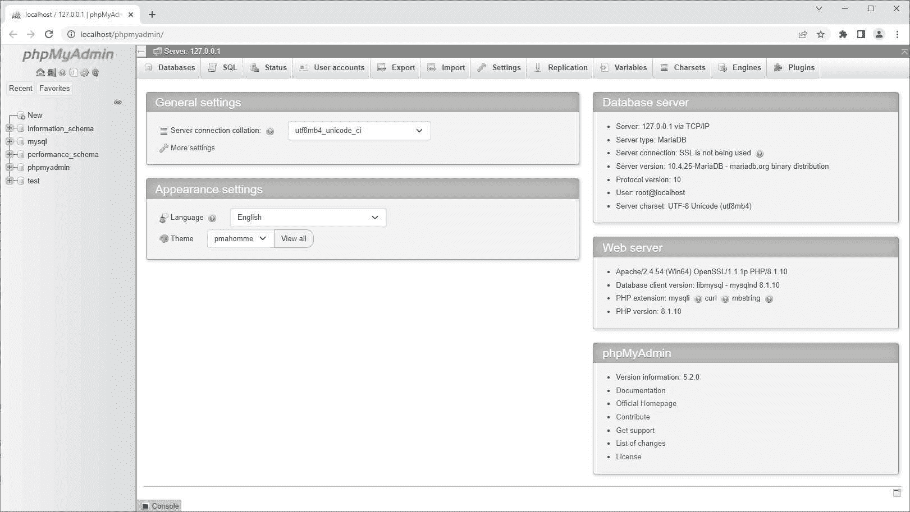
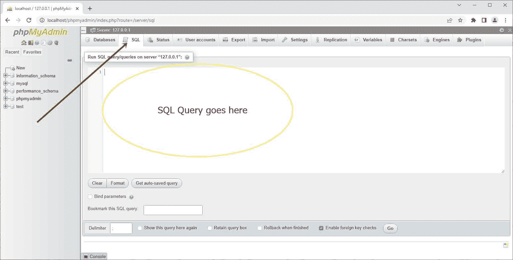
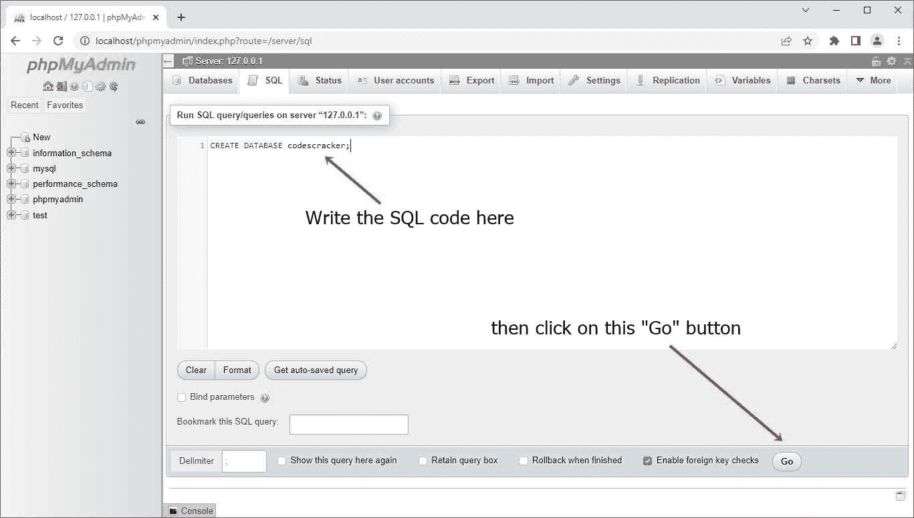
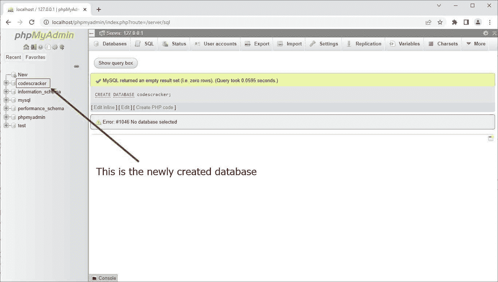
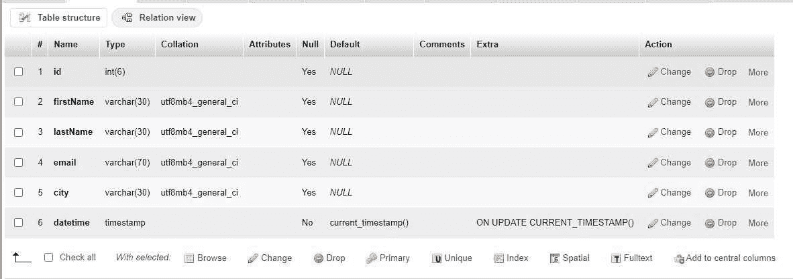
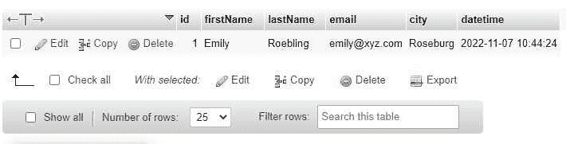
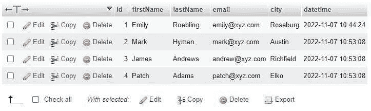

# 带示例的 SQL 教程

> 原文：<https://codescracker.com/sql/index.htm>

嘿，伙计们，我是戴夫，我是你们的 SQL 讲师。我将教你 SQL 的所有基础知识，比如你如何使用这种数据库语言来插入、更新、检索和删除数据库中的数据。但是在我们开始之前，我想告诉您一些关于 SQL 的重要细节。所以没有任何延迟，让我们开始吧😊。

## SQL 简介

SQL 代表“结构化查询语言”，最初被称为“SEQUEL”，是“结构化英语查询语言”的缩写，是一种用于存储、管理、操作和检索数据库数据的语言。

SQL 是由 IBM 的两位研究人员设计的，他们的名字是唐纳德·d·钱伯林和雷蒙德·f·博伊斯。SQL 是一种非常古老的语言，因为它在 1974 年首次出现，差不多有 50 年了，但它仍然是一种强大的💪和广泛使用的数据库语言。

让我与你分享一个可爱的 SQL 记忆:1970 年，甲骨文公司看到了潜力，并制作了自己的基于 SQL 的 RDBMS，出售给美国海军、中央情报局和其他重要的政府机构。

SQL 是一种非常容易学习的语言。我的意思是，它花更少的时间来学习，并提高你在 it 领域的技能。简而言之，学习 SQL 意味着花更少的时间获得更多。因此，与其浪费时间去学习一门占用你大量关键时间并带来不可预知结果的语言，不如学习 SQL，并自信地将这门语言添加到你的简历中。

掌握 SQL 技能会让你成为更好的后端程序员。你掌握的 SQL 技能越多，你就会成为越好的后端程序员👍。

创建、插入、选择、更新和删除是 SQL 可以对数据库做的五件最重要的事情。现在不用担心；您将在本教程的后面部分了解它。

现在我觉得这些知识已经足够开始学习 SQL 了。因为我相信编码和实际工作，而不是信息和理论知识。还有一件事。这篇全面的 SQL 教程中的所有代码和信息都是针对 MySQL 的。

## 设置 SQL 以实际学习它

在我真正开始编写和教您 SQL 查询之前，我们需要首先设置环境。现在让我告诉您为 SQL 设置环境的最简单的方法，这样您就可以立即进行设置，并通过自己编写和实现代码开始实际学习 SQL。

从网上下载一款名为“XAMPP”的软件，安装在你的电脑系统上。安装完成后，打开它。现在点击 Apache 和 MySQL 旁边的两个“开始”按钮，然后点击 MySQL 旁边的“管理”按钮。这里有一个快照供您理解:



单击“Admin”按钮后，软件会将您重定向到默认的 web 浏览器，并带您进入 phpMyAdmin 页面，该页面位于“http://localhost/phpmyadmin/”这里有一个快照供您理解。



你点击“SQL”链接，它作为导航出现在窗口的顶部。这是吸引你注意力的快照。此快照还显示了单击“SQL”部分或按钮后屏幕将如何变化。现在，您所有的 SQL 命令或代码都将写入这个白色窗口，一直到文本“在服务器“127.0.0.1”上运行 SQL 查询”



现在我们开始吧。现在一切都准备好了😋；让我们也通过做实际工作，一步一步地开始编码或学习 SQL。

因为在我们开始执行 SQL 查询来实际学习 SQL 之前，我们需要一个数据库，然后在其中创建一个表。那么，我们为什么不从用于创建数据库和表的 SQL 命令开始呢？

## 用 SQL 创建数据库

CREATE DATABASE 命令用于创建数据库。下面是创建数据库的一般形式。

```
CREATE DATABASE database_name;
```

例如，下面的 SQL 代码将创建一个名为“codescracker”的数据库。

```
CREATE DATABASE codescracker;
```

现在，在我已经提到的白色窗口中编写上述 SQL 语句，并单击“Go”按钮执行 SQL 查询或代码。这里有一个快照供您理解。



编写上述 SQL 语句并单击“Go”按钮后，您将创建一个名为“codescracker”的新数据库。单击“Go”按钮后，您将看到以下示例窗口:



你看 SQL 有多简单。也就是说，当我们需要创建一个数据库时，完成这项工作的 SQL 代码是“CREATE DATABASE name”这就像我用英语给一个人写信来创建一个数据库。

我们有一个数据库来工作。现在是时候在里面做一张桌子了。但是，因为表是由行和列组成的，正如我们所知道的，一些列可以保存 char 类型的值，如姓名和城市，而其他列可以保存 int 类型的值，如 id、卷号等。并且，在我们可以在列中存储这些类型的值之前，我们必须首先定义它的类型。因此，在使用 SQL 创建表之前，最好先理解 SQL 中使用的各种类型的数据。

## SQL 中的数据类型

因为 SQL 支持广泛的数据类型，所以我们将只讨论最重要和最常用的数据类型。我认为不值得浪费时间讨论那些很少用到的数据。

因此，让我列出 SQL 中最重要和最常用的数据类型及其范围。因此，我为您创建了一个列出重要数据类型的表，如下所示。

| 数据类型 | 范围 | 储存什么？ |
| 茶 | 0 到 255 | 线 |
| 可变长字符串 | 0 到 65，535 | 线 |
| 文本 | 0 到 65，535 | 线 |
| 中文字 | 0 到 16，777，215 | 线 |
| 长文本 | 0 到 4，294，967，295 | 线 |
| TINYINT | -128 到 127(有符号)或 0 到 255(无符号) | 整数 |
| 布尔 | 对还是错 | 布尔值。在其中插入 0 将被视为假，而其他将被视为真 |
| 斯莫列特 | -32，768 到 32，767(有符号)或 0 到 65，535(无符号) | 整数 |
| 中位 | -32，768 到 32，767(有符号)或 0 到 65，535(无符号) | 整数 |
| （同 Internationalorganizations）国际组织 | -2，147，483，648 到 2，147，483，647(有符号)或 0 到 42，949，672，95(无符号) | 整数 |
| 比吉斯本 | -9，223，372，036，854，775，808 至 9，223，372，036，854，775，807(签名)或 0 至 18，446，744，073，709，551，615(签名) | 整数 |
| 日期 | 1000-01-01 转 9999-12-31 | 约会。格式:年-月-日 |
| 日期时间 | 1000-01-01 00:00:00 至 9999-12-31 23:59:59 | 日期和时间。格式:YYYY-MM-DD hh:mm:ss |
| 时间戳 | 1970-01-01 00:00:01 至 2038-01-09 03:14:07 | 自动初始化当前日期和时间 |
| 时间 | -838:59:59 至 838:59:59 | 时间。格式:时:分:秒 |
| 年 | 1901 年至 2155 年 | 年 |

在定义列的数据类型时，还需要定义 size 参数，该参数用于指定列可以容纳该特定类型值的最大长度。下面是允许定义 size 参数的数据类型列表。

*   字符(大小)
*   VARCHAR(大小)
*   文本(大小)
*   TINYINT(尺寸)
*   斯莫列特(尺寸)
*   中等(大小)
*   INT(大小)
*   BIGINT(大小)

例如，如果我们需要定义一个名为“username”的列，它可以保存“VARCHAR”类型的值，最大长度或大小为 50 个字符，因此，下面是您需要编写的 SQL 代码:

```
username varchar(50)
```

现在，我认为是时候用 SQL 代码创建一个表了。那么我们还在等什么呢？让我们在下一节☺.中开始创建表

## 用 SQL 创建一个表

用 SQL 创建一个表看起来类似于用 SQL 创建一个数据库。唯一的区别是，由于表包含一个或多个列，我们需要编写一些额外的 SQL 代码，用于在表中插入列。在编写实际的 SQL 代码来创建表之前。让我来写用 SQL 创建表的一般形式。

```
CREATE TABLE tableName (
   column1Name column1DataType,
   column2Name column2DataType,
   column3Name column3DataType,
   .
   .
   .
   columnNName columnNDataType
);
```

例如:

```
CREATE TABLE customer (
    id int(6),
    firstName varchar(30),
    lastName varchar(30),
    email varchar(70),
    city varchar(30),
    datetime timestamp
);
```

执行这段 SQL 代码后，您将在数据库中有一个新创建的表。在那个白盒中编写或执行这个 SQL 代码的复制和粘贴工作之前，我已经提到了在哪里编写 SQL 代码以及在哪里单击“Go”按钮来执行代码，请确保单击“codescracker”数据库或您需要在其中创建表的数据库。

现在，这是在执行上述 SQL 程序或代码之后新创建的表。



成功创建了表，但是缺少了一些东西，那就是我们需要添加一个主键，这个主键可以用来通过主键唯一地验证表中的每一行。因此，要使“id”成为表的主键，您需要在创建表时执行这个 SQL 查询，而不是上面的查询。还有一件事，因为“id”列，我将它设置为唯一标识每一行的主键，并且因为我希望该列自动填充它的值，比如从 1 开始，每次向表中添加一个新行时就增加 1。因此，需要在“id int(6)”之后添加一个 SQL 代码“AUTO_INCREMENT”

```
CREATE TABLE customer (
    id int(6) AUTO_INCREMENT,
    firstName varchar(30),
    lastName varchar(30),
    email varchar(70),
    city varchar(30),
    datetime timestamp,
    PRIMARY KEY (id)
);
```

现在，如果您想要一个在填充新行时总是需要或要求一个值的列，那么您可以以这种方式用“NOT NULL”关键字定义该列。

```
id int(6) NOT NULL AUTO_INCREMENT,
```

或者

```
email varchar(70) NOT NULL,
```

别担心，你在一个一个学习 SQL 的同时，一定能理解所有这些代码。

## 用 SQL 将数据插入表中

因为已经创建了名为“customer”的表。所以现在是时候向其中插入或输入一些数据了。要使用 SQL 将数据插入表中，您需要遵循以下通用格式:

```
INSERT INTO tableName (column1Name, column2Name, column3Name, ..., columnNName)
VALUES (column1Value, column2Value, column3Value, ..., columnNValue);
```

下面是将数据插入表中的实际 SQL 代码。

```
INSERT INTO customer (firstName, lastName, email, city)
VALUES ('Emily', 'Roebling', 'emily@xyz.com', 'Roseburg');
```

请不要将数据插入一个设置为自动递增的列，就像我定义的“id”列一样。因此，在将数据插入到表中时，我不会包含该列。另外，我没有包括“datetime”列，因为该列被定义为一个*时间戳*， ，当插入新行时，它会自动插入当前日期和时间。现在这里是我的表在执行上述 SQL 查询后的快照。



因为我通过上面给出的 SQL 查询将数据插入表中的当前日期和时间是 2022 年 11 月 7 日，时间是上午 10:44，所以“datetime”具有自动插入的值，即插入行的日期和时间。

如果您想一次插入多行，例如，一次插入三行，那么您需要遵循以下 SQL 查询:

```
INSERT INTO customer (firstName, lastName, email, city)
VALUES ('Mark', 'Hyman', 'mark@xyz.com', 'Austin'),
('James', 'Andrews', 'andrew@xyz.com', 'Richfield'),
('Patch', 'Adams', 'patch@xyz.com', 'Elko');
```

下面是执行这个 SQL 查询后的新的表快照。



好消息是我们现在有了一个数据库和一个表，还有一些之前插入的数据。因此，现在是开始探索更多关于 SQL 的知识的时候了，比如如何显示数据、修改数据等等。

由于内容变得有点冗长，我决定将 SQL 教程分成这篇文章和其他一些文章。所以这篇帖子到此结束。点击本段后的“下一主题”按钮，继续学习 SQL。

[SQL 在线测验](/exam/showtest.php?subid=7)

* * *

* * *