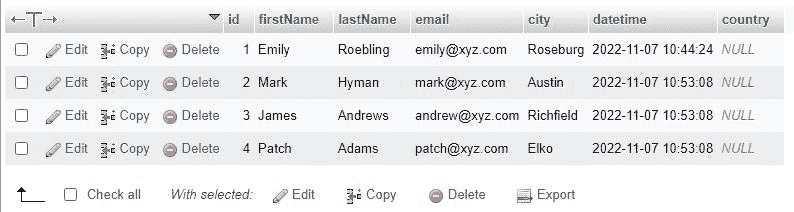

# 在 SQL 中更改表|在 SQL 的现有表中添加和删除现有列

> 原文：<https://codescracker.com/sql/sql-alter-table.htm>

这篇文章描述了如何在 SQL 中完成下面的任务。

*   向现有表中添加新列。
*   删除现有表中的特定列。

SQL ALTER TABLE 语句可以用来做以上两件事。

## 在 SQL 中向现有表添加新列

有时数据库中已经存在一个表，您需要在不破坏表数据的情况下向其中添加一列或多列。为了完成这个任务，SQL 中有一个 ALTER TABLE 语句，它的一般形式是

```
ALTER TABLE tableName
ADD columnName dataType;
```

例如:

```
ALTER TABLE customer
ADD country varchar(50);
```

在执行上述 SQL 查询之后，您将在现有的名为“customer”的表中有一个新添加的名为“country”的列下面是执行上述 SQL 查询后的快照，供您理解。



## 在 SQL 中删除现有表中的特定列

下面是 SQL ALTER TABLE 语句的一般形式，当我们需要删除现有表中的现有列时会用到它。

```
ALTER TABLE tableName
DROP COLUMN columnName;
```

例如:

```
ALTER TABLE customer
DROP COLUMN country;
```

上述 SQL 查询将从名为“customer”的表中删除名为“country”的列。

[SQL 在线测试](/exam/showtest.php?subid=7)

* * *

* * *