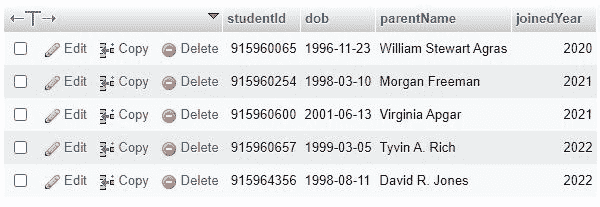
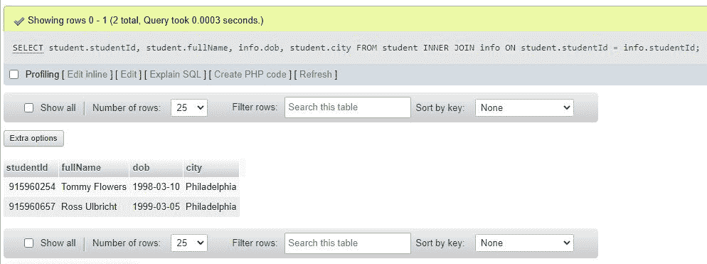
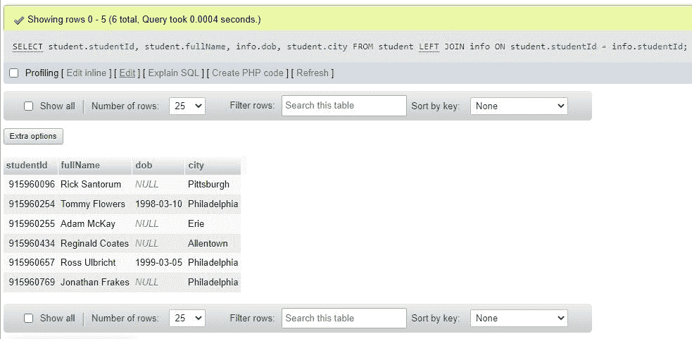

# 在 SQL | SQL 连接表中合并两个表

> 原文：<https://codescracker.com/sql/sql-joins.htm>

有时，我们需要根据两个表之间的公共列来联接或合并两个表。为了完成这项任务，SQL 提供了 JOIN 子句。

在我们继续描述使用 SQL JOIN 子句连接两个表之前，让我为您创建两个表作为示例，以便您可以轻松理解主题☺.

现在我只创建了两个表，即“学生”和“信息”这里有一个“学生”表的快照供您理解。


名为“info”的第二个表的快照是



现在，让我编写一个 SQL 查询作为示例，向您展示如何使用 join 子句连接两个表。

```
SELECT student.studentId, student.fullName, info.dob, student.city
FROM student
JOIN info ON student.studentId = info.studentId;
```

上面的 SQL 查询显示了表“student”中的列“studentId”、“fullName”和“city”，以及表“info”中的列“dob”。请注意我在上面的 SQL 查询中列出的列的顺序。由于“studentId”列是第一个写入的，因此它将首先显示，而“city”列是最后写入的，因此该列将最后显示。

下面是来自上述 SQL 示例的 SQL 代码片段:

```
JOIN info ON student.studentId = info.studentId;
```

用于显示两个表中具有匹配的“studentId”列值的所有记录。由于我们在两个表中都有两个 studentIds(分别为 915960254 和 915960657 ),因此，我们将从这两行中获得指定的数据。

下面是在连接两个表时执行上述 SQL 查询后产生的输出:



我们可以在 JOIN 中使用其他关键字，比如 LEFT、RIGHT 或 FULL，来修改连接标准。例如，使用 LEFT JOIN 显示左侧表中的所有记录和右侧表中的匹配记录；使用右联接显示右侧的所有记录和左侧的匹配记录；或者，如果从左表或右表中找到匹配项，则使用完全连接显示所有记录。例如:下面的 SQL 查询:

```
SELECT student.studentId, student.fullName, info.dob, student.city
FROM student
LEFT JOIN info ON student.studentId = info.studentId;
```

将产生以下输出:



[SQL 在线测试](/exam/showtest.php?subid=7)

* * *

* * *