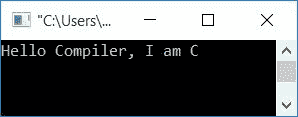
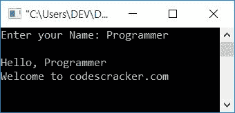
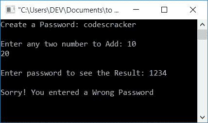
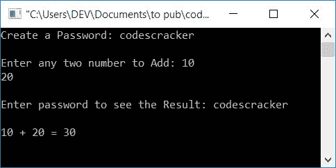
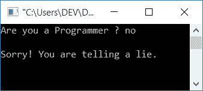
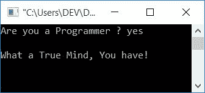
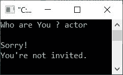
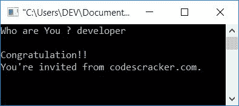
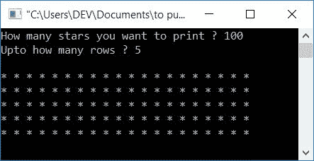
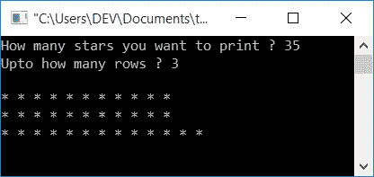

# C 编程示例

> 原文：<https://codescracker.com/c/program/c-programming-examples.htm>

编程就像数学。和数学一样，光有理论是不够的。因为要想清楚地理解题目，你必须练习解决与之相关的问题。就像这样，在编程中，学习任何一个话题，都必须练习与话题相关的编码(和自己一起)。

因此，我们在这里列出了 200 多个程序及其输出和一步一步的解释。从最基本的 C 程序到用 C 程序关闭你的电脑，一切都可以在这里找到。

但是在浏览所有这些程序之前，让我们先来看看这里给出的一些有趣的程序。我确信，在看了这里列出的这些程序的输出之后，您对编程的兴趣将会增加。看到代码不要抓狂；你不知道里面发生了什么，因为在这里你会学到比你想象的更多的 C 编程知识。

所有程序的逐步解释从下一页开始。然而，这些程序只是一个样本；在下一页，你会学到更多关于它们的知识。

我相信，在学习完所有的程序(从下一页开始)后，你将能够理解下面给出的程序，也可以自己修改它们。也许你能创造出一些超出我想象的程序。

我也确信你可以创建很多这里没有列出的程序。但是在阅读本文中列出的演示程序之前，让我们先来看看 C 语言中一些流行的程序:

1.  [将 C 中的两个数相加](/c/program/c-program-add-two-numbers.htm)
2.  [C 语言中的闰年程序](/c/program/c-program-check-leap-year.htm)
3.  [C 语言中的学生成绩程序](/c/program/c-program-calculate-student-grade.htm)
4.  [C 中三个数的最大值](/c/program/c-program-find-greatest-of-three-numbers.htm)
5.  [C 中数字的阶乘](/c/program/c-program-find-factorial.htm)
6.  [华氏温度到摄氏温度](/c/program/c-program-convert-fahrenheit-to-centigrade.htm)
7.  [C 语言中十进制到二进制的转换](/c/program/c-program-convert-decimal-to-binary.htm)
8.  [C 语言中的十六进制到八进制](/c/program/c-program-convert-hexadecimal-to-octal.htm)
9.  [C 语言中的图案打印程序](/c/program/c-program-print-star-pyramid-patterns.htm)
10.  [C 语言中的二分搜索法程序](/c/program/c-program-binary-search.htm)
11.  [C 语言中的冒泡排序程序](/c/program/c-program-bubble-sort.htm)
12.  [C 语言中的矩阵乘法程序](/c/program/c-program-multiply-two-matrices.htm)
13.  [比较 C 语言中的两个字符串程序](/c/program/c-program-compare-two-string.htm)
14.  [删除 C 中字符串的元音](/c/program/c-program-delete-vowels-from-string.htm)
15.  [删除 C 中字符串的空格](/c/program/c-program-remove-spaces-from-string.htm)
16.  [将 C 语言中的大写字母转换成小写字母](/c/program/c-program-convert-uppercase-into-lowercase.htm)
17.  [复制 C 中的文件](/c/program/c-program-copy-file.htm)
18.  [关闭 C 中的计算机](/c/program/c-program-shutdown-computer.htm)

## C 示例-演示程序

正如我在本文开头已经说过的，在看了这些程序的输出之后，你会对学习 c 更感兴趣。

### C 程序示例 1

下面是一个最简单的 C 程序，它会在屏幕上打印出“Hello Compiler，我是 C ”:

```
#include<stdio.h>
#include<conio.h>
int main()
{
    printf("Hello Compiler, I am C");
    getch();  // holds output screen, until user press a key
    return 0;
}
```

这个程序是在 Code::Blocks IDE 下构建和运行的。以下是该程序产生的输出:



### C 程序示例 2

这是第二个程序，允许用户输入任何内容。

```
#include<stdio.h>
#include<conio.h>
int main()
{
    char name[20];
    printf("Enter your Name: ");
    scanf("%s", name);
    printf("Hello, %s\nWelcome to codescracker.com", name);
    getch();
    return 0;
}
```

下面是上一个程序的运行示例:



### C 程序示例 3

这是一个有密码保护的程序。也就是说，允许用户创建一个密码，然后输入它来查看结果。

```
#include<stdio.h>
#include<conio.h>
#include<string.h>
int main()
{
    char pass[20], e_pass[20];
    int num1, num2, sum;
    printf("Create a Password: ");
    scanf("%s", pass);
    printf("\nEnter any two number to Add: ");
    scanf("%d %d", &num1, &num2);
    printf("\nEnter password to see the Result: ");
    scanf("%s", e_pass);
    if(!strcmp(pass, e_pass))
    {
        sum = num1 + num2;
        printf("\n%d + %d = %d", num1, num2, sum);
    }
    else
        printf("\nSorry! You entered a Wrong Password");
    getch();
    return 0;
}
```

上面的 C 程序在两种情况下的运行示例(如果用户输入正确或错误的密码)如下所示。如果用户输入了错误的密码，这是第一个输出:



如果用户输入正确的密码，这是第二个密码:



### C 程序示例 4

该程序接收用户输入的字符串，并将该字符串与 yes 进行比较，以根据输入打印消息。别担心，从下一页开始，你会一个接一个地学会所有的东西。

```
#include<stdio.h>
#include<conio.h>
#include<string.h>
int main()
{
    char str[10];
    printf("Are you a Programmer ? ");
    scanf("%s", str);
    if(!strcmp("yes", str))
        printf("\nWhat a True Mind, You have!");
    else
        printf("\nSorry! You are telling a lie.");
    getch();
    return 0;
}
```

这是第一个输出:



如果你在这里，那么你对学习编程感兴趣。那么，假设你是一个程序员，为什么我们输入“不”？让我们试着回答“是”。以下是第二个输出:



### C 程序示例 5

这是另一个用 C 编写的程序，它检查被邀请的成员，并根据用户输入打印当前用户是否被邀请。

```
#include<stdio.h>
#include<conio.h>
#include<string.h>
int main()
{
    char arr[6][20] = {"programmer", "developer", "engineer",
                        "student", "teacher", "professor"};
    char name[25];
    int found=0;
    printf("Who are You ? ");
    scanf("%s", name);
    for(int i=0; i<6; i++)
    {
        if(!strcmp(name, arr[i]))
        {
            printf("\nCongratulation!!");
            printf("\nYou're invited from codescracker.com.");
            found=1;
            break;
        }
        else
            found++;
    }
    if(found != 1)
        printf("\nSorry!\nYou're not invited.");
    getch();
    return 0;
}
```

上面的 C 程序在这两种情况下的运行示例如下所示。以下是第一个输出:



第二个如下:



### C 程序示例 6

这是最后一个演示程序。也就是说，在下一页，您将看到程序及其输出和对代码的逐步解释。

```
#include<stdio.h>
#include<conio.h>
int main()
{
    int starTot, rowTot, i, j, starInOneRow, rem;
    printf("How many stars you want to print ? ");
    scanf("%d", &starTot);
    printf("Upto how many rows ? ");
    scanf("%d", &rowTot);
    starInOneRow = starTot/rowTot;
    rem = starTot%rowTot;
    printf("\n");
    i=0;
    while(i<rowTot)
    {
        if(i!=0)
            printf("\n");
        for(j=0; j<starInOneRow; j++)
            printf("* ");
        i++;
    }
    if(rem!=0)
    {
        for(i=0; i<rem; i++)
            printf("* ");
    }
    getch();
    return 0;
}
```

下面给出的快照是其运行示例:



这是第二次样本运行:



从现在开始，你将被介绍到 C 编程的世界，从基础到高级。给出了所有程序的逐步解释。

[C 在线测试](/exam/showtest.php?subid=2)

* * *

* * *