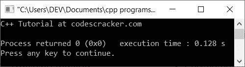
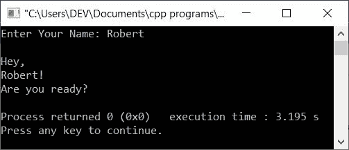

# C++教程

> 原文：<https://codescracker.com/cpp/index.htm>

本教程将教你所有关于 C++编程的知识，从初级到高级。

## 什么是 C++？

C++是一种区分大小写的、通用的、面向对象的编程语言。

C++是 C 编程语言的扩展。C++包含了 C 语言的所有元素，另外它还有处理对象、类、事件和其他面向对象概念的附加特性。

大多数应用程序属于以下类别:

*   文字处理
*   电子表格程序

是用 C++语言开发的。

您还可以使用来开发数据库系统和 web 应用程序。

## C++简史

C++编程语言是由比雅尼·斯特劳斯特鲁普于 1980 年在美国电话电报公司贝尔实验室开发的。他发现 C 缺乏模拟功能(计算机程序表现真实世界的技术)，并决定通过添加他最喜欢的语言 Simula 67 的一些功能来扩展这种语言。

Simula 67 语言是最早的面向对象语言之一。最初，比雅尼·斯特劳斯特鲁普称之为“C 与类”。

C++这个名字是 Rick Mascitti 创造的。在 C++中，“++”是 C 语言的增量运算符。自诞生以来，C++一直在进化，以处理用户遇到的问题，并通过 AT&T 的讨论。

## C++为什么这么受欢迎？

C++成功和流行的主要原因是，它支持面向对象技术，这是软件开发中的最新技术，也是最接近现实世界的技术。

## C++是一种面向对象的编程语言

C++支持面向对象编程，包括面向对象开发的以下四个支柱:

*   [封装](/cpp/cpp-encapsulation.htm)
*   [数据抽象](/cpp/cpp-data-abstraction.htm)
*   [继承](/cpp/cpp-inheritance.htm)
*   [多态性](/cpp/cpp-polymorphism.htm)

这是一个简单的 C++程序

```
/* C++ Tutorial - C++ Programming Tutorial */

#include<iostream.h>
#include<conio.h>
/* C++ comment */
void main()
{
   clrscr();   // to clear the screen
   cout<<"C++ Tutorial at codescracker.com";
   getch();
}
```

当编译并执行上述 C++程序时，它将产生以下输出:



让我们再看一个 C++示例程序。

```
/* C++ Programming Tutorial - C++ Tutorial with Examples */

#include<iostream.h>
#include<conio.h>
void main()
{
   clrscr();
   char user[20];
   cout<<"Enter Your Name: ";
   cin>>user;
   cout<<"\nHey,\n"<<user;
   cout<<"!\nAre you ready?";
   getch();
}
```

下面是这个 C++程序的运行示例。



在这个系列教程中，你将一个接一个地学习所有关于 C++编程的知识。

## 观众

本教程的设计和开发是为了帮助所有的 C++程序员，他们有兴趣在 C++的描述和教程中练习很多程序。

我们在 C++类别中包含了尽可能多的需要学习的章节及其教程和例子。

在这个系列教程中，我们在每一章中都包含了尽可能多的程序。

## 先决条件

在开始学习这里给出的 C++编程之前，你必须具备一些基本的计算机技能。如果您已经掌握了，那么您就可以理解如何设置您的环境来开始用 C++编程。

如果知道如何编程，那么在这里学习 C++就变得非常容易。

[C++在线测试](/exam/showtest.php?subid=3)

* * *

* * *