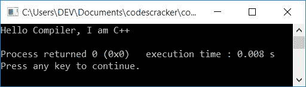
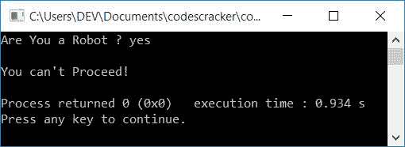

# C++ 编程示例

> 原文：<https://codescracker.com/cpp/program/cpp-programming-examples.htm>

这里给出的 C++ 程序示例帮助你[实际学习 C++](/cpp/index.htm) 编程。

由于使用 C++ 可以创建大量的程序，因此，我们创建了一系列 C++ 编程示例，分成 100 多篇文章。在每一篇文章中，您将获得一个或多个带有解释清楚的代码及其输出的程序。

我们列出了 500 多个 C++ 程序及其输出，从最简单的程序到使用 C++ 程序关闭计算机。

在所有程序的列表中，这里列出了一些流行的 C++ 程序:

*   [加两个数](/cpp/program/cpp-program-add-two-numbers.htm)
*   [是否勾选闰年](/cpp/program/cpp-program-check-leap-year.htm)
*   [制作简单的计算器](/cpp/program/cpp-program-make-calculator.htm)
*   [交换数字](/cpp/program/cpp-program-interchange-numbers.htm)的位数
*   [找出三个数字中最大的一个](/cpp/program/cpp-program-find-greatest-of-three-numbers.htm)
*   [求一个数的阶乘](/cpp/program/cpp-program-find-factorial.htm)
*   [检查阿姆斯特朗编号是否正确](/cpp/program/cpp-program-find-armstrong-number.htm)
*   [将十进制数转换成二进制数](/cpp/program/cpp-program-convert-decimal-to-binary.htm)
*   [在数组中插入元素](/cpp/program/cpp-program-insert-element-in-array.htm)
*   从数组中删除元素
*   [从字符串中删除单词](/cpp/program/cpp-program-delete-words-from-sentence.htm)
*   [加密&解密文件](/cpp/program/cpp-program-encrypt-file.htm)

**注**:这里给出的每一个 C++ 程序都经过了很好的测试和执行。你可以通过访问上面给出的一些 节目来亲自检验一下。

但是在开始 C++ 编程示例系列之前，让我们先浏览一下本文中给出的一些有趣的程序。让我们从最简单的 C++ 程序开始，如下例所示。

## C++ 程序：示例 1

下面是一个最简单的 C++ 程序，它将在输出中输出字符串“Hello Compiler，I am C++”。让我们看看下面给出的程序:

```
// C++ Programming Example No.1

#include<iostream>
using namespace std;
int main()
{
    cout<<"Hello Compiler, I am C++";
    cout<<endl;
    return 0;
}
```

这个程序是在 Code::Blocks IDE 下构建和运行的。下面是它的示例输出:



iostream 是一个头文件，代表输入/输出流，并为 C++ 程序提供基本的输入/输出服务。像上面的程序一样，cout 用于在输出屏幕上显示一些内容。它是在 iostream 头文件中定义的。

下面的 C++ 语句:

```
using namespace std;
```

用于提供标准(std)输入和输出命名空间。也就是说，包含了这个语句之后，我们就不需要在每个 cout 和 cin 之前写 std::了。

**endl** 代表“行尾”，用来断行，在新的一行开始下一件事。

## C++ 程序：示例 2

下面是 C++ 编程中的第二个例子。

```
// C++ Programming Example No.2

#include<iostream>
using namespace std;
int main()
{
    char str[30];
    cout<<"Enter Your Name: ";
    cin>>str;
    cout<<"\nHello "<<str<<" Sir, This is codescracker.com!";
    cout<<endl;
    return 0;
}
```

这是上述程序产生的初始输出:


现在输入你的名字，比如说 Albert，然后按回车键就可以看到下面的输出:


## C++ 程序：示例 3

让我们看看下面给出的 C++ 的第三个例子。这个程序接收用户输入的一个数字，并检查它是否大于 10 小于 100，或者是否相应地打印一条消息。

```
// C++ Programming Example No.3

#include<iostream>
using namespace std;
int main()
{
    int num;
    cout<<"Gues a Number: ";
    cin>>num;
    if(num>10 && num<100)
        cout<<"\nWhat a True Guess!";
    else
        cout<<"\nOpps!";
    cout<<endl;
    return 0;
}
```

下面是用户输入的运行示例:14。


下面是另一个用户输入的运行示例:3。


## C++ 程序：示例 4

这是 C++ 中的第四个示例程序。这个程序要求用户创建一个密码，然后接收输入的两个数字。但是，在将这两个数字相加并打印结果之前，程序会提示您输入之前创建的密码(在同一程序中):

如果用户输入正确的密码，那么程序计算并显示结果；否则，它不会显示结果，而是显示类似“密码错误！”

```
// C++ Programming Example No. 4

#include<iostream>
#include<string.h>
using namespace std;
int main()
{
    char pass[20], ePass[20];
    int numOne, numTwo, sum;
    cout<<"Create a Password: ";
    cin>>pass;
    cout<<"\nEnter Two Numbers to Add: ";
    cin>>numOne>>numTwo;
    cout<<"\nEnter the Password to See the Result: ";
    cin>>ePass;
    if(!strcmp(pass, ePass))
    {
        sum = numOne + numTwo;
        cout<<endl<<numOne<<" + "<<numTwo<<" = "<<sum;
    }
    else
        cout<<"\nSorry! You've entered a Wrong Password!";
    cout<<endl;
    return 0;
}
```

下面是这个 C++ 程序的运行示例。下面是初始输出:


现在提供以下输入:

*   要创建新密码，请使用 codescracker。
*   40 和 60 是两个数字
*   codescracker 作为密码，以查看输入的两个数字的总和

以下是提供这些输入后的输出:


如果你输入了错误的密码，那么你将看不到结果；相反，上述程序产生的输出是“对不起！您输入了错误的密码！”。

## C++ 程序：示例 5

这是 C++ 中的第五个示例程序。这个程序确认用户是否是机器人。

```
// C++ Programming Example No. 5

#include<iostream>
#include<string.h>
using namespace std;
int main()
{
    char robotChk[10];
    int val;
    cout<<"Are You a Robot ? ";
    cin>>robotChk;
    val = strcmp("yes", robotChk);
    if(val==0)
        cout<<"\nYou can't Proceed!";
    else
        cout<<"\nYou're Welcome!";
    cout<<endl;
    return 0;
}
```

下面是用户输入的上述 C++ 程序的运行示例，是的:



这是另一个使用用户输入运行的示例，没有:


## C++ 程序：示例 6

这是 C++ 中最后一个(第六个)示例程序，它要求输入用户名来检查他或她是否被邀请。

```
// C++ Programming Example No.6

#include<iostream>
#include<string.h>
using namespace std;
int main()
{
    char arr[6][20] = {"programmer", "developer", "engineer",
                        "student", "teacher", "professor"};
    char name[25];
    int found=0;
    cout<<"Who are You ? ";
    cin>>name;
    for(int i=0; i<6; i++)
    {
        if(!strcmp(name, arr[i]))
        {
            cout<<"\nCongratulation!";
            cout<<"\nYou're invited from codescracker.com";
            found=1;
            break;
        }
        else
            found++;
    }
    if(found != 1)
        cout<<"\nSorry!\nYou're not invited";
    cout<<endl;
    return 0;
}
```

下面是用户输入的运行示例，程序员:


**注意**:如果您不知道上面给出的 C++ 代码背后发生了什么，请不要惊慌。因为这只是一个 展示给你看的节目。从一个非常简单的程序开始，打印“Hello，world，”到一个高级程序，您将在下面的程序(文章)中逐一了解所有这些 事情。

### 对于 TurboC++ 用户

因为这里给出的所有程序都是通过 Code::Blocks IDE 经过良好测试和编译的，因此，如果你是 TurboC++ 用户，最好跳过它，继续使用这里使用的 IDE。但是如果你没有，那么做这些事情:

*   包括。在每个头文件的名字后面。例如，用 iostream.h 替换 iostream，如果头文件已经包含. h，则不要进行更改。
*   删除语句，**使用命名空间 std**
*   将 **int main()** 改为 **void main()** 。
*   **应该用 getch()** 代替**返回 0** 。

#### 其他语言编程示例

您可能还想浏览并了解其他语言的所有这些程序，例如:

*   [C 编程实例](/c/program/c-programming-examples.htm)
*   [Java 编程实例](/java/program/java-programming-examples.htm)
*   [Python 编程实例](/python/program/index.htm)

[C++ 在线测试](/exam/showtest.php?subid=3)

* * *

* * *