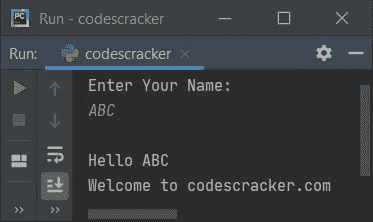

# Python 编程示例

> 原文：<https://codescracker.com/python/program/index.htm>

本文旨在为您提供尽可能多的用 [Python](/python/index.htm) 编写的程序，从非常基础的到高级的。 也就是说，你将练习用 Python 语言编写的各种程序。

理论很重要，但实践更重要。在骑自行车之前了解如何骑自行车是很重要的。但是练习骑行(实际上是骑行)对成为骑行领域的艺术家更重要。

所以，就像这样，Python 的理论固然重要，但实际上写 Python 程序更重要。因此，我创建了许多不同种类的程序，这样你可以学习、练习，并且感觉比以前更好。

### 关于 Python 编程示例

由于我已经创建了 1000 多个 Python 程序，并且所有程序无法在一篇文章中涵盖，所以我将所有这些程序分成许多篇文章。每篇文章都包含不止一个 Python 程序。

**注意**:这里写的所有程序都是用 Python 著名的 IDE，PyCharm，经过良好测试并执行的。

**注意**:每个程序都使用快照提供其样本输出。测试程序时会拍摄快照。还有， 所有的节目都有很好的解说。

**重要的**:如果你是 Python 的新手，不要担心；继续练习下一篇文章或下一页中给出的 Python 程序。由于 每个节目都有很好的解释，你会一个一个地了解关于这个话题的一切。最后，通过这一系列的 Python 程序， 你会感觉比以前好得多。

## 流行 Python 程序列表

由于我在 Python 编程示例这一节中创建了 1000 多个 Python 程序，所以它们被分成了许多篇文章。但是这里有一些受欢迎的列表:

*   [打印 Hello World](/python/program/python-program-print-hello-world.htm)
*   [获取用户的输入](/python/program/python-program-get-input-from-user.htm)
*   [加两个数](/python/program/python-program-add-two-numbers.htm)
*   [是否勾选闰年](/python/program/python-program-check-leap-year.htm)
*   [添加数字的位数](/python/program/python-program-add-digits-of-number.htm)
*   [检查阿姆斯特朗编号是否正确](/python/program/python-program-check-armstrong.htm)
*   [查找用户输入的 n 个数的和](/python/program/python-add-n-numbers.htm)
*   [将两个二进制数相加](/python/program/python-add-two-binary-numbers.htm)
*   [十进制到二进制的转换](/python/program/python-program-convert-decimal-to-binary.htm)
*   [二进制到十六进制的转换](/python/program/python-program-convert-binary-to-hexadecimal.htm)
*   [打印星星、金字塔和数字的图案](/python/program/python-program-print-star-pyramid-patterns.htm)
*   [添加两个矩阵](/python/program/python-program-add-two-matrices.htm)
*   [连接两个字符串](/python/program/python-program-concatenate-string.htm)
*   从字符串中删除一个单词
*   [小写到大写的转换](/python/program/python-program-convert-lowercase-to-uppercase.htm)
*   [向文件追加文本](/python/program/python-append-text-to-file.htm)
*   文件中的每个单词都要大写
*   [打印日期和时间](/python/program/python-program-print-date-time.htm)
*   [关机重启电脑](/python/program/python-program-shutdown-restart-computer.htm)

## Python 演示程序

Python 编程示例系列从下面的文章开始。但是现在，让我们在这里看一些用 Python 写的程序，以引起对 Python 的更多兴趣。

**重要**:如果你在阅读下面给出的代码时感到不舒服，不用担心；从下一篇文章继续这个系列。 你将一个接一个地学习 Python 的所有知识。

## Python 示例 1

这是一个最简单的 Python 程序，它使用 print()来打印作为参数传递的值或大括号内的值。

```
print("Welcome to the World of Python!")
```

如果您运行上述程序，您将看到以下输出:


在上面的程序中，有两行代码；第一行是一个[注释](/python/python-comments.htm)。Python 将任何以#(散列)符号开头的 视为注释。编译器会忽略或不执行#之后编写的任何内容。

而第二行使用 [print()](/python/python-print-statement.htm) 输出写在大括号里面的东西。例如， 考虑下面的 Python 程序:

```
# print("Welcome to the World of Python!")

text = "Welcome to the World of Python!"
print(text)
```

产生与前一个程序相同的输出。前面程序中的第一行用#注释。也就是说，我在第一行代码前添加了#号，所以编译器会忽略它，这一行代码不会被执行。

现在最后两行用来输出与前一个程序相同的内容，但方式不同。也就是说，我没有直接打印字符串(单引号(')或双引号(')内的任何内容都被视为字符串)，而是使用了一个名为 text 的[变量](/python/python-variables.htm) 。字符串在这个变量中被初始化，我已经用 print()打印了这个变量的值。

**注意**:在将变量文本放入 print()的大括号中时，我没有使用双引号(" ")。因为如果我包含一个双引号， ，那么文本变量将被当作一个字符串而不是变量。并且你将得到的输出应该是文本，而不是“欢迎来到 Python 的世界！”

## Python 示例程序 2

这是 Python 编程示例系列的第二个演示程序。

```
print("Enter Your Name: ")
name = input()

print("\nHello", name, "\nWelcome to codescracker.com")
```

现在，如果您执行或运行这个程序，您将看到以下初始输出:


现在提供输入，也就是写下你的名字，说罗伯特，然后按回车键。下面是您将看到的输出:


在前面的程序中使用 print()，将在输出中显示一条消息“输入您的姓名”。使用 input()，我接收了用户名作为输入，用户输入的任何名称都被初始化为 name 变量。

再次使用 print()，我打印了 name 的值以及一些额外的内容。n 用于插入一个换行符。因此，下面的陈述是正确的:

```
print("\nHello", name, "\nWelcome to codescracker.com")
```

声明如下:

*   换行符
*   然后使用字符串“Hello”。
*   名字的价值
*   再次换行
*   又是一串“欢迎来到 codescracker.com”

在输出中打印出来。也就是说，如果用户输入名称 ABC，输出将如下所示:



## Python 程序 3 号

这个程序是使用 Python 的 [if-else](/python/python-if-else-elif-statements.htm) 语句创建的。让我们来看看:

```
print("Guess a Number: ")
num = input()

num = int(num)
if num>10 and num<20:
    print("\nCorrect Guess!")
else:
    print("\nIncorrect Guess!")
```

下面是它的初始输出:


现在猜一个数字并键入它，比如 13，然后按 ENTER 键查看输出，如下面给出的快照所示:


由于我猜测并键入了一个大于 10 小于 20 的数字，因此，我看到了如上面的快照所示的输出。

默认情况下，当使用 input()函数接收输入时，接收到的值被视为字符串类型的值。因此，使用 int()方法，我已经将输入的值转换为它的整数等价物。

使用 if 语句，我应用了一个条件，num>10。编译器检查 num 的值是否大于 10。因为它的值(13)大于 10，所以该条件的计算结果为 true。现在我已经使用了“and”关键字，第二个条件也计算为 true，允许执行包含在其主体中的语句。因为第二个条件也评估为真，所以程序流进入 if 的主体并执行打印正确猜测的语句！作为输出。

并且如果两个条件中的任何一个为假，则程序流执行 else 的主体，如具有用户输入 34 的上述程序的以下示例运行所示:


## Python 程序 4 号

这是第四个程序，它用最基本的方式检查用户是否是机器人。

```
print("Are you a Robot ? ")
chk = input()

if chk == "yes":
    print("\nSorry!\nRobots aren't Allowed here!")
else:
    print("\nWelcome to codescracker.com!")
```

以下是用户输入“yes”后运行的示例:


这是另一个用户输入的例子，“不”。


这是用户输入 123 的第三次样本运行。


上面的程序是这样编写的，首先通过 input()接收输入，然后初始化为 chk。现在，再次使用 if，我比较了 chk 的值和“是”也就是说，如果它的值为“是”，那么条件评估为真，程序流进入它的主体并执行打印消息的语句，“不允许机器人！”

但是，如果用户输入不等于“yes”的任何内容，这意味着条件的计算结果为 false，因此 if 语句的对应语句，即 else 语句将被执行。

## Python 程序 5 号

这是 Python 练习(示例)系列的最后一个演示程序。

```
print("Create a Password: ")
cp = input()

print("\nEnter Two Numbers to Add: ")
numOne = int(input())
numTwo = int(input())

print("\nEnter Password to Display the Result: ")
ep = input()

if cp == ep:
    sum = numOne + numTwo
    print("\nResult = ", sum)
else:
    print("\nWrong Password!")
```

以下是运行上述程序后产生的初始输出:


现在创建一个密码，说“codescracker”，然后按回车键。这是您将看到的输出


现在输入任意两个数字，比如 30 和 60，一个接一个。以下是提供这两个数字后的输出:


除非输入正确的密码，否则不会显示结果。以下是输入正确密码后的输出，是 codescracker:


#### 开始 Python 示例系列之前的最后一条消息

要实际学习 Python，您必须完成本系列中的所有 Python 程序，从下一页开始。练习这些 Python 程序，以便在 Python 世界中感到舒适。

许多 Python 程序都是可用的，从如何使用 Python 代码[打印 Hello World](/python/program/python-program-print-hello-world.htm) 到 [关闭和重启计算机](/python/program/python-program-shutdown-restart-computer.htm)。

#### 其他语言编程示例

*   [C 编程实例](/c/program/c-programming-examples.htm)
*   [C++编程实例](/cpp/program/cpp-programming-examples.htm)
*   [Java 编程实例](/java/program/java-programming-examples.htm)

[Python 在线测试](/exam/showtest.php?subid=10)

* * *

* * *