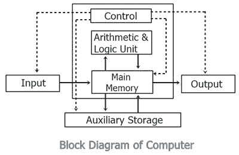

# 计算机框图及说明

> 原文：<https://codescracker.com/computer-fundamental/block-diagram-of-computer.htm>

计算机的框图向你展示了计算机内部是如何工作的。或者你可以说，在计算机的框图中，我们将看到计算机如何从输入数据到得到结果。

这是一个计算机系统的框图:

在上图中，**控制(控制单元或 CU)** 和**运算&逻辑单元(ALU)** 合称为 **[中央处理器(CPU)](/computer-fundamental/central-processing-unit-cpu.htm)** 。

让我们逐一描述上图中包含的所有部件。

## 处理器单元(CPU)

它是计算机系统的大脑。

所有主要的计算和比较都在 CPU 内部进行，它还负责激活和控制其他单元的操作。

该单元由两个主要部件组成，即算术逻辑单元(ALU)和控制单元(CU)。

### 算术逻辑单元

在这里，算术逻辑单元执行所有的算术运算，如加、减、乘、除。它还使用逻辑运算进行比较。

### 控制单元

并且 CPU 的控制单元控制计算机的整体操作。它还控制所有连接到 CPU 的设备，如内存、输入/输出设备。

CU 从存储器中取出指令，对指令进行解码，解释指令以知道要执行什么任务，并向其它组件发送适当的控制信号，以执行指令的必要步骤。

## 输入输出设备

输入/输出单元由用于在外部世界和计算机内存之间传输信息的设备组成。

通过输入单元输入的信息存储在计算机的存储器中进行处理，存储在存储器中的最终结果可以记录或显示在输出介质上。

## 存储单元

存储单元是数字计算机的基本[部件。 它是存储所有中间数据和最终结果的地方。](/computer-fundamental/components-of-computer.htm)

从主存储器或输入单元读取的数据被传送到[计算机的存储器](/computer-fundamental/computer-memory-and-types.htm)中，在那里它们可用于处理。

这个存储单元用于保存要执行的指令和要处理的数据。

## 磁盘存储单元

通过[输入设备](/computer-fundamental/input-devices.htm) 输入计算机系统的数据和指令，在实际加工开始前必须存储在计算机内部。

两种类型的存储单元是主存储单元和辅助存储单元。

### 主存储单元

主存储器与输入设备和输出设备直接相连。它存储输入数据，计算结果。

### 辅助存储单元

主存储无法永久存储数据以供将来使用。因此需要一些其他类型的存储技术来长期永久地存储数据，这被称为二级或辅助存储。

[计算机基础在线测试](/exam/showtest.php?subid=14)

* * *

* * *