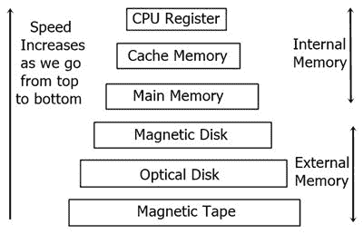

# 计算机内存及其类型

> 原文：<https://codescracker.com/computer-fundamental/computer-memory-and-types.htm>

保存程序指令和数据以供处理的区域称为内存，就像人脑一样，计算机也需要一些空间来存储数据和指令以供处理。

CPU 没有能力永久存储程序或大量数据。它只包含操作计算机所需的基本指令。因此需要内存。

## 计算机内存的类型

这里给出的记忆主要有两种类型:

1.  内存储器
    *   随机存取存储器
        *   静态随机存储器
        *   动态随机存储器
    *   只读存储器
        *   屏蔽只读存储器(MROM)
        *   可编程只读存储器
        *   可擦除可编程只读存储器(EPROM)
        *   电可擦除可编程只读存储器(EEPROM)
    *   按序存取存储器
    *   高速缓冲存储器
    *   虚拟内存
2.  外部存储器
    *   外置硬盘
    *   固态硬盘(SSD)
    *   USB 闪存驱动器等。

## 随机存取存储器

RAM 构成 CPU 的内部存储器，用于存储数据、程序和程序结果。它是读/写存储器。它被称为随机存取存储器(RAM)。

因为 RAM 中的访问时间与字的地址无关，也就是说，内存中的每个存储位置与其他位置一样容易到达，并且花费相同的时间。我们可以以极快的速度随机访问内存，但代价也很高。

RAM 是易失性的，也就是说，当我们关闭计算机或断电时，存储在 RAM 中的数据会丢失。因此，计算机通常使用备用不间断电源系统(UPS)。

就其物理大小和可容纳的数据量而言，RAM 都很小。

## RAM 的类型

RAM 有两种类型:

1.  静态随机存储器
2.  动态随机存储器

### 静态随机存储器

“静态”一词表示只要通电，存储器就会保留其内容。

然而，由于易变的性质，当电源关闭时，数据会丢失。

静态 RAM 芯片使用 6 个晶体管的矩阵，没有电容。

晶体管不需要电源来防止泄漏，因此静态 RAM 不需要定期刷新。由于矩阵中的额外空间，对于相同数量的存储空间，静态 RAM 比动态 RAM 使用更多的芯片，从而使制造成本更高。

使用静态 RAM 是因为高速缓存需要非常快和小。

### 动态随机存储器

动态 RAM 不同于静态 RAM，它必须不断地被替换以保持数据。这是通过将存储器放置在每秒钟重写数据几百次的刷新电路上来实现的。

动态 RAM 用于大多数系统内存，因为它便宜且体积小。

所有动态 ram 都是由存储单元组成的。这些单元由一个电容器和一个晶体管组成。

## 只读存储器

ROOM 代表只读存储器。我们只能读不能写的存储器。

这种存储器是非易失性的。在制造过程中，信息被永久地存储在这样的存储器中。

一个只读存储器，存储当电源第一次打开时启动计算机所需指令，这个操作被称为引导。

只读存储器芯片不仅用于计算机，也用于其他电子产品，如洗衣机和微波炉。

## ROM 的类型

让我们简单地列出以下计算机中可用的 ROM:

1.  屏蔽只读存储器(MROM)
2.  可编程只读存储器
3.  可擦除可编程只读存储器(EPROM)
4.  电可擦除可编程只读存储器(EEPROM)

### 屏蔽只读存储器(MROM)

最早的只读存储器是包含一组预编程数据或指令的硬件设备。这种类型的只读存储器被称为屏蔽只读存储器。Tt 是廉罗。

### 可编程只读存储器

PROM 是只读存储器，用户只能修改一次。用户购买一个空白的 PROM，并使用 PROM 编程器输入所需的内容。

在可编程只读存储器内部，有一些在编程过程中烧断的小保险丝。它只能被编程一次，而且不可擦除。

### 可擦除可编程只读存储器(EPROM)

EPROM 可以通过暴露在紫外光下长达 40 分钟来擦除。

通常，一个 EPROM 擦除器可以实现这个功能。在编程期间，电荷被捕获在绝缘栅区中。

电荷保持超过 10 年，因为电荷没有泄漏路径。为了消除这种电荷，紫外光穿过石英晶体窗口(lid)。暴露在紫外线下会驱散电荷。在正常使用期间，石英盖用一个标签密封。

### 电可擦除可编程只读存储器(EEPROM)

EEPROM 被电编程和擦除。它可以被擦除和重新编程大约一万次。

擦除和编程都需要大约 4 到 10 毫秒。在 EEPROM 中，任何位置都可以有选择地擦除和编程。

EEPROMs 可以一次擦除一个字节，而不是擦除整个芯片。因此，重新编程的过程是灵活但缓慢的。

## 按序存取存储器

顺序访问意味着系统必须从内存地址的开始搜索存储设备，直到找到所需的数据。

支持这种存取的存储设备被称为顺序存取存储器或串行存取存储器。

串行存取存储器中的磁带。

## 高速缓冲存储器

高速缓冲存储器是一种非常高速的半导体存储器，可以提高 CPU 的速度。它充当 CPU 和主存储器之间的缓冲器。

它用来保存 CPU 最常用的数据和程序部分。部分数据和程序通过操作系统从磁盘转移到高速缓冲存储器，CPU 可以从那里访问它们。

高速缓冲存储器，位于 CPU 和主存储器之间。

它也被称为 CPU 内存，计算机微处理器访问它的速度比访问普通 RAM 要快。

该存储器通常直接与 CPU 芯片集成在一起，或者放置在与 CPU 具有独立总线互连的独立芯片上。

高速缓冲存储器节省了时间并提高了效率，因为最近处理的数据存储在其中，这使得获取更容易。

### 高速缓存的功能

高速缓冲存储器的基本目的是存储软件在运行过程中频繁引用的程序指令。快速访问这些指令提高了软件程序的整体速度。

高速缓冲存储器的主要作用是加快计算机的工作机制。

### 高速缓存的优势

高速缓冲存储器比主存储器快。

与主存储器相比，它消耗较少的存取时间。

它存储了可以在短时间内执行的程序。

它存储数据供临时使用。

### 高速缓存的缺点

高速缓冲存储器的容量有限。

高速缓冲存储器非常昂贵。

## 虚拟内存

这种技术允许执行内存中不完全可用的进程。这种模式的主要优点是程序可以比物理内存大。

虚拟内存是用户逻辑内存与物理内存的分离。当只有较小的物理内存可用时，这种分离允许为程序员提供非常大的虚拟内存。

以下是不需要将整个程序完全加载到主存中的情况。

用户编写的错误处理程序仅在数据或计算中出现错误时使用。

程序的某些选项和功能可能很少使用。

许多表被分配了固定数量的地址空间，即使实际上只使用了表中的一小部分。

执行一个部分在内存中的程序的能力会抵消许多好处。

将每个用户程序装入或交换到内存中需要更少的输入/输出(I/O)。

程序将不再受可用物理内存量的限制。

每个用户程序可以占用更少的物理内存，更多的程序可以同时运行，相应地提高了 CPU 利用率和吞吐量。

## 外部存储器(辅助存储器)

辅助存储器比主存储器大得多，但速度较慢。它通常存储系统程序、指令和数据文件。它也被称为辅助记忆。如果超过了主存储器容量，它还可以用作溢出/虚拟存储器。

处理器不能直接访问辅助存储器。首先，辅助存储器的数据/信息被传送到主存储器，然后该信息可以被 CPU 访问。

### 辅助存储器的特性

以下是辅助记忆的特点:

*   **非易失性存储器** -断电时数据不会丢失。
*   **可重复使用的** -永久保存在二级存储器中的数据阶段，直到它不被用户覆盖或删除。
*   **可靠** -二级存储设备物理稳定性高，二级存储中的数据安全。
*   **便利** -在计算机软件的帮助下，授权人员可以快速找到并访问数据。
*   **容量** -二级存储可以在多个磁盘组中存储大量数据。
*   **成本** -在磁带或磁盘上存储数据比主存储器便宜得多。

我们也可以说，二级存储器是另一种需要长时间永久存储数据的存储器。

## 辅助存储设备的类型

有各种类型的辅助存储设备可用于存储数据以备将来使用。这些设备允许在内存中任何地方读或写。

常用的辅助存储设备有:

*   磁带
*   磁盘
*   和光盘等。

## 磁带

它类似于含有涂有磁性材料的塑料带的录音带。数据以电流的形式编码在磁性材料上。导通状态(开)代表一(1)，非导通状态(关)代表零(0)。

数据编码的类型称为二进制数据存储。磁带存储容量大，价格便宜，可以存储 60 MB 到 24 GB 的数据。

## 磁盘

这些是直接存取存储介质，其中数据的存取要快得多，因为不需要通过调用先前的数据来到达特定的数据。

在这种类型的存储设备中，存在涂有磁性墨水的塑料材料的圆形磁盘(圆盘),在其上进行数据编码。

磁盘通常有三种类型，即:

*   软盘
*   硬盘
*   温彻斯特磁盘

## 光盘

数据可以通过激光束从光盘上读出或写入光盘。这些磁盘能够存储大量的数据。这些光盘有 CD-ROM、WORM(一次写入只读)可擦除光盘。

在 CD-ROM 中，数据只能存储一次，而且是只读的。这些被称为光盘只读存储器。这些可以存储 600 MB 到 1GB 的数据。一种叫做 CD-ROM 播放器的特殊设备被用来从 CD-ROM 上读取数据。

## 外置硬盘

所有用于在计算机外部存储信息的驱动器或设备。该设备可能连接到也可能没有连接到计算机。例如，在笔记本电脑中，500GB、1TB 或 2TB 的硬盘驱动器等。将任何信息永久存储在该驱动器中。现在，许多人还使用外部硬盘驱动器或 HDD 来存储任何关键或额外的信息。

## 固态硬盘(SSD)

固态硬盘(SSD)是一种非易失性存储设备，它使用集成电路组件作为内存来永久存储任何信息。

## USB 闪存驱动器

USB 闪存驱动器是一种固态设备，即它没有移动部件。在 USB 闪存驱动器中，信息通过数百万个小门以电子方式存储，这些小门的值为 0 和 1。

简而言之，它是一个用来储存信息的装置。它包括一个闪存和一个集成的通用串行总线(USB)接口。

USB 闪存驱动器尺寸更小或便于携带，也就是说，您可以在口袋中处理或携带 USB 闪存驱动器。这意味着，您可以使用 USB 闪存驱动器将所有信息放在口袋里。

## 分级存储器体系

现在让我们看看记忆层次的照片或图表及其特征。

上图显示了计算机内存的层次结构。

当我们从上到下移动时，内存层次结构的特征如下:

*   存储容量增加
*   每比特存储成本降低
*   CPU 访问内存的频率降低
*   CPU 访问时间增加

[计算机基础在线测试](/exam/showtest.php?subid=14)

* * *

* * *