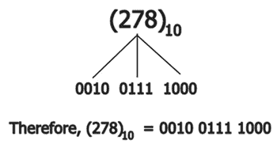

# BCD 码、3 余码、2421 码、格雷码

> 原文：<https://codescracker.com/computer-fundamental/bcd-excess-3-2421-gray-code.htm>

这里我们将讨论四种类型的代码，即:

1.  BCD 码
2.  超额 3 代码
3.  2421 代码
4.  格雷编码

先说 BCD 码。

## 二进制编码十进制码

二进制编码的十进制(BCD)码是表示十进制数的最简单的二进制码。

在 BCD 码中，十进制数由 4 个二进制位表示。如果一个十进制数由两个或两个以上数字组成，那么每个十进制数字由 4 位二进制等价数字单独表示。例如，BCD 中的(278) 10 在下图中表示为给定的 :

因此我们可以说二进制数 278 表示为 0010 0111 1000 或**(278)10= 0010 0111 1000**。

BCD 码是一种加权码，即代表一个数字的四个二进制位的重量是 8，4，2，1。现代计算机使用补码进行减法运算，当用 BCD 码表示数字时，很难形成补码。

## 超额 3 代码

在超 3 码中，十进制数的单个数字加 3，然后写出这些二进制数的等效值。例如，超出-3 代码中的(278) 10 用 0101101011 表示。该代码不是加权代码。

## 2421 代码

2421 码是另一种 BCD 码。这是加权码。比如 6 是 1100，3 是 0011。

## 格雷码

格雷码是二进制码。二进制位的排列方式是，当我们从一个数改变到下一个数时，每次只有一个二进制位改变。

格雷码是反射码。该代码用于轴编码，以数字形式表示轴的角度位置。轴位置编码器盘用作传感器。它不是加权码。格雷码可以使用以下属性来构建:

*   1 位格雷码有两个码字 0 和 1，分别代表十进制数 0 和 1。
*   n 位格雷码将具有用于 n-1 位的前 2 个 n-1 个格雷码，按顺序写入，并附加前导 0。
*   最后 2 个 n-1 个格雷码将等于一个(n-1)位格雷码的格雷码字，以相反的顺序写入 (假设在前 2 个 n-1 个和最后 2 个 n-1 个格雷码之间放置一面镜子)并附加一个前导 1。

## 例子

下表显示了所有四种代码相互转换的示例。

| Decimal No. | BCD (8421) | 超额 3 代码 | 2421 代码 | 格雷码 |
| Zero | 0000 | 0011 | 0000 | 0000 |
| one | 0001 | 0100 | 0001 | 0001 |
| Two | 0010 | 0101 | 0010 | 0011 |
| three | 0011 | 0110 | 0011 | 0010 |
| four | 0100 | 0111 | 0100 | 0110 |
| five | 0101 | One thousand | 0101 | 0111 |
| six | 0110 | One thousand and one | One thousand one hundred | 0101 |
| seven | 0111 | One thousand and ten | One thousand one hundred and one | 0100 |
| eight | One thousand | One thousand and eleven | One thousand one hundred and ten | One thousand one hundred |
| nine | One thousand and one | One thousand one hundred | One thousand one hundred and eleven | One thousand one hundred and one |
| Ten | 0001 0000 |  |  | One thousand one hundred and eleven |
| Eleven | 0001 0001 |  |  | One thousand one hundred and ten |
| Twelve | 0001 0010 |  |  | One thousand and ten |
| Thirteen | 0001 0011 |  |  | One thousand and eleven |
| Fourteen | 0001 0100 |  |  | One thousand and one |
| Fifteen | 0001 0101 |  |  | One thousand |

[计算机基础在线测试](/exam/showtest.php?subid=14)

* * *

* * *