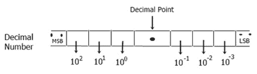
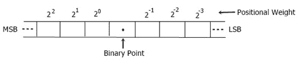
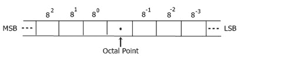
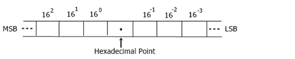

# 数系及其类型

> 原文：<https://codescracker.com/computer-fundamental/number-system-with-types-and-conversion.htm>

在本教程中，您将了解计算机数制及其类型。让我们从数系的定义开始这个教程。

## 数系的定义

数字系统定义了一组用来表示数量的值。

数字系统是一种数字系统语言，由一组称为数字的符号组成，并定义了加法、乘法和其他数学运算的规则。

一个数系的基数是用来表示它的符号数。

## 数字系统的类型

通常有四种数制:

1.  十进数制
2.  二进制数系
3.  八进位数制
4.  十六进制数系统

## 所有数系的基数

下表给出了各种类型的数制及其基数:

| 数系 | 基础 |
| 二进制的 | Two |
| 八进制的 | eight |
| 小数 | Ten |
| 十六进制的 | Sixteen |

## 数字系统中使用的符号

十进制数字系统使用 10 个符号，分别是 0，1，2，3，4，5，6，7，8，9。

二进制数字系统只使用两个符号，即 0 和 1。

八进制数字系统使用 8 个符号，分别是 0，1，2，3，4，5，6，7。

十六进制数字系统使用 16 个符号，分别是 0，1，2，3，4，5，6，7，8，9，A，B，C，D，E，f。

## 十进数制

十进制也称为十进制，因为它总共有 10 个数字，即从 0 到 9。

## 二进制数系

从计算机的角度来看，二进制数系是所有数系中最重要和最有价值的。众所周知，计算机不能在十进制或任何其他数字系统上运行，因为它只使用二进制逻辑运行。

这个数字系统只使用 2 个数字或符号，即 0 和 1。或者我们可以说，这个系统只依赖于 0 和 1。

## 八进位数制

八进制数字系统使用从 0 到 7 的数字，即总共 8 个数字或符号。

## 十六进制数系统

这个数字系统使用 16 位数字或符号。在 16 位数中，10 位数是从 0 到 9，另外 6 位数是从 A 到 f。

## 数字系统转换

现在我们将讨论从一个数系到另一个数系的转换，并逐步解释。以下是下节课将要讨论的转换列表。

*   [十进制到二进制的转换](/computer-fundamental/decimal-to-binary.htm)
*   [十进制到八进制的转换](/computer-fundamental/decimal-to-octal.htm)
*   [十进制到十六进制的转换](/computer-fundamental/decimal-to-hexadecimal.htm)
*   [二进制到十进制的转换](/computer-fundamental/binary-to-decimal.htm)
*   [二进制到八进制的转换](/computer-fundamental/binary-to-octal.htm)
*   [二进制到十六进制的转换](/computer-fundamental/binary-to-hexadecimal.htm)
*   [八进制到十进制的转换](/computer-fundamental/octal-to-decimal.htm)
*   [八进制到二进制的转换](/computer-fundamental/octal-to-binary.htm)
*   [八进制到十六进制的转换](/computer-fundamental/octal-to-hexadecimal.htm)
*   [十六进制到十进制的转换](/computer-fundamental/hexadecimal-to-decimal.htm)
*   [十六进制到二进制的转换](/computer-fundamental/hexadecimal-to-binary.htm)
*   [十六进制到八进制的转换](/computer-fundamental/hexadecimal-to-octal.htm)

从下一页，你会看到所有的转换及其一步一步的工作规则。

[计算机基础在线测试](/exam/showtest.php?subid=14)

* * *

* * *