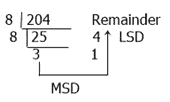

# 十进制到八进制的转换

> 原文：<https://codescracker.com/computer-fundamental/decimal-to-octal.htm>

在本教程中，你将逐步了解十进制到八进制的转换方法。

### 十进制和八进制数

十进制数的基数是 10。这意味着它总共有 10 个数字，分别是 0，1，2，..., 8, 9.然而，八进制数的基数是 8。这意味着它总共有 8 个数字，分别是 0，1，2，..., 6, 7.

## 十进制到八进制步长&示例

要将十进制转换为八进制，我们必须将十进制数除以八进制数系统的基数，即 8。让我们举个例子来清楚地理解它。

(204) 10 =(？) 8 。

从上面的例子可以看出，我们必须将数字 204 转换为八进制数字系统。

仔细看上图。这里，我们首先将数字 204 除以 8，我们得到 25 作为结果，4 作为余数，现在再次将 25 除以 8。继续除法，直到这个数小于你要除的那个数，这里是 8。

总是把余数写在结果的右边。除数后或得到小于 8 的余数后，停止除数，从最后到第一写余数。在这里，314 是十进制数的结果或八进制值，即 204。

(204) 10 = ( 314 ) 8 。

#### 在此基础上制作的节目

*   [C 语言中的十进制到八进制](/c/program/c-program-convert-decimal-to-octal.htm)
*   [c++中的十进制到八进制](/cpp/program/cpp-program-convert-decimal-to-octal.htm)
*   [Java 中的十进制到八进制](/java/program/java-program-convert-decimal-to-octal.htm)
*   [Python 中的十进制到八进制](/python/program/python-program-convert-decimal-to-octal.htm)

[计算机基础在线测试](/exam/showtest.php?subid=14)

* * *

* * *