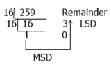

# 十进制到十六进制的转换

> 原文：<https://codescracker.com/computer-fundamental/decimal-to-hexadecimal.htm>

在本教程中，您将逐步了解十进制到十六进制的转换方法。

### 十进制和十六进制数

十进制数的基数为 **10** 。这意味着它总共有 10 个数字，分别是 **0，1，2，...，8，9** 。 而十六进制数的基数是 **16** 。这意味着它总共有 16 位数字，分别是 **0** 、 **1** 、 **2** 、...、 **7** 、 **8** 、 **9** 、10(以 **A** 为代表)、11 (以 **B** 为代表)、12(以 **C** 为代表)、13(以 **D** 为代表)、14(以 **E** 为代表)、 15(以**F**为代表)****

因为 10 有两个数字 0 和 1，同样，11 也有两个数字 1 和 1，以此类推。因此，10 用 A 表示，同样，11 用 B 表示，...，15 用 f 表示。

## 十进制到十六进制的步骤&示例

由于在十六进制数字系统中，基数是 16，因此我们必须将十进制数除以 16，并遵循在[十进制到八进制](/computer-fundamental/decimal-to-octal.htm)中给出的类似转换规则。

让我们举个例子来清楚地理解这种转换方法。

(259) 10 =(？) 16

从上图中，我们得到了十六进制系统中的值 103，也就是同一个数字。

于是，(259) 10 = (103) 16

#### 在此基础上制作的节目

*   [C 语言中的十进制到十六进制](/c/program/c-program-convert-decimal-to-hexadecimal.htm)
*   [c++中的十进制到十六进制](/cpp/program/cpp-program-convert-decimal-to-hexadecimal.htm)
*   [Java 中的十进制到十六进制](/java/program/java-program-convert-decimal-to-hexadecimal.htm)
*   [Python 中的十进制到十六进制](/python/program/python-program-convert-decimal-to-hexadecimal.htm)

[计算机基础在线测试](/exam/showtest.php?subid=14)

* * *

* * *