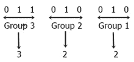

# 二进制到八进制转换

> 原文：<https://codescracker.com/computer-fundamental/binary-to-octal.htm>

在本教程中，你将逐步了解二进制到八进制的转换方法。

### 二进制和八进制数

二进制数的基数为 **2** 。这意味着它总共有两位数，分别是 **0** 和 **1** 。而 八进制数的基数为 **8** 。这意味着它总共有 8 个数字，分别是 **0、1、2、...，6，7** 。

## 二进制到八进制方法

我们有两种方法将任何二进制数转换成八进制数。

*   将[二进制转换成十进制](/computer-fundamental/binary-to-decimal.htm)，然后将 十进制转换成八进制
*   直接将二进制转换为八进制

这里我们只讨论第二种方法。因为，在第一种方法中，我们已经讨论过这两种转化。重新学习，你可以按照这两个单独的教程。

## 二进制到八进制步长

遵循下面给出的二进制到八进制转换的所有步骤:

1.  从 LSB 开始，将二进制位分成 3-3 个部分
2.  在二进制数之前根据需要放置 1 或 2 个零，以防数字的总数不能被 3 整除。由于我们必须制作 3-3 位数的配对，那么如果我们有 8 位数像 10110100，8 不能被 3 整除，那么我们必须在 10110100 前追加 0，使其成为 010110100。
3.  现在将每组转换成等价的十进制数。

## 二进制到八进制公式

以下是有助于二进制到八进制转换的规则

*   假设给定的二进制数是 **1101110** 。
*   我们必须把它转换成等价的八进制值
*   然后首先我们要从右边开始做 3-3 对二进制数字
*   因此，从右侧开始的 3-3 对 **1101110** 将是， **110** (作为第一对)， **101** (作为第二对)，以及 **1** (作为第三对)
*   您可以在第三对的开头添加零(0)，在第三对的开头 添加两个零之后，该零变成 **001**
*   现在我们必须将所有的对逐一转换成它的等价八进制值

下面是第三个二进制对的转换， **001** 转换成其等效的八进制值:

```

22  21  20
4   2   1

0   0   1   (last binary pair)
        1   (write below 1 only)
=1          (sum up all the values)
```

下面是第二个二进制对， **101** 到其等效八进制值的转换:

```

22  21  20
4   2   1

1   0   1   (second binary pair)
4       1   (write below 1 only)
=4+1        (sum up all the values)
=5
```

下面是第一个二进制对的转换， **110** 转换成其等价的八进制值:

```

22  21  20
4   2   1

1   1   0   (first binary pair)
4   2       (write below 1 only)
=4+2        (sum up all the values)
=6
```

现在我们有三个八进制数字，即 **1、5** 和 **6** 。因此 **1101110** 的八进制值为 **156** 。

## 二进制到八进制示例

现在让我们举一个例子，看看如何将二进制形式的数字 11010010 转换成八进制数字系统。

或者，convert (11010010) <sub>2</sub> =(？) <sub>8</sub> 。



从上图可以看出，把二进制形式给出的数字 11010010 转换成八进制数字体系后，我们得到 322。

因此，(11010010)<sub>2</sub>=(322)<sub>8</sub>

#### 在此基础上制作的节目

*   [C 语言中的二进制到八进制](/c/program/c-program-convert-binary-to-octal.htm)
*   [C++ 中的二进制到八进制](/cpp/program/cpp-program-convert-binary-to-octal.htm)
*   [Java 中的二进制到八进制](/java/program/java-program-convert-binary-to-octal.htm)
*   [Python 中的二进制到八进制](/python/program/python-program-convert-binary-to-octal.htm)

[计算机基础在线测试](/exam/showtest.php?subid=14)

* * *

* * *