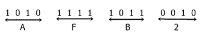

# 二进制到十六进制转换

> 原文：<https://codescracker.com/computer-fundamental/binary-to-hexadecimal.htm>

在本教程中，您将逐步了解用于二进制到十六进制转换的方法。

### 二进制和十六进制数

二进制数的基数为 **2** 。也就是说总共有两位数，分别是 **0** 和 **1** 。 而十六进制数的基数为 **16** 。这意味着它总共有 16 个数字，分别是 **0，1，2，...，14，15** 。在十六进制中，从 **10 到 15** 的数字用 **A 到 F** 表示。即 10 用 A 表示，11 用 B 表示，...，14 用 E 表示，15 用 f 表示。

## 二进制到十六进制的步骤

要将任何数字从二进制转换成十六进制，我们必须遵循给定的步骤:

1.  将二进制数字分成 4-4 对。
2.  从 LSB 开始到 MSB，组成一对 4-4 位或数。
3.  现在，将每个 4 位二进制数转换为相应的十六进制数。
4.  现在合并所有转换后的数字，这将是相同的数字，但在十六进制数字系统。

## 二进制到十六进制公式

下面的规则可以帮助你将任何给定的二进制数转换成相应的十六进制数。假设用户已经输入了 **1101110** 作为二进制数输入。

*   然后，我们必须首先从右侧生成 4-4 对给定的二进制数字，即 **1101110** 从右侧共有 2 对 4-4 位数字
*   也就是说，第一对将是 **1110** ，第二对将是 **110**
*   您可以在第二个二进制对的开头添加 0，使其成为 4 位数字对
*   即在二进制对 **110** 的开始处添加 0 之后
*   这对组合成为 **0110**

现在将所有的两个二进制对转换成其相应的十六进制值，如下面给出的两个方框所示:

```
23  22  21  20
8   4   2   1

0   1   1   0    (last or second binary pair)
    4   2        (write below 1 only)
=4+2             (sum up all values)
=6
```

下面是将第一个二进制对转换成等效的十六进制值的过程:

```
23  22  21  20
8   4   2   1

1   1   1   0    (last or second binary pair)
8   4   2        (write below 1 only)
=8+4+2             (sum up all values)
=14
```

现在我们有两个十六进制数字，分别是 **6** 和 **14** ，而且我们已经告诉过你，从第 10 位 到第 15 位，我们要用 A 到 f 的字符来替换它，因此，6 会保持原样，14 会用 e 来转换 ，也就是说， **6E** 是给定二进制数 **1101110** 的最终十六进制值。因此， **(1101110)<sub>2</sub>**=**(6E)<sub>16</sub>**。

## 二进制到十六进制示例

让我们举一个例子，看看如何将二进制数转换成十六进制数。

我们有一个数字，比如 1010111110110010，现在我们要把它转换成十六进制形式。请参见下图:



正如你从上图中看到的，我们总共有 4 个数字，分别是 A、F、B 和 2。现在结合所有的四个数字，我们将得到 AFB2，这是相同的数字，但在十六进制形式。

因此，(10101111110110010)<sub>2</sub>=(af B2)<sub>16</sub>

#### 在此基础上制作的节目

*   [C 语言中的二进制到十六进制](/c/program/c-program-convert-binary-to-hexadecimal.htm)
*   [c++中的二进制到十六进制](/cpp/program/cpp-program-convert-binary-to-hexadecimal.htm)
*   [Java 中的二进制到十六进制](/java/program/java-program-convert-binary-to-hexadecimal.htm)
*   [Python 中的二进制到十六进制](/python/program/python-program-convert-binary-to-hexadecimal.htm)

[计算机基础在线测试](/exam/showtest.php?subid=14)

* * *

* * *