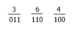

# 八进制到二进制转换

> 原文：<https://codescracker.com/computer-fundamental/octal-to-binary.htm>

在本教程中，你将逐步了解八进制到二进制的转换方法。

### 八进制和二进制数

八进制数的基数是 **8** 。这意味着它总共有 8 个数字，分别是 **0，1，2，...，6，7** 。 而二进制数的基数为 **2** 。这意味着它总共有两位数，分别是 **0** 和 **1** 。

## 八进制到二进制公式

要将任何八进制数转换成二进制数，我们必须将每个八进制数转换成 3 位二进制数。我们举个例子。

将八进制数 364 转换为二进制。或者(364) 8 =(？) 2 。

从上图来看，我们有 3 个 3 位二进制数，第一个是 011，第二个是 110，第三个是 100。因此在合并时，我们有 011110100。

结果是，(364)8=(011110100)2。

## 八进制到二进制转换表

借助下表，任何八进制数都可以转换成二进制数。你必须把八进制数字一个接一个地转换成它的二进制等价物。下表显示了所有 8 个八进制数字的二进制等效值:

| 八进制数字 | 等效二进制值 |
| Zero | 000 |
| one | 001 |
| Two | 010 |
| three | 011 |
| four | One hundred |
| five | One hundred and one |
| six | One hundred and ten |
| seven | One hundred and eleven |

## 八进制到二进制示例

例如，让我们假设数字 **254** 被给定为八进制数，因此要把它转换成二进制数， 你必须一个接一个地写出每个八进制数的二进制等值。八进制数字是 **2、5、**和 **4** 。 因此， **2** 、 **5** 、 **4** 八进制数的二进制等效值分别为 **010** 、 **101** 和 **100** 。即**(254)8**=**(010101100)2**

#### 在此基础上制作的节目

*   [C 语言中的八进制到二进制](/c/program/c-program-convert-octal-to-binary.htm)
*   [c++中的八进制到二进制](/cpp/program/cpp-program-convert-octal-to-binary.htm)
*   [Java 中的八进制到二进制](/java/program/java-program-convert-octal-to-binary.htm)
*   [Python 中的八进制到二进制](/python/program/python-program-convert-octal-to-binary.htm)

[计算机基础在线测试](/exam/showtest.php?subid=14)

* * *

* * *