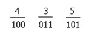
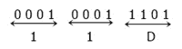

# 八进制到十六进制的转换

> 原文：<https://codescracker.com/computer-fundamental/octal-to-hexadecimal.htm>

在本教程中，您将逐步了解用于将八进制转换为十六进制的方法。

### 八进制和十六进制数

八进制数的基数是 **8** 。这意味着它总共有 **8 个**位，分别是 **0、1、2、...、6、7** 。而十六进制数的基数是 **16** 。这意味着它总共有 **16 个** 位，即 **0、1、2、...，8，9，A，B，C，D，E，F** 。在十六进制数字系统中，数字 **10 到 15** 是用字符 **A 到 F** 来表示的 。即 A 代表 10，B 代表 11，...，E 代表 14，F 代表 15

## 八进制到十六进制公式

要将任何八进制数转换成十六进制，我们必须先将八进制数转换成二进制数，然后再将二进制数转换成十六进制数。

比如，(435) <sub>8</sub> =(？) <sub>16</sub>

我们必须将上述八进制数 435 转换成十六进制数。然后我们必须转换它的二进制等价物。下图显示了 435 的二进制等值或二进制等值。



根据上面给出的数字，我们得到的值是 100 011 101，也就是二进制数等于八进制数 435。现在我们把它转换成十六进制。或者我们要计算一下，(100011010) <sub>2</sub> =(？) <sub>16</sub>

在继续之前，我们必须制作 4-4 对二进制位，这里我们共有 9 个数字，因此要制作 4-4 对，我们必须在数字前添加 3 个零，添加 3 个零后，我们得到 000100011101。现在制作 4-4 对，并将每对转换成十六进制的等值，如下图所示。



根据上图，我们得到的十六进制等值是 11D。因此，(435) <sub>8</sub> = (11D) <sub>16</sub>

## 八进制到十六进制步长

假设给定的八进制数是 **1452** 。现在，请仔细看看下面的方框， 将向你展示完成这项工作的规则:

```
1     4     5     2     (write all octal digits)
001   100   101   010   (write its binary equivalent)

001100101010            (combine all binary digits)

0011  0010  1010        (make 4-4 binary pair)
3     2     10          (write decimal equivalent of each binary pair)
3     2     A           (convert digit 10 to 15 into character A to F)
=32A
```

从上面的方框可以看出

*   首先你必须写出所有的八进制数字
*   然后在 3-3 二进制对中逐一写出每个八进制数字的二进制等效值
*   然后组合所有的二元对。现在做 4-4 二进制对
*   写出每个二进制对的十进制等效值

如果任何大于 9 的数字都可以作为十进制数字，那么就像上面说的那样把它转换成字符。因此，从上表可以看出，给定八进制数 **1452** 的十六进制等效值是 **32A** 。或者你可以 写**(1452)<sub>8</sub>**=**(32A)<sub>16</sub>**

#### 在此基础上制作的节目

*   [C 语言中的八进制到十六进制](/c/program/c-program-convert-octal-to-hexadecimal.htm)
*   [C++ 中的八进制到十六进制](/cpp/program/cpp-program-convert-octal-to-hexadecimal.htm)
*   [Java 中的八进制到十六进制](/java/program/java-program-convert-octal-to-hexadecimal.htm)
*   [Python 中的八进制到十六进制](/python/program/python-program-convert-octal-to-hexadecimal.htm)

[计算机基础在线测试](/exam/showtest.php?subid=14)

* * *

* * *