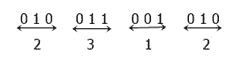

# 十六进制到八进制的转换

> 原文：<https://codescracker.com/computer-fundamental/hexadecimal-to-octal.htm>

在本教程中，您将逐步了解用于将十六进制转换为八进制的方法。

### 十六进制和八进制数

十六进制数字系统以 16 为基数。这意味着，总共有 16 个字符用来表示十六进制数的值。这 16 个字符分别是 **0，1，2，3，4，5，6，7，8，9，A，B，C，D，E， F** 。在这里，A、B、C、D、E、F 用于在一个字符中表示 10、11、12、13、14、15。那就是:

*   a 代表 10
*   b 代表 11
*   等等

八进制数字系统以 8 为基数。这意味着，总共有 8 个字符用来表示八进制数的值。这 8 个字符是 **0，1，2，3，4，5，6，7** 。

## 十六进制到八进制公式

要将十六进制数转换为八进制数，请遵循下面给出的步骤。我们假设， **4CA** 是十六进制数制中的给定值 :

*   在 4 位二进制对中写入每个十六进制数字的二进制等效值
*   即 **4CA** 的二进制等价为 **0100 1100 1010**
*   组合这些 4 位二进制数
*   所以会是 **010011001010**
*   现在从 **LSB** 侧开始将上述二进制数分成 3-3 对
*   所以将会是 **010 011 001 010**
*   将每个 3 位组转换成相应的八进制数字
*   所以会是 **2 3 1 2**
*   组合这些八进制数字
*   所以会是 **2312**
*   因此，(**4CA**)16=(**2312**)8

## 十六进制到八进制示例

让我们举一个例子来应用上面所有的规则，并以一种将十六进制数转换为八进制数的清晰方式来理解它。

(4CA) 16 =(？) 8

因此，我们有一个十六进制的数字，即 4CA。我们必须拆分该数字，并将其转换为 4 位二进制等效值，如下表所示:

| 十六进制数字 | 等效 4 位二进制 |
| four | 0100 |
| C | One thousand one hundred |
| A | One thousand and ten |

因此，我们总共有 3 对 4 位二进制数，即 0100、1100 和 1010。现在将所有 3 对组合起来，我们得到 010011001010。现在我们必须把它分成 3-3 对。然后我们得到，010，011，001，和 010。如下图所示，将这 4 对 3 位二进制数转换为相应的八进制值:

从上图可以看出，将所有的 4 个八进制等效值结合起来，我们得到 2312。

因此，最后(4CA) 16 = (2312) 8

#### 在此基础上制作的节目

*   [C 语言中的十六进制到八进制](/c/program/c-program-convert-hexadecimal-to-octal.htm)
*   [C++ 中的十六进制到八进制](/cpp/program/cpp-program-convert-hexadecimal-to-octal.htm)
*   [Java 中的十六进制到八进制](/java/program/java-program-convert-hexadecimal-to-octal.htm)
*   [Python 中的十六进制到八进制](/python/program/python-program-convert-hexadecimal-to-octal.htm)

[计算机基础在线测试](/exam/showtest.php?subid=14)

* * *

* * *