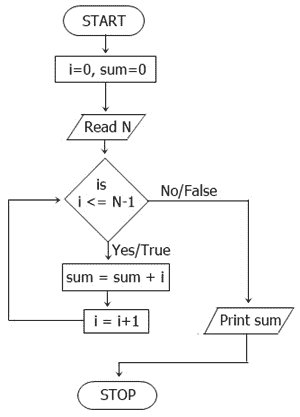

# 算法和流程图

> 原文：<https://codescracker.com/computer-fundamental/algorithm-and-flowchart.htm>

在这篇文章或教程中，我们将通过例子详细了解算法和流程图。先说算法。

## 算法

算法是一步一步地描述如何解决任何给定的问题。

或者你可以说，任何程序的算法都是对给定程序或问题的逐步解决方案的描述。

为了符合算法的要求，指令序列必须具备以下特征:

*   每一份书面说明都应该准确无误
*   每条指令都应该在有限的时间内执行
*   任何指令都不应该无限重复
*   在执行了所有给定的指令后，必须获得期望的结果

## 算法示例

现在让我们举一个算法的例子，我们如何写一个给定问题的算法。

#### 写一个算法来计算前 N 个数的和

在这里，我们必须写一个算法或一步一步的解决方案的描述，寻找前 N 个数字的总和。

```
1. Read the value of n
2. Put i=1, sum=0
3. if(i>n) go to step 7
4. Update s = s + i
5. Update i = i+1
6. go to step 3
7. Print the value of s
8. Stop
```

正如你所看到的，上面的算法分 8 步编写，可以帮助你编写一个程序来计算前 N 个数的和。

#### 写一个算法，从给定的列表中找出最小和最大的数字

在这里，我们必须编写一个算法，帮助我们从给定的数字列表中找出最小和最大的数字。

```
1. Read list of all numbers
2. Assign the first number as largest number
3. Assign the first number as smallest number
4. Repeat step 5, 6 and 7 as long as the largest and smallest number are there
5. Read number and check for largest and smallest with comparision
6. If the number is greater than largest then the current number is the largest.
7.If the number is lesser than smallest then the current number is the smallest.
8. Print Largest Number
9. Print Smallest Number
10. Stop
```

现在你可以很容易地应用上面给出的所有步骤，使你的程序从给定的数字列表中找到最大和最小的数字。

## 流程图

流程图是任何给定任务、问题或程序的图示。

### 流程图的类型

有两种类型的流程图，这里给出了简短的描述:

1.  系统流程图-这些流程图描述了流程的逻辑流程，实际上是在完成某件事情之前发生的一系列商业事件
2.  **程序流程图** -这是高级语言中单个程序的流程图。这种类型的流程图具有用于输入、输出、更新所访问文件的文件名，以及程序运行后可能创建的报告的名称。这意味着，程序流程图包含了程序的每一个细节

### 流程图的优势

以下是在将任何解决方案应用于程序之前使用流程图的一些主要优点:

1.  **有效分析** -使用流程图，任何问题都可以用更有效的方式进行分析
2.  沟通 -流程图是向所有相关人员传达系统逻辑的更好方式
3.  高效编码 -每个流程图都是系统分析和程序开发阶段的指南或蓝图
4.  **正确调试** -流程图有助于调试过程
5.  **高效的程序维护** -使用流程图，运行程序的维护变得非常容易。
6.  正确的文档-程序流程图是一个好的程序文档，它有多种用途

### 流程图的缺点

以下是使用流程图解决任何给定问题的一些主要缺点:

1.  **复杂逻辑** -有时，给定的程序逻辑相当复杂。在这种情况下，为该问题或程序设计或绘制流程图就变得非常困难。在这种情况下，算法帮助很大
2.  **改动和修改**——如果我们想改动或改变流程图中程序的任何逻辑，那么我们必须重新绘制整个流程图，这是非常令人恼火的。

### 流程图中使用的基本符号

美国国家标准协会(ANSI)已经标准化了这些给定的基本流程图符号。

#### 末端的

终端符号用来表示程序的开始和结束。这里是终端的符号:


#### 输入/输出

平行四边形用于表示输入和输出表示或操作。以下是流程图中使用的输入/输出的演示符号:


#### 处理符号

为了表示流程图中的任何处理操作，我们必须使用矩形符号。下面是在绘制流程图时使用的矩形的演示符号，以使用存储或算术运算:


#### 决策符号

为了表示决策陈述的步骤，我们必须使用菱形框。以下是菱形框的演示符号:


#### 线条的流动

线条流表示程序中逻辑流程的路径。在流程图中使用的每个方框之间，我们必须用线条来表示程序流程的走向。这是线条流的演示符号:


#### 连接器符号

我们必须用圆圈来连接流程图的不同部分。以下是流程图中使用的圆形演示符号:


### 流程图示例

现在让我们举一个流程图的例子来清楚地理解如何使用上面给出的所有符号，并画出告诉任何程序或问题的解决方案的图示。

#### 画流程图找出三个数字中最大的一个

下图显示了有助于找到三个数字中最大值的流程图:


#### 画流程图，找出前 N 个数的和

下面是另一个计算前 N 个自然数之和的流程图:



[计算机基础在线测试](/exam/showtest.php?subid=14)

* * *

* * *