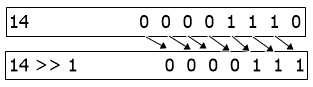
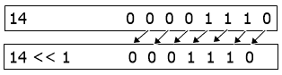

# 带示例的按位运算符

> 原文：<https://codescracker.com/computer-fundamental/bitwise-operators.htm>

按位运算符用于按位操作。也就是说，按位运算符在二进制级别上对整数和单位进行运算。也就是说，无论操作数值是什么，按位运算符都会对其等效的二进制值执行计算。

## 按位运算符的类型

以下是 6 种按位运算符:

1.  按位与(&)
2.  按位或(|)
3.  按位异或(&Hat;)
4.  位元 not(；)
5.  按位右移(>>)
6.  按位左移(<

现在，让我们简单地讨论和理解所有的位操作符，以及它的简短和完整的可理解的例子。

## 按位与(&)

按位 AND 或按位&运算符的真值表是:

| A | B | A & B |
| one | one | one |
| one | Zero | Zero |
| Zero | one | Zero |
| Zero | Zero | Zero |

例如:

```

  0011 1100   (60)
& 0000 1101   (13)
-----------
  0000 1100   (12)
```

因此， **60 & 13 = 12**

## 按位或(|)

按位 or 或按位|运算符的真值表是:

| A | B | A &#124; B |
| one | one | one |
| one | Zero | one |
| Zero | one | one |
| Zero | Zero | Zero |

例如:

```

  0011 1100   (60)
| 0000 1101   (13)
-----------
  0011 1101   (61)
```

因此， **60 | 13 = 61**

## 按位异或(&Hat;)

按位异或&Hat;(按位异或)的真值表为:

| A | B | A &Hat; B |
| one | one | Zero |
| one | Zero | one |
| Zero | one | one |
| Zero | Zero | Zero |

```

  0011 1100   (60)
&Hat; 0000 1101   (13)
-----------
  0011 0001   (49)
```

因此， **60 &的帽子；13 = 49**

## 位元 not(；)

与其他按位运算符不同，按位 NOT 或按位\u 运算符是一元运算符。一元运算符是指只对一个操作数进行运算或只接受一个输入的运算符。

按位 NOT 运算符对输入的每一位逐一进行补码。我们可以把这里的&quit;补语理解为反过来。以下是按位 NOT 运算符的真值表:

| A | (a) |
| one | Zero |
| Zero | one |

例如:

```
˜ 0111   (7)
------
  1000   (8)
```

因此，**᳠7 = 8**

## 按位右移(>>)

按位右移或按位>>运算符将二进制序列向右移位。比如 14 的二进制等价为 **0000 1110** (8 位二进制等价)，然后 **14 > > 1** 给出 **000 0111** 。下图显示了按位右移操作的 图示:



**注意-** 空的位置被替换为 0。因此，**14>T5】1 = 0000 0111**(即等于 7)。

同样，**14>T3】2**可以计算为:

```
14            0000 1110
14 >> 2         00 0011
```

因此，**14>T3】2 = 0000 0011**(即等于 3)。也就是说，14 的二进制等效值向右移动两位。

## 按位左移(<

按位左移或按位<< operator shifts the binary sequence to the left. For example, the binary equivalent of 14 is **0000 1110** (8 位二进制等价)，然后**14<T7】1**给出 **0001 1100** 。下图以图形形式显示了 位左移操作的执行方式:



**注意-** 同样，在按位左移中，空的位置被替换为 0。因此，**14<T5】1 = 0001 1100**(即等于 28)。

同样，**14<T3】2**可以计算为:

```
14            0000 1110
14 << 2       0011 10
```

因此，**14<T3】2 = 0011 1000**(即等于 56)

[计算机基础在线测试](/exam/showtest.php?subid=14)

* * *

* * *