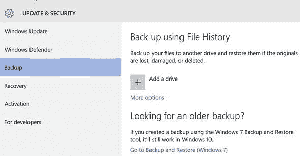
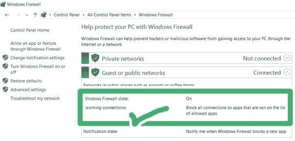

# 什么是勒索软件，防范勒索软件的最佳方法是什么

> 原文：<https://codescracker.com/computer-tricks/ransomware-virus-attack.htm>

## 什么是勒索软件？

勒索软件是一种[病毒](/operating-system/viruses.htm)程序，用于控制受害者的 电脑系统或者锁定受害者的电脑。

在勒索软件攻击之前，您可以完全控制您的计算机系统。

勒索软件攻击后，你无法对你的电脑系统有任何进一步的控制。

## 为什么要勒索？

勒索软件就是病毒要钱的意思。或病毒，只是采取一些钱从受害者后，执行一些危险的行动，使受害者成为能够支付那些要求金额的钱，从该病毒。

## 互联网历史上最大的病毒攻击

WannaCry 勒索病毒攻击是[互联网](/networking/internet.htm)历史上最大的病毒攻击。

## 勒索病毒攻击能做什么？

勒索病毒攻击锁定您的计算机，即在勒索病毒攻击后，您不能进一步操作您的计算机系统，或者您将无法打开您的文件或任何其他重要文件存储在您的计算机系统。

你可以在 wannacry 勒索病毒攻击之前打开你所有正常到秘密和私人的文件。

wannacry 勒索病毒攻击后无法打开任何从正常到私密的文件。

## 如何保护电脑免受勒索病毒攻击？

要保护您的计算机免受勒索病毒的大规模攻击，只需遵循以下步骤:

**(1)** 备份你 电脑上存储的所有[文件](/operating-system/files.htm)。

**(2)** 如果你使用的是 windows [操作系统](/operating-system/index.htm)，那么就更新 ，安装最新的 Windows 安全程序如 Windows 防火墙、windows defender 等。

**(3)** 为您的操作系统更新并安装所有最新的功能和安全更新。

注意你的计算机系统上发生的任何不想要的和未知的动作。

**(5)** 不要随意打开任何不知名的邮件。

**(6)** 请不要点击来自未知发件人的任何电子邮件附件。

**(7)** 尽快更新你的电脑系统。

**(8)** 开启 windows defender。

**(9)** 开启 windows 防火墙。

**(10)** 让电脑系统始终开启所有可用的实时防护功能。

以上 10 个是可以执行的顶级操作，以保护您的计算机/PC/笔记本电脑免受任何病毒攻击，甚至是大规模 WannaCry 勒索病毒攻击。

使您的操作系统保持最新，因为勒索病毒程序也可以更改其代码，以进入早期更新的操作系统。因此，只需让您的操作系统执行自动更新。

## 防范勒索病毒攻击的最佳方式

保护您的计算机免受大规模勒索病毒攻击的最佳方法如下:

*   使用最新版本的 Windows 10 并允许自动更新。
*   不要打开任何陌生人的邮件，也不要点击任何陌生人的邮件。

如果你想要一个硬的方法来保护你的电脑或笔记本电脑或电脑系统免受勒索病毒的攻击，只是不要在你的电脑上使用互联网，你把你的重要文件或你不希望任何 WannaCry 勒索型病毒的攻击。

## 勒索软件是什么时候推出的？

勒索病毒攻击开始于 2017 年 12 月 5 日，也就是 2017 年 5 月 12 日周五。

## 勒索病毒攻击后会怎么样？

通过这次勒索病毒攻击，人们发现他们的计算机被锁定，所有文件都被加密。

勒索病毒攻击要求受害者支付 290 美元或 290 美元的比特币，以使他们的系统恢复到原始状态或解密他/她的计算机系统的所有文件。

## 勒索软件是怎样的一种大攻击？

勒索病毒攻击是一种大规模的攻击，因为这种病毒攻击很难感染同一网络上的计算机和服务器。

## 勒索软件的目的是什么？

勒索软件的主要目的只是从受害者那里获得一些所需的金额。截至目前，勒索病毒要求受害者支付 290 美元的比特币。

## 勒索软件到达了多少个国家？

WannaCry 勒索病毒攻击几乎遍及太多国家，即超过 150 个国家，并且仅在攻击的几个小时(少于 3-4 天)内就影响了大约超过 250000 台计算机。因此，你可以想象这种非常大规模的勒索软件攻击是如何进行的。

这种 WannaCry 勒索软件攻击主要针对大学、学院、机构和政府等。但个人也可以找到勒索病毒的受害者，因为 WannaCry 勒索病毒也以个人计算机或个人为目标。

基本上，WannaCry 勒索病毒攻击的目标是所有使用尚未打补丁的旧版本 windows 操作系统的计算机用户。

因此，如果您使用的是较旧的 windows 操作系统，如 Windows XP、Windows Server 2003 或 Windows 8 等。然后只需更新您的操作系统，这样您的计算机系统就不会受到当前 WannaCry 勒索病毒攻击的攻击。

## 抵御勒索软件的最佳操作系统

以下是一些最佳操作系统的列表，它们通常可以防御/保护您或您的计算机免受大规模 WannaCry 勒索病毒的攻击:

*   Windows 10
*   Windows 8.1
*   Windows 7
*   Windows Server 2016
*   Windows Server 2008
*   Windows Server 2008 R2 版
*   Windows Vista
*   Windows Server 2012
*   Windows Server 2012 R2 版

在上述所有操作系统中，windows 10 是几乎可以自动保护你的电脑免受 WannaCry 勒索病毒攻击的最佳操作系统。

## 自动防御勒索软件攻击的最佳操作系统

最新的 Windows 10 是最好的操作系统(OS ),通过其部分安全程序如 Windows 防火墙、windows defender 等自动保护您的计算机系统免受 WannaCry 勒索病毒的攻击。

安装 windows 10 后，或者如果您已经在使用最新版本的 windows 10，也允许自动更新功能在有新补丁可用时自动更新您的 windows 10，以最佳方式保护您的计算机免受勒索病毒的攻击。

## 哪些 OS 用户不用担心勒索软件攻击？

有一些操作系统截至目前几乎无法受到 WannaCry 勒索病毒攻击的影响。以下是不会受到勒索病毒程序影响的操作系统列表:

*   马科斯
*   chrome os
*   Linux 操作系统
*   ios
*   机器人

从以上 5 个操作系统来看，前 3 个用于电脑系统，后 2 个用于手机。换句话说，前 3 个操作系统是电脑的操作系统，后两个是手机操作系统。

## 如果您正在使用旧版本的 Windows 来抵御勒索软件，该怎么办？

如果您使用的是旧版本的 Windows，只是为了保护自己免受 WannaCry 勒索软件的攻击，请阻止 TCP 端口 445。或者只是修补你的操作系统。

## 如何防范更新版本的勒索软件

当你的窗口被修补时，只是保持警惕突变并不意味着你总是安全的，你的系统被保护免受勒索软件的攻击，因为较新版本的勒索软件也可以找到漏洞并进入你修补的窗口，你在那个窗口内感到安全。因此，只需更新您的计算机系统，特别是您的操作系统。

## 移动用户不必担心 WannaCry 勒索软件攻击

截至目前，移动用户不必担心 WannaCry 勒索病毒的攻击，因为勒索病毒通常针对 Windows 特定的用户。

WannaCry 勒索病毒只针对并感染 Windows 操作系统。因此，截至目前，移动或电话用户不必担心这种大规模的勒索病毒攻击。

## 遭遇勒索病毒攻击后怎么办？

现在，在免费成为勒索病毒攻击的受害者后，没有发现任何保护自己的方法。

所以，你只需要支付制造勒索病毒的人向你索要的钱，就可以让你的系统恢复原形。

[计算机基础在线测试](/exam/showtest.php?subid=14)

* * *

* * *