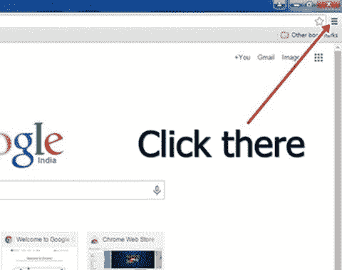
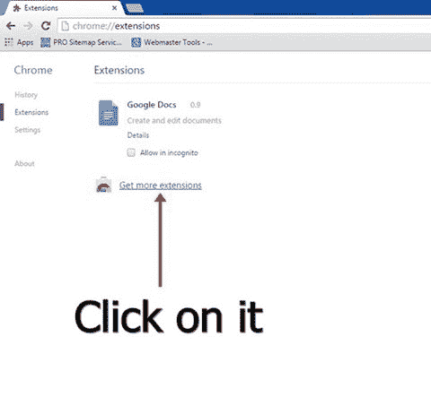
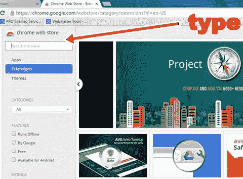
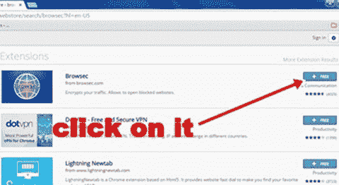
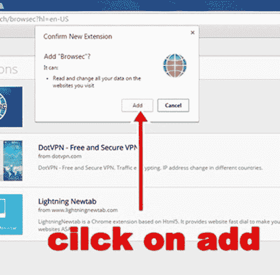

# 如何打开被阻止的网站和 Youtube

> 原文：<https://codescracker.com/computer-tricks/open-blocked-website.htm>

打开被阻止的网站或 Youtube。请遵循以下步骤:

打开类似**谷歌浏览器**的浏览器，点击右上角，如下图所示

现在转到/点击**更多工具**然后**扩展**。现在会出现一个新窗口，如下图所示

现在在**搜索商店**框中输入**browsec**，如下图所示

在搜索框中输入 **browsec** 后，按 **`ENTER`** 。现在你会看到一个新的窗口再次出现，如下图所示

现在点击免费按钮，然后你会看到一个新的确认对话框，要求确认。现在点击**是**T2 按钮如下图所示

单击“是”后，等待几秒钟。现在你会看到一个新的扩展将被添加到你的浏览器右上角。现在**点击扩展图标**，然后**点击保护我按钮**

流程已完成。现在你可以打开任何网站，Youtube 等。被您的管理员阻止。

[计算机基础在线测试](/exam/showtest.php?subid=14)

* * *

* * *