# 矩阵乘法规则和公式

> 原文：<https://codescracker.com/nonprog/matrix-multiplication.htm>

在本教程中，您将学习所有关于矩阵乘法的知识。在这里，我通过图示展示了矩阵乘法中涉及的步骤。我认为绘画是定义任何小的复杂主题的最好的东西。因此，这里有两个你需要了解的话题:

*   矩阵是什么？
*   两个矩阵的乘法是如何进行的？

我将用这里任何程序员都能理解的术语来解释这两个主题。

### 什么是矩阵？

在编程领域，矩阵基本上是一个二维(2D)数组。这里的二维是指，数组的元素排列成二维的行和列。行从上到下，而列从左到右。举个例子，

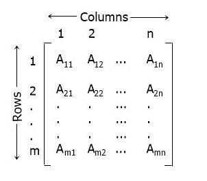

从上面的矩阵可以看出，总共有 **m** 个数字或行和 **n** 个列。 和**一个 <sub>11</sub> ，一个 <sub>12</sub> ，.....一个<sub>Mn</sub>T11】是矩阵的元素，以一种方式排列，即 元素**

*   A <sub>11</sub> 位于第 1 <sup>行</sup>和第 1 <sup>行</sup>列
*   A <sub>12</sub> 位于第 1 <sup>行第</sup>列，第 2 <sup>行第</sup>列
*   A <sub>1n</sub> 在第 1 <sup>第</sup>行，第 n <sup>第</sup>列
*   A <sub>21</sub> 位于第 2 <sup>第</sup>行，第 1 <sup>第</sup>列
*   A <sub>22</sub> 位于第 2 <sup>第</sup>行，第 2 <sup>第</sup>列
*   A <sub>2n</sub> 在第 2 <sup>第</sup>行，第 n <sup>第</sup>列
*   A <sub>m1</sub> 在第 m <sup>行</sup>处，第 1 <sup>行</sup>列
*   A <sub>m2</sub> 在第 m <sup>行</sup>第 2 <sup>第</sup>列
*   A <sub>mn</sub> 在第 m <sup>行第</sup>列，第 n <sup>行第</sup>列

## 矩阵乘法是如何执行的？

要将任意两个矩阵相乘，我们需要做行和列的**点积**。在进行到 矩阵乘法的分步过程之前。我们先来了解一下矩阵**点积**。所以要做 **(1，2，3)的 点积。(4，5，6)** 。以下是步骤:

```
(1,2,3).(4,5,6)
=(1x4)+(2x5)+(3x6)
=4+10+18
=32
```

现在让我们用下面给出的一步一步的过程来理解矩阵乘法。

## 矩阵乘法的逐步过程

下面是两个给定矩阵相乘的逐步过程:

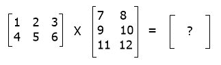

在第一步中，对(第一个矩阵的)第一行元素和(第二个矩阵的)第一列元素执行点积，如下所示:

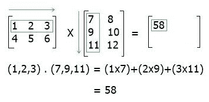

在第二步中，对(第一个矩阵的)第一行元素和(第二个矩阵的)第二列元素执行点积，如下所示:

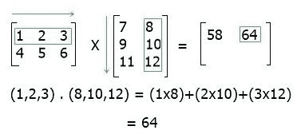

在第三步中，执行第二行元素(第一个矩阵)与第一列元素(第二个矩阵)的点积，如下所示:

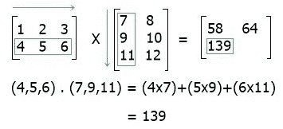

在第四步中，执行第二行元素(第一个矩阵)与第二列元素(第二个矩阵)的点积，如下所示:

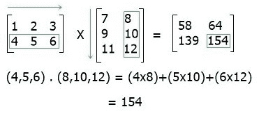

这样，你就可以执行矩阵乘法了。

## 执行矩阵乘法条件

为了执行或定义矩阵乘法，第一个矩阵的列数必须等于第二个矩阵的行数。

### 矩阵乘法的进一步解释

称为矩阵乘法的二进制过程从两个矩阵创建一个矩阵。第一个矩阵的列数必须与下一个矩阵的行数相同，矩阵才能相乘。

第一个矩阵的行数和第二个矩阵的列数组合起来形成最终的矩阵，或矩阵乘积。字母 AB 代表矩阵 A 和 b 的结果。因此，矩阵乘法是线性代数的基本工具，并且已经在纯算术和实用算术的许多分支中具有各种用途，包括在统计学、物理学、经济学以及工程学中。

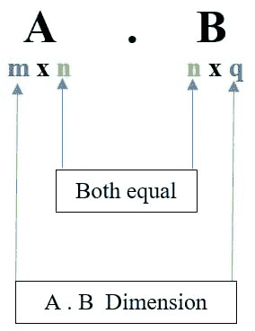

假设我们拥有两个矩阵 A 和 B，矩阵 A 可以用公式(AB)乘以矩阵 B。换句话说，任何 m×n 矩阵“A”与 n×q 矩阵“B”相乘的结果矩阵可以表示为 m×q 阶的矩阵“C”

通过使用“初始行与列相乘(一个组件接一个组件)，然后所有行被完全填充”的概念，我们可以掌握矩阵相乘的一般过程。基本方法可用于乘矩阵:
确保第二个矩阵中的行数与第一个 矩阵中的列数相匹配是第一步。

第二步需要将第一个矩阵的第 i <sup>行的分量乘以另一个矩阵的第 j 列的分量 ，然后将结果相加。这将是第 i <sup>行</sup>和第 j <sup>列</sup>下的 结果矩阵的组成部分。</sup>

第三阶段是将额外的货物放置在适当的位置。

## 2×2 矩阵的乘法

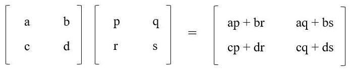

## 3×3 矩阵的乘法

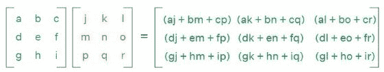

## 矩阵乘法的例子

求 A 矩阵和 B 矩阵的乘法。矩阵 A =

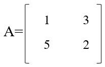

矩阵 B =

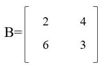

因此，A.B =

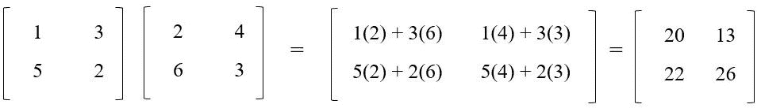

#### 在此基础上制作的节目

*   [C 语言中的矩阵乘法](/c/program/c-program-multiply-two-matrices.htm)
*   [C++ 中的矩阵乘法](/cpp/program/cpp-program-multiply-two-matrices.htm)
*   [Java 中的矩阵乘法](/java/program/java-program-multiply-two-matrices.htm)
*   [Python 中的矩阵乘法](/python/program/python-program-matrix-multiplication.htm)

* * *

* * *