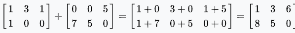

# 两个矩阵如何相加？

> 原文：<https://codescracker.com/nonprog/matrix-addition.htm>

在这篇文章中，你将了解到如何将任意两个给定的矩阵相加。假设有两个给定的矩阵，矩阵 A 和矩阵 b。矩阵 A 的值是:

```
1  2
3  4
```

矩阵 B 的值是:

```
5  6
7  8
```

然后它的添加是这样的:


所以我们有另一个矩阵，矩阵 C，矩阵 C 的值是:

```
6   8
10  12
```

这是两个给定矩阵 A 和 b 的相加。

## 矩阵加法的条件

为了定义两个矩阵的相加，维数必须相同。也就是说，如果一个矩阵中有 3 行 4 列可用，比如说 **A** ，那么用另一个矩阵加上它，比如说 **B** 。矩阵 B 必须有 3 行和 4 列，以便定义它与矩阵 a 的加法

### 矩阵加法的进一步解释

如前所述，对于矩阵加法，应该有相等数量的行和列。在数学中，将两个矩阵相加包括将每个矩阵的匹配项相加。然而，其他操作，包括直接求和以及克罗内克求和，也可以被视为矩阵的加法。

给定 A 和 B 矩阵如下，求 A+B。

即矩阵 A =


并且矩阵 B =


简单地将来自矩阵 A 和 B 的匹配元素相加将提供总数，以这种方式:



#### 在此基础上制作的节目

*   [C 中的矩阵加法](/c/program/c-program-add-two-matrices.htm)
*   [C++ 中的矩阵加法](/cpp/program/cpp-program-add-two-matrices.htm)
*   [Java 中的矩阵加法](/java/program/java-program-add-two-matrices.htm)
*   [Python 中的矩阵加法](/python/program/python-program-add-two-matrices.htm)

* * *

* * *