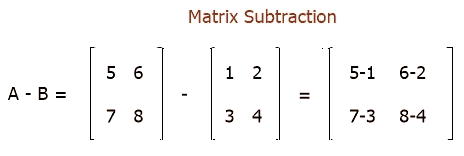
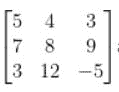
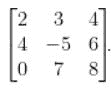
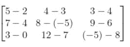
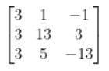

# 两个矩阵如何相减？

> 原文：<https://codescracker.com/nonprog/matrix-subtraction.htm>

在这篇文章中，你将了解如何从一个矩阵中减去另一个矩阵。假设有两个给定的矩阵，矩阵 A 和矩阵 b，矩阵 A 的值为:

```
5  6
7  8
```

矩阵 B 的值是:

```
1  2
3  4
```

那么它的减法是这样的:



所以我们有另一个矩阵，矩阵 C，矩阵 C 的值是:

```
4  4
4  4
```

这是两个给定矩阵 A 和 b 的减法。

## 矩阵减法的条件

为了定义两个矩阵的减法，维数必须相同。也就是说，如果一个矩阵中有 3 行 4 列，比如说 **A** ，那么用另一个矩阵减去它，比如说 **B** 。矩阵 B 必须有 3 行 4 列，以便定义它与矩阵 a 的减法

### 矩阵减法的进一步解释

如前所述，对于矩阵减法，应该有相等数量的行和列。当一个矩阵从自身中减去，或者当 A-A = 0 时，就产生了一个零矩阵。

矩阵减法是将一个矩阵的负数与另一个矩阵相加，即 A - B = A + (-B)。为了减去矩阵，相关元素也被减去。

给定 A 和 B 矩阵如下，求 A-B。矩阵 A =



并且矩阵 B =



通过这种方式，简单地从矩阵 A 和 B 中减去匹配元素就可以得到答案。



因此矩阵 A -矩阵 B 的值将是:



#### 在此基础上制作的节目

*   [C 语言中的矩阵减法](/c/program/c-program-subtract-matrices.htm)
*   [C++ 中的矩阵减法](/cpp/program/cpp-program-subtract-matrices.htm)
*   [Java 中的矩阵减法](/java/program/java-program-subtract-matrices.htm)
*   [Python 中的矩阵减法](/python/program/python-program-subtract-two-matrices.htm)

* * *

* * *