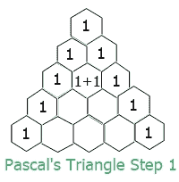
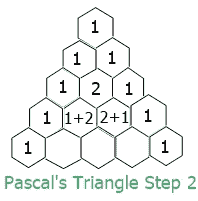
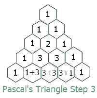
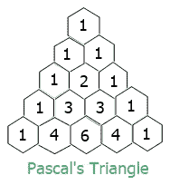

# 帕斯卡三角形

> 原文：<https://codescracker.com/nonprog/pascal-triangle.htm>

在这篇文章中，你将得到关于帕斯卡三角形的简要描述。这里给出帕斯卡三角形最简单的描述。关于这个我就不细说了。因为，这篇文章只是为了给这里的每一个程序员一个关于它的概念，这样他们就可以很容易地在上面创建一个程序。

## 帕斯卡的三角形是如何展开的

这是创建帕斯卡三角形的算法。这些步骤可以用来用你最喜欢的语言来创建它，比如 [C](/c/index.htm) 、 [C++](/cpp/index.htm) 、 、 [Java](/java/index.htm) 或 [Python](/python/index.htm) 等。

*   第一行只有一列的值为 1
*   每行的第一列和最后一列的值为 1
*   第二行有两列。因此，两列的相加作为下一(第三)行第二列的值
*   第三行有三列。因此，第一列和第二列的相加作为下一(第四)行第二列的值。第二和第三列的相加再次作为下一(第四)行第三列的值
*   第四行有四列。因此，第一列和第二列的和将作为下一行(第五行)第二列的值。第二列和第三列的相加再次作为下一行(第五行)第三列的值。第三和第四列的相加再次作为下一行(第五行)第四列的值
*   依此类推，如果有更多的行数

## 帕斯卡三角形的结构

帕斯卡三角形就像<u>等边三角形</u>。其中，有:

*   第一行只有一列
*   第二行 2 列
*   第三行 3 列
*   等等

其中每下一行是以这样的方式创建的

*   第二列的值是前一行第一列和第二列的总和
*   第三列的值是前一行第二和第三列的总和
*   第四列的值是上一行第三和第四列的总和
*   等等

现在让我们看看帕斯卡三角形的图示。

## 帕斯卡三角形公式

这里有一个简单的公式来计算帕斯卡三角形每一行的列值。

```
value = (row!)/((column!)*(row-columns)!)
```

**！**表示阶乘。*行*和*列*都从 0 开始。即求 **第 4**行的 **第 2**列的值。因此，在输入第*行*和第*列*的值时，我们将得到:

```
value = (row!)/((column!)*(row-columns)!)
      = (4!)/((2!)*(4-2)!)
      = (24)/(2*(2!))
      = 24/(2*2)
      = 24/4
      = 6
```

所以 6 是出现在第四行第二列的数字。数字 *n* 的阶乘计算如下:

```
n! = n*(n-1)(n-2)*(n-3)*....*1
```

所以 4 的阶乘是:

```
4! = 4*3*2*1
   = 24
```

## 帕斯卡三角形的图示

这是一步一步的 5 行帕斯卡三角形的图示。这是第一个:



这是第二个



下面是第三个:



这是最后一个:



要了解更多，你可以谷歌一下。但是给出了关于帕斯卡三角形的必备知识。现在，您可以出于编程目的，使用任何您想要的编程语言来创建它。

#### 在此基础上制作的节目

*   [C 打印帕斯卡三角形](/c/program/c-program-print-pascal-triangle.htm)
*   [C++打印帕斯卡三角形](/cpp/program/cpp-program-print-pascal-triangle.htm)
*   [Java 打印帕斯卡三角形](/java/program/java-program-print-pascal-triangle.htm)

* * *

* * *