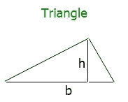
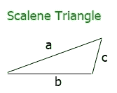
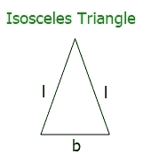
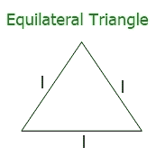

# 求三角形面积和周长的公式

> 原文：<https://codescracker.com/nonprog/area-perimeter-of-triangle.htm>

在这篇文章中，你将学习如何用这里给出的公式计算三角形的面积和周长。与正方形和长方形不同，三角形不只有一种形状。因此，这里给出了不同形状(类型)的三角形所需的所有公式。

## 三角形面积公式

要根据三角形的底和高值计算三角形的面积，请使用以下公式:

```
area = 1/2*b*h
```

这里的 **b** 和 **h** 表示三角形的**底**和**高**。以上公式也可以 写成:

```
area = 0.5*b*h
```

下图显示了三角形的底边和高的位置:



**注-** 此处的 **h** (高度)是与底边垂直的直线。

## 三角形的面积——海伦公式

海伦公式用于利用三角形所有三条边的长度来计算三角形的面积。公式如下:

```
area = square root of (s*(s-a)*(s-b)*(s-c))
```

这里的 **a** 、 **b** 和 **c** 表示三角形的所有三条边的长度。并且**s**T8】的值可以计算为:

```
s = (a+b+c)/2
```

## 三角形周长公式

如果三条边的长度都不相等，那么它就是一个不等边三角形。不规则三角形看起来像:



因此，下面是计算不等边三角形周长的公式:

```
perimeter = a+b+c
```

这里 **a，b，c** 是三角形三条边的长度。

如果两条边的长度相等，那么它就是一个等腰三角形。等腰三角形看起来像:



因此，下面是计算等腰三角形周长的公式:

```
perimeter = (2*a)+b
```

这里 **a** 表示(等边的)边长， **b** 表示(不等边的) 边长。

如果三条边都等长，那么它就是一个等边三角形。等边三角形看起来像:



因此，下面是计算等边三角形周长的公式:

```
perimeter = 3*a
```

这里的 **a** 表示三角形任一边的长度

#### 在此基础上制作的节目

*   [C++面积，三角形的周长](/cpp/program/cpp-program-area-perimeter-triangle.htm)

* * *

* * *